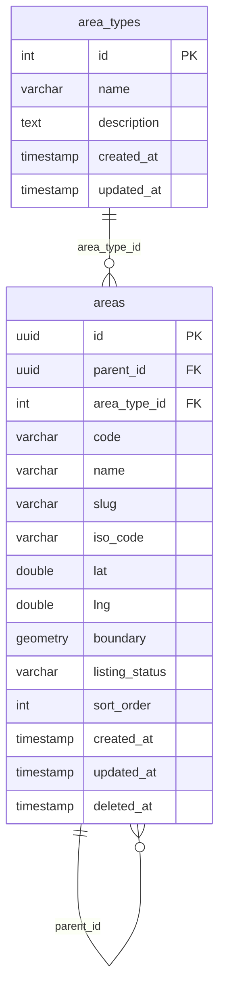
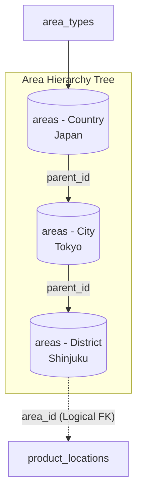

# Area Domain - Technical Data Model & Architecture

> **Overview**
> Technical documentation for the Area/Geography Domain data model. This architecture is centered around managing hierarchical geographical regions, destinations, and administrative boundaries (Countries, Provinces, Cities/Areas, Sub-districts) to support multi-level location mapping across trips, products, and hotels.
>
> _Engineered for High Scalability, Hierarchical Tree Traversal, and optimized for a NestJS + PostgreSQL stack._

---

## 🏗️ Architecture, Scalability & Engineering Principles

The following architectural guidelines must be strictly adhered to during implementation to ensure enterprise-grade reliability, optimal client consumption, and seamless deployment.

### 1. Hierarchical Closure Pattern & Adjacency List

To handle multi-level geographical relationships (e.g., Continent -> Country -> State/Province -> City -> Area) efficiently without recursive CTE performance hits on deep reads, the architecture combines an **Adjacency List (`parent_id`)** for simple CRUD operations with optimized **Materialized Paths** or composite indexing for rapid subtree lookups.

### 2. DevOps & Automated Migrations

The provided PostgreSQL DDL scripts serve as the foundational schema. These migration scripts must be version-controlled and integrated directly into CI/CD deployment pipelines to maintain consistent geographic reference data states across staging and production environments.

### 3. Handling Polymorphic & Spatial Extensions

Areas act as anchor points for multiple entities (`products`, `product_locations`, `hotels`, `airports`).

- **Geospatial Indexing:** We utilize PostgreSQL's **PostGIS** extension (`GEOMETRY` / `GEOGRAPHY` types) alongside spatial B-Tree/GiST indexes (`USING GIST`) to support high-performance radius searches and boundary containment queries (e.g., "Find all products within a 50km radius of Central Jakarta").
- **Denormalized Redundancy:** To minimize complex multi-table joins during high-traffic product catalog rendering, child records (such as `product_locations`) store denormalized metadata (`area_name`, `country_code`) while maintaining strict foreign-key references to `areas.id`.

### 4. Concurrency & Reference Data Integrity

Geographic master data is largely read-heavy and updated infrequently by administrative jobs. Implement **Read-Through Caching** (via Redis) in NestJS for area hierarchies and popular destination nodes to reduce database load to near-zero for search widget autocomplete endpoints.

### 5. Precision & Geospatial Standards

Geographic coordinates (`lat`, `lng`) are strictly cast as `DOUBLE PRECISION` (or `GEOMETRY(Point, 4326)` using standard WGS 84 spatial reference systems). Bounding boxes and polygons use standard GeoJSON formatting for seamless frontend map rendering (Mapbox / Google Maps integration).

---

## 🛠️ PostgreSQL DDL Migration Script

Use this schema as the baseline for your ORM migrations.

```sql
-- =========================================================================
-- 1. EXTENSIONS & SPATIAL SETUP
-- =========================================================================
CREATE EXTENSION IF NOT EXISTS "uuid-ossp";
CREATE EXTENSION IF NOT EXISTS "postgis"; -- Required for advanced spatial queries

-- =========================================================================
-- 2. AREA / GEOGRAPHY CORE TABLES
-- =========================================================================
CREATE TABLE area_types (
    id SERIAL PRIMARY KEY,
    name VARCHAR(50) NOT NULL UNIQUE, -- e.g., 'COUNTRY', 'PROVINCE', 'CITY', 'DISTRICT', 'POI'
    description TEXT,
    created_at TIMESTAMP NOT NULL DEFAULT CURRENT_TIMESTAMP,
    updated_at TIMESTAMP NOT NULL DEFAULT CURRENT_TIMESTAMP
);

CREATE TABLE areas (
    id UUID PRIMARY KEY DEFAULT uuid_generate_v4(),
    parent_id UUID REFERENCES areas(id) ON DELETE CASCADE, -- Adjacency list for hierarchy
    area_type_id INT NOT NULL REFERENCES area_types(id) ON DELETE RESTRICT,
    code VARCHAR(50) UNIQUE NOT NULL, -- e.g., 'ID-JK', 'JAPAN-TYO'
    name VARCHAR(255) NOT NULL,
    slug VARCHAR(255) UNIQUE NOT NULL,
    iso_code VARCHAR(10), -- ISO 3166-1 alpha-2 for countries, etc.
    lat DOUBLE PRECISION,
    lng DOUBLE PRECISION,
    boundary GEOMETRY(Polygon, 4326), -- PostGIS polygon for geographic boundaries
    listing_status VARCHAR(50) NOT NULL DEFAULT 'ACTIVE',
    sort_order INT DEFAULT 0,
    created_at TIMESTAMP NOT NULL DEFAULT CURRENT_TIMESTAMP,
    updated_at TIMESTAMP NOT NULL DEFAULT CURRENT_TIMESTAMP,
    deleted_at TIMESTAMP NULL
);

-- COMPOSITE & SPATIAL INDEXES
CREATE INDEX idx_areas_parent_id ON areas(parent_id);
CREATE INDEX idx_areas_type ON areas(area_type_id);
CREATE INDEX idx_areas_boundary_gist ON areas USING GIST (boundary);
CREATE INDEX idx_areas_slug ON areas(slug);

-- =========================================================================
-- 3. AUDIT TRIGGER AUTOMATION
-- =========================================================================
CREATE OR REPLACE FUNCTION set_updated_at_timestamp()
RETURNS TRIGGER AS $$
BEGIN
    NEW.updated_at = CURRENT_TIMESTAMP;
    RETURN NEW;
END;
$$ LANGUAGE plpgsql;

CREATE TRIGGER trg_area_types_updated_at BEFORE UPDATE ON area_types FOR EACH ROW EXECUTE FUNCTION set_updated_at_timestamp();
CREATE TRIGGER trg_areas_updated_at      BEFORE UPDATE ON areas      FOR EACH ROW EXECUTE FUNCTION set_updated_at_timestamp();
```

---

## 📊 Domain Data Scenario

**Area Hierarchy:** Asia (Continent) -> Japan (Country) -> Tokyo (City) -> Shinjuku (District)
**Root Area ID:** `area_asia_01`

_(Sample data is included below each respective ERD block to illustrate context)._

### 1. Area Types & Core Areas

**Entity Relationship Diagram**



**Sample Data**

**`area_types`**

| id | name | description | created_at | updated_at |
| :--- | :--- | :--- | :--- | :--- |
| 1 | COUNTRY | Sovereign states and independent nations | 2026-01-01 00:00:00 | 2026-01-01 00:00:00 |
| 2 | CITY | Major metropolitan areas and municipalities | 2026-01-01 00:00:00 | 2026-01-01 00:00:00 |
| 3 | DISTRICT | Local neighborhoods or administrative wards | 2026-01-01 00:00:00 | 2026-01-01 00:00:00 |

**`areas`**

| id | parent_id | area_type_id | code | name | slug | iso_code | lat | lng | boundary | listing_status | sort_order | created_at | updated_at | deleted_at |
| :--- | :--- | :--- | :--- | :--- | :--- | :--- | :--- | :--- | :--- | :--- | :--- | :--- | :--- | :--- |
| area_jp_01 | NULL | 1 | JP | Japan | japan | JP | 36.2048 | 138.2529 | NULL | ACTIVE | 1 | 2026-01-01 00:00:00 | 2026-01-01 00:00:00 | NULL |
| area_tyo_01 | area_jp_01 | 2 | JP-TYO | Tokyo | tokyo | NULL | 35.6762 | 139.6503 | NULL | ACTIVE | 2 | 2026-01-01 00:00:00 | 2026-01-01 00:00:00 | NULL |
| area_shinjuku | area_tyo_01 | 3 | JP-TYO-SJN | Shinjuku | shinjuku-tokyo | NULL | 35.6938 | 139.7034 | NULL | ACTIVE | 3 | 2026-01-01 00:00:00 | 2026-01-01 00:00:00 | NULL |

### 2. High-Level Global Area Hierarchy ERD


