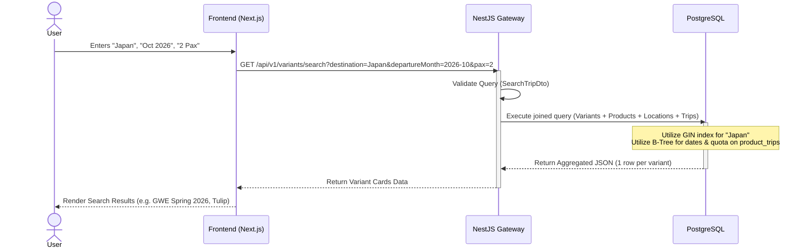

# Product Domain - Search & Filter Architecture

> **Overview**
> Technical documentation for the Trip Search & Filter engine. This architecture maps the frontend search widget (Destination, Departure Month, and Pax Count) to the updated PostgreSQL data model with the **3-level hierarchy**: `products → product_variants → product_trips`.
>
> _Optimized for fast reads, complex relational filtering, and seamless integration with NestJS._

> **See Also:** [Product Hierarchy Technical Design](./product-hierarchy-technical-design.md)

---

## 🎯 UI to Database Mapping

Based on the core search widget, we have three primary filter parameters. Here is how they map to the existing database schema:

| UI Field             | Description                                 | Target Table & Column                           | Filter Logic                                                                 |
| :------------------- | :------------------------------------------ | :---------------------------------------------- | :--------------------------------------------------------------------------- |
| **Where To?**        | Destination keyword (e.g., "Europe, Japan") | `product_locations.area_name` / `products.slug` | `ILIKE` or Full-Text Search (FTS) matching the area or product name.         |
| **Departure Month**  | Selected Month of Travel                    | `product_trips.start_date`                      | Date range query extracting all trips falling within the selected month.     |
| **Guest Count (Pax)**| Number of passengers                        | `product_trips.max_quota`                       | Numeric comparison (`>=`) to ensure the trip has enough available quota.     |

---

## 📡 API Contract (NestJS DTO)

The frontend will send a `GET` request with query parameters. The backend will validate these using NestJS `class-validator`.

```typescript
// search-trip.dto.ts
import {
  IsOptional,
  IsString,
  IsInt,
  Min,
  IsDateString,
} from "class-validator";
import { Type } from "class-transformer";

export class SearchTripDto {
  @IsOptional()
  @IsString()
  destination?: string; // Maps to "Where To?"

  @IsOptional()
  @IsString()
  departureMonth?: string; // Format: "YYYY-MM" (e.g., "2026-10")

  @IsOptional()
  @Type(() => Number)
  @IsInt()
  @Min(1)
  pax?: number = 1; // Maps to "Guest Count (Pax)", Default is 1
}
```

---

## ⚙️ Query Execution Strategy

To avoid the N+1 problem and ensure optimal performance, the search query must join `product_variants` with `products`, `product_locations`, and `product_trips` in a single execution — returning **one row per variant** (the unit rendered as a listing card).

### SQL Query Example (TypeORM / Kysely equivalent)

This is the underlying SQL logic generated by the backend to fetch available trips:

```sql
SELECT
    pv.id           AS variant_id,
    pv.name         AS variant_name,
    pv.slug         AS variant_slug,
    p.id            AS product_id,
    json_agg(DISTINCT pl.area_name)   AS destinations,
    json_agg(DISTINCT pt.start_date)  AS available_dates,
    MIN(ptp.selling_price)            AS starting_price
FROM product_variants pv
-- Join parent product
INNER JOIN products p ON p.id = pv.product_id
-- 1. Join Locations to filter by "Mau Ke Mana?"
INNER JOIN product_locations pl ON pl.product_id = p.id
-- 2. Join Trips (replaces Schedules) to filter by Date and Pax
INNER JOIN product_trips pt ON pt.variant_id = pv.id
-- 3. Join Pricing (optional, for starting price display)
LEFT JOIN product_trip_pricings ptp ON ptp.trip_id = pt.id
WHERE
    p.listing_status = 'ACTIVE'
    AND pv.listing_status = 'ACTIVE'
    AND pt.status = 'ACTIVE'
    -- Destination Filter (Triggered if 'destination' is provided)
    AND (
        pl.area_name ILIKE '%Jepang%'
        OR p.slug ILIKE '%Jepang%'
    )
    -- Departure Month Filter (Triggered if 'departureMonth' is '2026-10')
    AND pt.start_date >= '2026-10-01'
    AND pt.start_date < '2026-11-01'
    -- Pax Filter (Ensuring enough quota is available)
    AND pt.max_quota >= 2
GROUP BY pv.id, pv.name, pv.slug, p.id;
```

> **Note on Quota:** In a real-world scenario, `max_quota` represents the total capacity. The query should ideally check `(max_quota - booked_quota) >= requested_pax`. For this data model, we filter directly against the available limits.
>
> **Result:** The query returns one row **per variant** (not per product). For example, searching "Eropa, September 2026" would return `GWE Spring 2026` and `Tulip` as separate listing cards.

---

## ⚡ Database Optimization & Indexing

To ensure the search remains blazing fast as the product catalog grows, the following indexes **MUST** be applied to the PostgreSQL database:

### 1. Indexing for Date & Quota (B-Tree)

Because users frequently search by departure date and pax count, a composite index on the schedule table will drastically speed up the `WHERE` clause evaluation.

```sql
CREATE INDEX idx_trips_search
ON product_trips (start_date, max_quota);
```

### 2. Indexing for Destination Search (GIN / pg_trgm)

Standard `ILIKE '%keyword%'` queries result in full-table scans. We must use PostgreSQL's `pg_trgm` extension to index partial text searches efficiently.

```sql
-- Enable Trigram extension if not already enabled
CREATE EXTENSION IF NOT EXISTS pg_trgm;

-- Create GIN index for fast partial text matching on area names
CREATE INDEX idx_locations_area_name_trgm
ON product_locations USING GIN (area_name gin_trgm_ops);

CREATE INDEX idx_products_slug_trgm
ON products USING GIN (slug gin_trgm_ops);

-- Also index variant slug and name for variant-level searches
CREATE INDEX idx_variants_name_trgm
ON product_variants USING GIN (name gin_trgm_ops);

CREATE INDEX idx_variants_slug_trgm
ON product_variants USING GIN (slug gin_trgm_ops);
```

---

## 🔄 Search Flow Architecture


