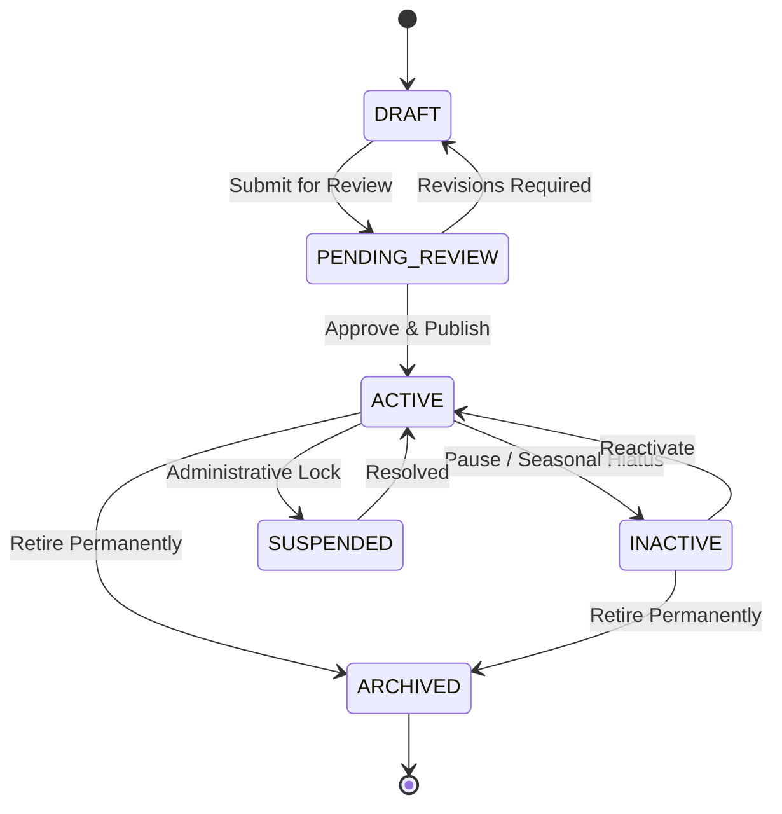
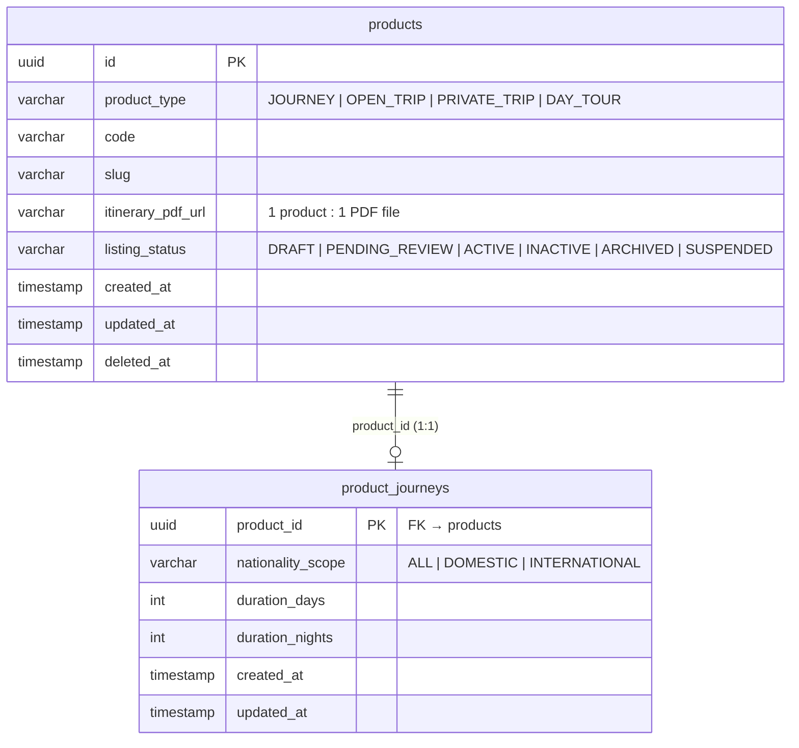
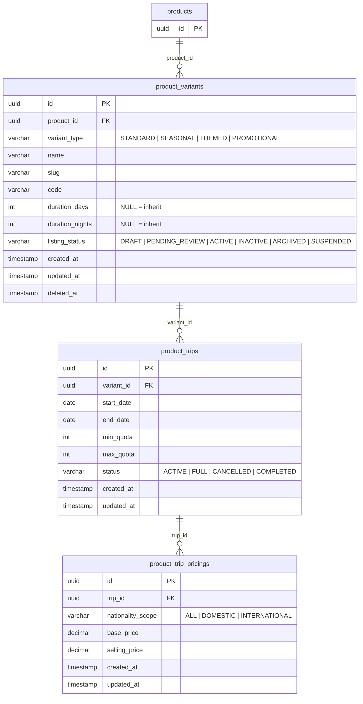
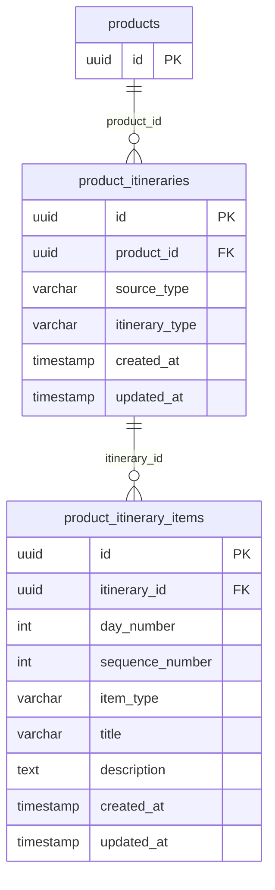
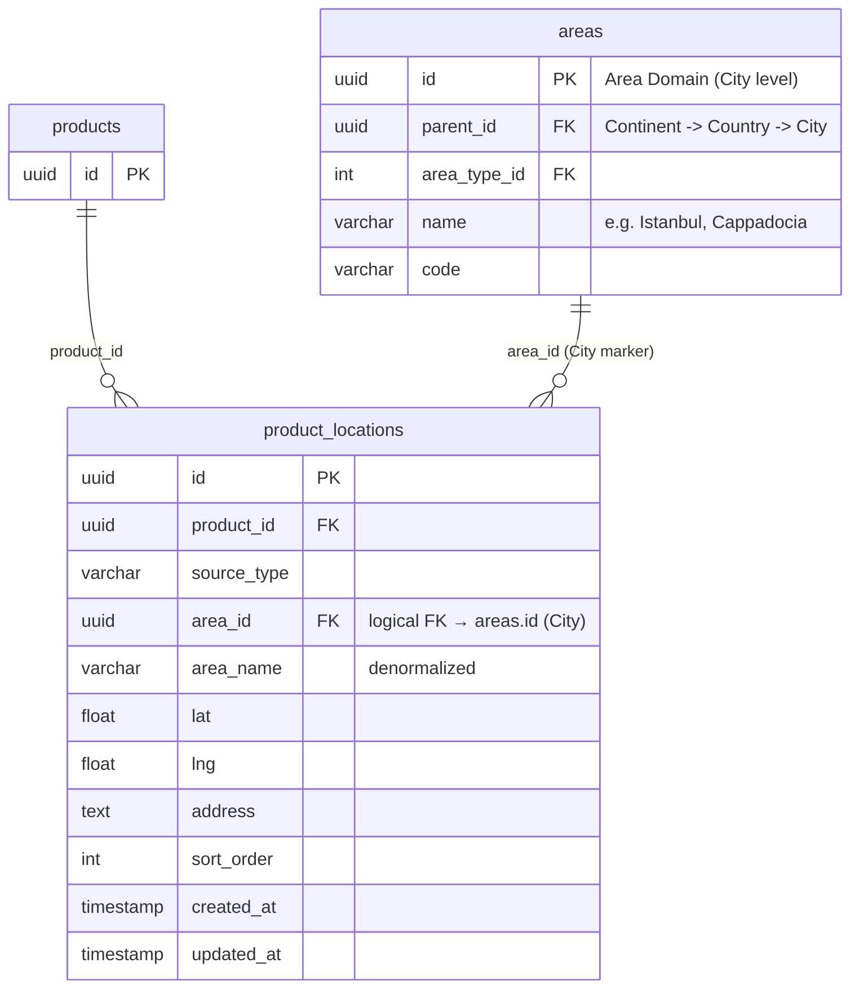
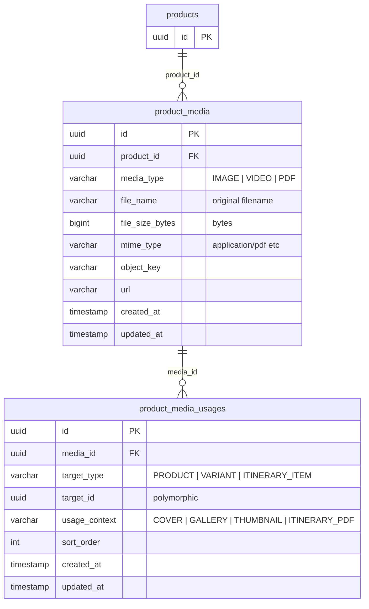
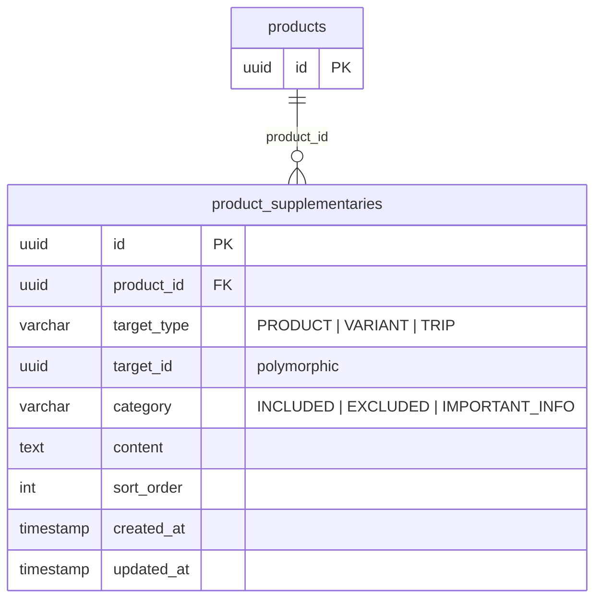
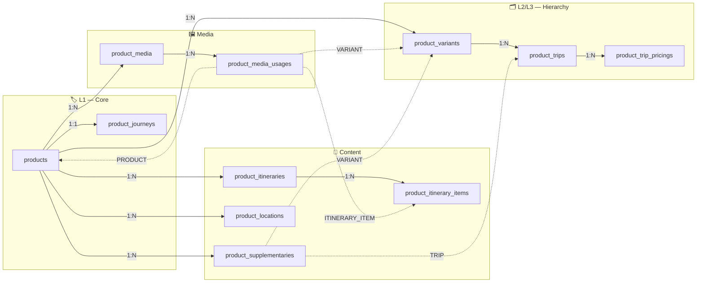

# Product Domain — Technical Data Model & Architecture

> **Overview**
> Single source of truth for the Product Domain PostgreSQL schema. This document covers the complete DDL for all product tables, architectural principles, and per-table ERDs with sample data.
>
> _Engineered for High Scalability, Data Integrity, and optimized for a NestJS + PostgreSQL stack._

**Document Map:**

| Document                                                       | Responsibility                                                               |
| -------------------------------------------------------------- | ---------------------------------------------------------------------------- |
| **This file**                                                  | Full DDL schema, per-table ERDs, sample data, architecture principles        |
| [Product Hierarchy](./product-hierarchy-technical-design.md)   | 3-level hierarchy mental model, full-domain ERD, hierarchy sample data (GWE) |
| [Search & Filter](./product-search-filter-technical-design.md) | Search API contract, SQL query, indexing strategy                            |

---

## 🏗️ Architecture & Engineering Principles

### 1. Client-Optimized Data Aggregation

Backend must serve aggregated JSON payloads — never raw rows. Avoid N+1 queries by joining variants, trips, pricing, and media in a **single database round-trip** using TypeORM query builders or raw SQL with `json_agg`.

### 2. Schema Version Control

All DDL scripts are the source of truth for ORM migrations. Every schema change must be committed as a versioned migration file and run through CI/CD pipelines — never applied manually in production.

### 3. Polymorphic Relationships

Media usages and supplementary content use `(target_type, target_id)` to target multiple entity types from one table. Rules:

- **DB-level:** composite B-Tree index on `(target_type, target_id)` is mandatory for read performance.
- **App-level:** NestJS service layer is responsible for cascading deletes to polymorphic child rows inside a **database transaction** — no database FK can enforce this.
- **Valid `target_type` values:** `PRODUCT` · `VARIANT` · `TRIP` · `ITINERARY_ITEM`

### 4. Concurrency & Quota Management

`product_trips.max_quota` is an **immutable ceiling** set at product configuration time. During booking, use **Pessimistic Locking** (`SELECT ... FOR UPDATE`) on the trip row to prevent race conditions. Live availability is tracked in a separate `product_trip_bookings` table — never mutate `max_quota`.

### 5. Precision Economics

All price columns use `DECIMAL(15,2)`. Never use `FLOAT` or `DOUBLE` for monetary values. Use `decimal.js` or `big.js` in NestJS for all arithmetic before returning to clients.

### 6. Media & Document (PDF) Lifecycle & Validation

`product_media` serves as the centralized repository for all binary assets: images, videos, and PDF documents.

- **MIME & Byte Validation:** PDF uploads require strict backend validation for `application/pdf` along with magic byte (`%PDF-`) verification in the NestJS upload interceptor. Maximum file size is strictly capped (e.g., 20 MB).
- **Single Itinerary PDF Guarantee:** A partial unique index (`uq_media_usages_product_itinerary_pdf`) on `product_media_usages` guarantees at the database level that a product can have at most **one** active `ITINERARY_PDF` usage.
- **Client Download Disposition:** Media records store `file_name` and `file_size_bytes` so UI clients can display human-readable labels and file size indicators (`PDF • 4.6 MB`). CDN / S3 headers must stream downloads with `Content-Disposition: attachment; filename="<file_name>"`.
- **Fast Read Redundancy:** While `product_media` is the authoritative source of file metadata, `products.itinerary_pdf_url` stores the denormalized active CDN URL for instant O(1) reads without table joins.

### 7. Audit Timestamps & State Traceability (`created_at`, `updated_at`, `deleted_at`)

Every domain table strictly maintains timestamp tracking for auditability, cache invalidation, and data synchronization:

- **`created_at` & `updated_at`:** Every table enforces `TIMESTAMP NOT NULL DEFAULT CURRENT_TIMESTAMP`. A database trigger function (`set_updated_at_timestamp()`) automatically updates `updated_at` on row mutation to prevent stale data even during direct SQL operations.
- **Soft Deletes (`deleted_at`):** High-value catalog entities (`products`, `product_variants`) use nullable `deleted_at` timestamps instead of physical deletion. Partial indexes explicitly exclude soft-deleted rows (`WHERE deleted_at IS NULL`) to maintain query performance.

### 8. Catalog Lifecycle State Machine & Classification Enums

All entity lifecycles, audience classifications, and category tiers are enforced strictly via database-level `CHECK` constraints:

#### A. Listing Status (`listing_status`) — `products` & `product_variants`

Governs catalog visibility, publication readiness, and public bookability across the tour lifecycle:

- **`DRAFT`:** Initial draft state; visible only to the author/operator; not indexed in search or bookable.
- **`PENDING_REVIEW`:** Submitted by tour creator / merchant for editorial and compliance verification; awaiting administrator approval.
- **`ACTIVE`:** Verified, approved, and live on the storefront; indexed in search queries; bookable if valid departure trips exist.
- **`INACTIVE`:** Temporarily paused / hidden from catalog (e.g., seasonal hiatus, content revamp); not bookable or searchable publicly.
- **`SUSPENDED`:** Administratively frozen / locked due to safety, regulatory, policy violation, or merchant suspension.
- **`ARCHIVED`:** Permanently retired catalog item; preserved strictly for historical booking references and financial audit trails.



#### B. Nationality Scope Types (`nationality_scope`) — `product_journeys` & `product_trip_pricings`

Defines customer target tiers and nationality-specific pricing logic:

- **`ALL`:** Universal tier; open to all travelers worldwide without passport / residency differentiation.
- **`DOMESTIC`:** Indonesian Citizens (WNI) and Indonesian resident permit / KITAS holders.
- **`INTERNATIONAL`:** Foreign Citizens (WNA) and international passport holders.

#### C. Variant Types (`variant_type`) — `product_variants`

Categorizes bookable cards surfaced on the **All Tours** storefront. Each variant represents a distinct marketing edition with its own departure calendar, quota, and pricing tiers:

| `variant_type` | Architectural & Business Role | Real-World Example in Hobiholidays | Frontend UI Badge | Catalog Filter Tag |
| -------------- | ----------------------------- | ---------------------------------- | ----------------- | ------------------ |

| **`STANDARD`** | Core year-round package with regular recurring departures. Unaffected by specific seasonal or promotional gimmicks. | _Turkey Wonders Classic 9D_, _Grand Europe Signature 11D_ | None / `⭐ Classic` | "Regular Packages" |
| **`SEASONAL`** | Tied strictly to natural seasons, weather changes, or regional climate windows (Spring, Summer, Autumn, Winter). | _GWE Spring 2026_, _Korea Autumn Leaves_, _Hokkaido Winter Snow 7D_ | `🌸 Spring` / `🍂 Autumn` / `❄️ Winter` | "Spring / Autumn / Winter" |
| **`THEMED`** | Centered around cultural festivals, flower blooms, sports events, or special attractions. | _Tulip Edition (Keukenhof)_, _Japan Sakura Golden Route_, _Christmas Market Tour_ | `🌷 Tulip Edition` / `🎌 Festival` | "Themed & Events" |
| **`PROMOTIONAL`** | Limited-seat commercial releases, early bird launches, or flash sale campaigns with special pricing. | _Early Bird Europe 2026_, _Flash Sale Switzerland IDR 29.5M_, _Travel Fair Special_ | `🔥 Flash Sale` / `⚡ Early Bird` | "Promotions & Deals" |

#### D. Product Types (`product_type`) — `products`

- **`JOURNEY`:** Flagship curated multi-day tour program.
- **`OPEN_TRIP`:** Scheduled open-registration group departure.
- **`PRIVATE_TRIP`:** Bespoke / custom private charter tour.
- **`DAY_TOUR`:** Single-day guided excursion or city tour.

#### E. Trip Departure Status (`status`) — `product_trips`

- **`ACTIVE`:** Open for booking; quota available.
- **`FULL`:** Sold out; maximum capacity reached.
- **`CANCELLED`:** Departure cancelled (minimum quota unmet or force majeure).
- **`COMPLETED`:** Tour concluded successfully.

---

## 🛠️ PostgreSQL DDL Schema

> This is the complete, authoritative schema for the Product domain. Tables are ordered by dependency (parents before children).

```sql
-- =========================================================================
-- 0. EXTENSIONS
-- =========================================================================
CREATE EXTENSION IF NOT EXISTS "uuid-ossp";
CREATE EXTENSION IF NOT EXISTS "pg_trgm"; -- Required for GIN text search indexes


-- =========================================================================
-- 1. CORE — L1: products & product_journeys
-- =========================================================================

-- Master product entity — the brand/program umbrella
CREATE TABLE products (
    id                UUID         PRIMARY KEY DEFAULT uuid_generate_v4(),
    product_type      VARCHAR(50)  NOT NULL,                    -- JOURNEY | OPEN_TRIP | PRIVATE_TRIP | DAY_TOUR
    code              VARCHAR(100) UNIQUE NOT NULL,             -- e.g. GWE
    slug              VARCHAR(255) UNIQUE NOT NULL,             -- e.g. grand-west-europe
    itinerary_pdf_url VARCHAR(500),                             -- 1 Product : 1 PDF Itinerary file (shared across variants)
    listing_status    VARCHAR(50)  NOT NULL DEFAULT 'DRAFT',    -- DRAFT | PENDING_REVIEW | ACTIVE | INACTIVE | ARCHIVED | SUSPENDED
    created_at        TIMESTAMP    NOT NULL DEFAULT CURRENT_TIMESTAMP,
    updated_at        TIMESTAMP    NOT NULL DEFAULT CURRENT_TIMESTAMP,
    deleted_at        TIMESTAMP    NULL,

    CONSTRAINT chk_products_listing_status CHECK (listing_status IN ('DRAFT', 'PENDING_REVIEW', 'ACTIVE', 'INACTIVE', 'ARCHIVED', 'SUSPENDED')),
    CONSTRAINT chk_products_type           CHECK (product_type IN ('JOURNEY', 'OPEN_TRIP', 'PRIVATE_TRIP', 'DAY_TOUR'))
);
CREATE INDEX idx_products_status      ON products(listing_status) WHERE deleted_at IS NULL;
CREATE INDEX idx_products_slug_trgm   ON products USING GIN (slug gin_trgm_ops);

-- Base journey metadata (1:1 with products)
CREATE TABLE product_journeys (
    product_id          UUID        PRIMARY KEY REFERENCES products(id) ON DELETE CASCADE,
    nationality_scope   VARCHAR(50) NOT NULL DEFAULT 'ALL',     -- ALL | DOMESTIC | INTERNATIONAL
    duration_days       INT         NOT NULL DEFAULT 1,
    duration_nights     INT         NOT NULL DEFAULT 0,
    created_at          TIMESTAMP   NOT NULL DEFAULT CURRENT_TIMESTAMP,
    updated_at          TIMESTAMP   NOT NULL DEFAULT CURRENT_TIMESTAMP,

    CONSTRAINT chk_duration            CHECK (duration_days >= 1 AND duration_nights >= 0),
    CONSTRAINT chk_journey_nationality CHECK (nationality_scope IN ('ALL', 'DOMESTIC', 'INTERNATIONAL'))
);


-- =========================================================================
-- 2. HIERARCHY — L2: product_variants
-- One product → many variants. Each variant is one card on All Tours.
-- =========================================================================
CREATE TABLE product_variants (
    id              UUID         PRIMARY KEY DEFAULT uuid_generate_v4(),
    product_id      UUID         NOT NULL REFERENCES products(id) ON DELETE CASCADE,
    variant_type    VARCHAR(50)  NOT NULL DEFAULT 'STANDARD', -- STANDARD | SEASONAL | THEMED | PROMOTIONAL
    name            VARCHAR(255) NOT NULL,                    -- e.g. "GWE Spring 2026"
    slug            VARCHAR(255) UNIQUE NOT NULL,              -- e.g. "gwe-spring-2026"
    code            VARCHAR(100) UNIQUE NOT NULL,              -- e.g. "GWE-SPR-2026"

    -- Duration override: NULL means inherit from product_journeys via COALESCE
    duration_days   INT          NULL,
    duration_nights INT          NULL,

    listing_status  VARCHAR(50)  NOT NULL DEFAULT 'DRAFT',    -- DRAFT | PENDING_REVIEW | ACTIVE | INACTIVE | ARCHIVED | SUSPENDED
    created_at      TIMESTAMP    NOT NULL DEFAULT CURRENT_TIMESTAMP,
    updated_at      TIMESTAMP    NOT NULL DEFAULT CURRENT_TIMESTAMP,
    deleted_at      TIMESTAMP    NULL,

    CONSTRAINT chk_variants_variant_type   CHECK (variant_type IN ('STANDARD', 'SEASONAL', 'THEMED', 'PROMOTIONAL')),
    CONSTRAINT chk_variants_listing_status CHECK (listing_status IN ('DRAFT', 'PENDING_REVIEW', 'ACTIVE', 'INACTIVE', 'ARCHIVED', 'SUSPENDED'))
);
CREATE INDEX idx_variants_product_id   ON product_variants(product_id);
CREATE INDEX idx_variants_slug         ON product_variants(slug);
CREATE INDEX idx_variants_status       ON product_variants(listing_status) WHERE deleted_at IS NULL;
CREATE INDEX idx_variants_name_trgm    ON product_variants USING GIN (name gin_trgm_ops);


-- =========================================================================
-- 3. HIERARCHY — L3: product_trips & product_trip_pricings
-- One variant → many trips. A trip is a concrete dated departure window.
-- =========================================================================
CREATE TABLE product_trips (
    id              UUID        PRIMARY KEY DEFAULT uuid_generate_v4(),
    variant_id      UUID        NOT NULL REFERENCES product_variants(id) ON DELETE CASCADE,
    start_date      DATE        NOT NULL,
    end_date        DATE        NOT NULL,
    min_quota       INT         NOT NULL DEFAULT 1,
    max_quota       INT         NOT NULL,
    status          VARCHAR(50) NOT NULL DEFAULT 'ACTIVE',    -- ACTIVE | FULL | CANCELLED | COMPLETED
    created_at      TIMESTAMP   NOT NULL DEFAULT CURRENT_TIMESTAMP,
    updated_at      TIMESTAMP   NOT NULL DEFAULT CURRENT_TIMESTAMP,

    CONSTRAINT uq_trip_variant_start UNIQUE (variant_id, start_date),
    CONSTRAINT chk_trip_dates        CHECK  (end_date > start_date),
    CONSTRAINT chk_trip_quota        CHECK  (max_quota >= min_quota AND min_quota >= 1),
    CONSTRAINT chk_trips_status      CHECK  (status IN ('ACTIVE', 'FULL', 'CANCELLED', 'COMPLETED'))
);
CREATE INDEX idx_trips_variant_id ON product_trips(variant_id);
-- Partial index: search queries only touch ACTIVE trips
CREATE INDEX idx_trips_search     ON product_trips(start_date, max_quota)
    WHERE status = 'ACTIVE';

-- Pricing tiers per trip (e.g. per nationality scope)
CREATE TABLE product_trip_pricings (
    id                  UUID           PRIMARY KEY DEFAULT uuid_generate_v4(),
    trip_id             UUID           NOT NULL REFERENCES product_trips(id) ON DELETE CASCADE,
    nationality_scope   VARCHAR(50)    NOT NULL DEFAULT 'ALL', -- ALL | DOMESTIC | INTERNATIONAL
    base_price          DECIMAL(15,2)  NOT NULL,
    selling_price       DECIMAL(15,2)  NOT NULL,
    created_at          TIMESTAMP      NOT NULL DEFAULT CURRENT_TIMESTAMP,
    updated_at          TIMESTAMP      NOT NULL DEFAULT CURRENT_TIMESTAMP,

    CONSTRAINT uq_pricing_trip_scope   UNIQUE (trip_id, nationality_scope),
    CONSTRAINT chk_price_sanity        CHECK  (selling_price > 0 AND base_price >= selling_price),
    CONSTRAINT chk_pricing_nationality CHECK  (nationality_scope IN ('ALL', 'DOMESTIC', 'INTERNATIONAL'))
);


-- =========================================================================
-- 4. CONTENT — Itinerary
-- Day-by-day programme. Owned at the product level (shared across variants).
-- =========================================================================
CREATE TABLE product_itineraries (
    id              UUID        PRIMARY KEY DEFAULT uuid_generate_v4(),
    product_id      UUID        NOT NULL REFERENCES products(id) ON DELETE CASCADE,
    source_type     VARCHAR(50) NOT NULL,       -- MERCHANT | INTERNAL
    itinerary_type  VARCHAR(50) NOT NULL,       -- STANDARD | CUSTOM
    created_at      TIMESTAMP   NOT NULL DEFAULT CURRENT_TIMESTAMP,
    updated_at      TIMESTAMP   NOT NULL DEFAULT CURRENT_TIMESTAMP,

    CONSTRAINT chk_itineraries_source_type CHECK (source_type IN ('MERCHANT', 'INTERNAL')),
    CONSTRAINT chk_itineraries_type        CHECK (itinerary_type IN ('STANDARD', 'CUSTOM'))
);

CREATE TABLE product_itinerary_items (
    id              UUID        PRIMARY KEY DEFAULT uuid_generate_v4(),
    itinerary_id    UUID        NOT NULL REFERENCES product_itineraries(id) ON DELETE CASCADE,
    day_number      INT         NOT NULL,
    sequence_number INT         NOT NULL,
    item_type       VARCHAR(50) NOT NULL,       -- ACTIVITY | TRANSPORT | MEAL | ACCOMMODATION
    title           VARCHAR(255),
    description     TEXT,
    created_at      TIMESTAMP   NOT NULL DEFAULT CURRENT_TIMESTAMP,
    updated_at      TIMESTAMP   NOT NULL DEFAULT CURRENT_TIMESTAMP,

    CONSTRAINT uq_itinerary_item_order  UNIQUE (itinerary_id, day_number, sequence_number),
    CONSTRAINT chk_itinerary_item_type CHECK (item_type IN ('ACTIVITY', 'TRANSPORT', 'MEAL', 'ACCOMMODATION'))
);


-- =========================================================================
-- 5. CONTENT — Locations
-- Multiple destination markers per product. area_id is a logical FK to the
-- Area/Geography domain (not enforced at DB level across domains).
-- =========================================================================
CREATE TABLE product_locations (
    id          UUID           PRIMARY KEY DEFAULT uuid_generate_v4(),
    product_id  UUID           NOT NULL REFERENCES products(id) ON DELETE CASCADE,
    source_type VARCHAR(50)    NOT NULL,                   -- AREA | MANUAL
    area_id     UUID           NOT NULL,                   -- Logical FK → Area domain
    area_name   VARCHAR(100),                              -- Denormalized for fast UI rendering
    lat         DOUBLE PRECISION,
    lng         DOUBLE PRECISION,
    address     TEXT,
    sort_order  INT            NOT NULL DEFAULT 0,
    created_at  TIMESTAMP      NOT NULL DEFAULT CURRENT_TIMESTAMP,
    updated_at  TIMESTAMP      NOT NULL DEFAULT CURRENT_TIMESTAMP,

    CONSTRAINT chk_locations_source_type CHECK (source_type IN ('AREA', 'MANUAL'))
);
CREATE INDEX idx_locations_product_id    ON product_locations(product_id);
CREATE INDEX idx_locations_area_name_trgm ON product_locations USING GIN (area_name gin_trgm_ops);


-- =========================================================================
-- 6. MEDIA — product_media & product_media_usages (polymorphic)
-- Media assets are owned at the product level.
-- Usage slots (cover, gallery, thumbnail, itinerary_pdf) target entities polymorphically.
-- Supports images, videos, and document assets (PDF brochures).
-- =========================================================================
CREATE TABLE product_media (
    id               UUID         PRIMARY KEY DEFAULT uuid_generate_v4(),
    product_id       UUID         NOT NULL REFERENCES products(id) ON DELETE CASCADE,
    source_upload_id VARCHAR(255),                          -- CDN / upload service ref
    media_type       VARCHAR(50)  NOT NULL,                  -- IMAGE | VIDEO | PDF
    file_name        VARCHAR(255),                          -- Original / download filename (e.g. Turkey-Wonders-Itinerary.pdf)
    file_size_bytes  BIGINT,                                -- File size in bytes for UI preview
    mime_type        VARCHAR(100),                          -- e.g. application/pdf, image/jpeg, video/mp4
    object_key       VARCHAR(500) NOT NULL,                 -- S3/GCS object key
    url              VARCHAR(500) NOT NULL,                 -- CDN public URL
    created_at       TIMESTAMP    NOT NULL DEFAULT CURRENT_TIMESTAMP,
    updated_at       TIMESTAMP    NOT NULL DEFAULT CURRENT_TIMESTAMP,

    CONSTRAINT chk_media_type CHECK (media_type IN ('IMAGE', 'VIDEO', 'PDF'))
);

CREATE TABLE product_media_usages (
    id            UUID        PRIMARY KEY DEFAULT uuid_generate_v4(),
    media_id      UUID        NOT NULL REFERENCES product_media(id) ON DELETE CASCADE,
    target_type   VARCHAR(50) NOT NULL,    -- PRODUCT | VARIANT | ITINERARY_ITEM
    target_id     UUID        NOT NULL,    -- Polymorphic — resolved by target_type
    usage_context VARCHAR(50) NOT NULL,    -- COVER | GALLERY | THUMBNAIL | ITINERARY_PDF | ATTACHMENT
    sort_order    INT         NOT NULL DEFAULT 0,
    created_at    TIMESTAMP   NOT NULL DEFAULT CURRENT_TIMESTAMP,
    updated_at    TIMESTAMP   NOT NULL DEFAULT CURRENT_TIMESTAMP,

    CONSTRAINT chk_media_target_type    CHECK (target_type IN ('PRODUCT', 'VARIANT', 'ITINERARY_ITEM')),
    CONSTRAINT chk_media_usage_context CHECK (usage_context IN ('COVER', 'GALLERY', 'THUMBNAIL', 'ITINERARY_PDF', 'ATTACHMENT'))
);
-- Essential composite index for polymorphic reads
CREATE INDEX idx_media_usages_target ON product_media_usages(target_type, target_id);

-- Enforce strict 1:1 rule: exactly 1 active ITINERARY_PDF per Product
CREATE UNIQUE INDEX uq_media_usages_product_itinerary_pdf
    ON product_media_usages(target_id, usage_context)
    WHERE target_type = 'PRODUCT' AND usage_context = 'ITINERARY_PDF';


-- =========================================================================
-- 7. SUPPLEMENTARY CONTENT (polymorphic)
-- Reusable content blocks that can target any entity level.
-- =========================================================================
CREATE TABLE product_supplementaries (
    id          UUID        PRIMARY KEY DEFAULT uuid_generate_v4(),
    product_id  UUID        NOT NULL REFERENCES products(id) ON DELETE CASCADE,
    target_type VARCHAR(50) NOT NULL,    -- PRODUCT | VARIANT | TRIP
    target_id   UUID        NOT NULL,    -- Polymorphic
    category    VARCHAR(50) NOT NULL,    -- INCLUDED | EXCLUDED | IMPORTANT_INFO | NOTE
    content     TEXT,
    sort_order  INT         NOT NULL DEFAULT 0,
    created_at  TIMESTAMP   NOT NULL DEFAULT CURRENT_TIMESTAMP,
    updated_at  TIMESTAMP   NOT NULL DEFAULT CURRENT_TIMESTAMP,

    CONSTRAINT chk_supp_target_type CHECK (target_type IN ('PRODUCT', 'VARIANT', 'TRIP')),
    CONSTRAINT chk_supp_category    CHECK (category IN ('INCLUDED', 'EXCLUDED', 'IMPORTANT_INFO', 'NOTE'))
);
CREATE INDEX idx_supplementaries_target ON product_supplementaries(target_type, target_id);


-- =========================================================================
-- 8. AUDIT TRIGGER AUTOMATION
-- PostgreSQL trigger function to automatically update `updated_at` timestamps
-- upon row mutation across all domain entities.
-- =========================================================================
CREATE OR REPLACE FUNCTION set_updated_at_timestamp()
RETURNS TRIGGER AS $$
BEGIN
    NEW.updated_at = CURRENT_TIMESTAMP;
    RETURN NEW;
END;
$$ LANGUAGE plpgsql;

-- Apply timestamp triggers to all tables with updated_at
CREATE TRIGGER trg_products_updated_at             BEFORE UPDATE ON products             FOR EACH ROW EXECUTE FUNCTION set_updated_at_timestamp();
CREATE TRIGGER trg_product_journeys_updated_at     BEFORE UPDATE ON product_journeys     FOR EACH ROW EXECUTE FUNCTION set_updated_at_timestamp();
CREATE TRIGGER trg_product_variants_updated_at     BEFORE UPDATE ON product_variants     FOR EACH ROW EXECUTE FUNCTION set_updated_at_timestamp();
CREATE TRIGGER trg_product_trips_updated_at        BEFORE UPDATE ON product_trips        FOR EACH ROW EXECUTE FUNCTION set_updated_at_timestamp();
CREATE TRIGGER trg_product_trip_pricings_updated_at BEFORE UPDATE ON product_trip_pricings FOR EACH ROW EXECUTE FUNCTION set_updated_at_timestamp();
CREATE TRIGGER trg_product_itineraries_updated_at  BEFORE UPDATE ON product_itineraries  FOR EACH ROW EXECUTE FUNCTION set_updated_at_timestamp();
CREATE TRIGGER trg_product_itinerary_items_updated_at BEFORE UPDATE ON product_itinerary_items FOR EACH ROW EXECUTE FUNCTION set_updated_at_timestamp();
CREATE TRIGGER trg_product_locations_updated_at    BEFORE UPDATE ON product_locations    FOR EACH ROW EXECUTE FUNCTION set_updated_at_timestamp();
CREATE TRIGGER trg_product_media_updated_at        BEFORE UPDATE ON product_media        FOR EACH ROW EXECUTE FUNCTION set_updated_at_timestamp();
CREATE TRIGGER trg_product_media_usages_updated_at BEFORE UPDATE ON product_media_usages FOR EACH ROW EXECUTE FUNCTION set_updated_at_timestamp();
CREATE TRIGGER trg_product_supplementaries_updated_at BEFORE UPDATE ON product_supplementaries FOR EACH ROW EXECUTE FUNCTION set_updated_at_timestamp();
```

---

## 📊 Domain Data Scenario — Turkey Wonders

**Product:** Turkey Wonders · **ID:** `prod_turkey_01`

_Each section below shows the ERD for that sub-domain, followed by concrete sample rows. (Standard audit timestamps `created_at`, `updated_at`, and `deleted_at` are defined in the schema and ERD above, but omitted from the sample data tables below for readability)._

---

### 1. Core Product & Journey



| Table      | id             | product_type | code           | slug           | itinerary_pdf_url                                                | listing_status |
| ---------- | -------------- | ------------ | -------------- | -------------- | ---------------------------------------------------------------- | -------------- |
| `products` | prod_turkey_01 | JOURNEY      | TURKEY-WONDERS | turkey-wonders | https://cdn.hobiholidays.com/docs/itineraries/turkey-wonders.pdf | ACTIVE         |

| Table              | product_id     | nationality_scope | duration_days | duration_nights |
| ------------------ | -------------- | ----------------- | ------------- | --------------- |
| `product_journeys` | prod_turkey_01 | ALL               | 9             | 8               |

---

### 2. Variants, Trips & Pricing

> Full hierarchy ERDs and GWE sample data: [Product Hierarchy Technical Design](./product-hierarchy-technical-design.md)



| Table              | id             | product_id     | variant_type | name                          | slug                       | code            | duration_days | duration_nights | listing_status |
| ------------------ | -------------- | -------------- | ------------ | ----------------------------- | -------------------------- | --------------- | ------------- | --------------- | -------------- |
| `product_variants` | var_turkey_std | prod_turkey_01 | STANDARD     | Turkey Wonders Classic        | turkey-wonders-classic     | TURKEY-STD-2026 | NULL (9)      | NULL (8)        | ACTIVE         |
| `product_variants` | var_turkey_oct | prod_turkey_01 | SEASONAL     | Turkey Wonders Autumn         | turkey-wonders-autumn-2026 | TURKEY-AUT-2026 | NULL (9)      | NULL (8)        | ACTIVE         |
| `product_variants` | var_turkey_bln | prod_turkey_01 | THEMED       | Turkey Balloon Fiesta Edition | turkey-balloon-fiesta      | TURKEY-BLN-2026 | 10 (override) | 9 (override)    | ACTIVE         |
| `product_variants` | var_turkey_fls | prod_turkey_01 | PROMOTIONAL  | Turkey Flash Sale IDR 22M     | turkey-flash-sale-2026     | TURKEY-FLS-2026 | NULL (9)      | NULL (8)        | ACTIVE         |

| Table           | id             | variant_id     | start_date | end_date   | min_quota | max_quota | status |
| --------------- | -------------- | -------------- | ---------- | ---------- | --------- | --------- | ------ |
| `product_trips` | trip_tur_std01 | var_turkey_std | 2026-08-10 | 2026-08-18 | 10        | 30        | ACTIVE |
| `product_trips` | trip_tur_001   | var_turkey_oct | 2026-10-10 | 2026-10-18 | 10        | 30        | ACTIVE |
| `product_trips` | trip_tur_bln01 | var_turkey_bln | 2026-09-15 | 2026-09-24 | 8         | 25        | ACTIVE |
| `product_trips` | trip_tur_fls01 | var_turkey_fls | 2026-11-05 | 2026-11-13 | 10        | 15        | ACTIVE |

| Table                   | id              | trip_id        | nationality_scope | base_price  | selling_price |
| ----------------------- | --------------- | -------------- | ----------------- | ----------- | ------------- |
| `product_trip_pricings` | pricing_std_dom | trip_tur_std01 | DOMESTIC          | 26000000.00 | 23500000.00   |
| `product_trip_pricings` | pricing_std_int | trip_tur_std01 | INTERNATIONAL     | 31000000.00 | 28500000.00   |
| `product_trip_pricings` | pricing_001_dom | trip_tur_001   | DOMESTIC          | 25000000.00 | 22000000.00   |
| `product_trip_pricings` | pricing_001_int | trip_tur_001   | INTERNATIONAL     | 30000000.00 | 27000000.00   |
| `product_trip_pricings` | pricing_bln_all | trip_tur_bln01 | ALL               | 32000000.00 | 28900000.00   |
| `product_trip_pricings` | pricing_fls_all | trip_tur_fls01 | ALL               | 25000000.00 | 20900000.00   |

---

### 3. Itinerary



| Table                 | id            | product_id     | source_type | itinerary_type |
| --------------------- | ------------- | -------------- | ----------- | -------------- |
| `product_itineraries` | itinerary_001 | prod_turkey_01 | MERCHANT    | STANDARD       |

| Table                     | id       | itinerary_id  | day_number | sequence_number | item_type | title                      | description                                                                          |
| ------------------------- | -------- | ------------- | ---------- | --------------- | --------- | -------------------------- | ------------------------------------------------------------------------------------ |
| `product_itinerary_items` | item_001 | itinerary_001 | 1          | 1               | ACTIVITY  | Istanbul City Tour         | Arrive at Istanbul Airport, meet tour guide, visit Blue Mosque and Hagia Sophia.     |
| `product_itinerary_items` | item_002 | itinerary_001 | 3          | 1               | ACTIVITY  | Cappadocia Hot Air Balloon | Sunrise hot air balloon flight over Göreme Valley followed by traditional breakfast. |
| `product_itinerary_items` | item_003 | itinerary_001 | 6          | 1               | ACTIVITY  | Bursa Grand Mosque         | Explore historical Ottoman architecture and silk market in Bursa.                    |

---

### 4. Locations



| Table               | id     | product_id     | source_type | area_id                              | area_name  | lat     | lng     | address                       | sort_order |
| ------------------- | ------ | -------------- | ----------- | ------------------------------------ | ---------- | ------- | ------- | ----------------------------- | ---------- |
| `product_locations` | loc_01 | prod_turkey_01 | AREA        | 550e8400-e29b-41d4-a716-446655440001 | Istanbul   | 41.0082 | 28.9784 | Sultanahmet, Istanbul, Turkey | 1          |
| `product_locations` | loc_02 | prod_turkey_01 | AREA        | 550e8400-e29b-41d4-a716-446655440002 | Cappadocia | 38.6431 | 34.8289 | Göreme, Nevşehir, Turkey      | 2          |
| `product_locations` | loc_03 | prod_turkey_01 | AREA        | 550e8400-e29b-41d4-a716-446655440003 | Bursa      | 40.1885 | 29.0610 | Osmangazi, Bursa, Turkey      | 3          |

---

### 5. Media



| Table           | id        | product_id     | source_upload_id | media_type | file_name                             | file_size_bytes | mime_type       | object_key                                        | url                                                              |
| --------------- | --------- | -------------- | ---------------- | ---------- | ------------------------------------- | --------------- | --------------- | ------------------------------------------------- | ---------------------------------------------------------------- |
| `product_media` | media_001 | prod_turkey_01 | upl_img_001      | IMAGE      | hot-air-balloon.jpg                   | 1845200         | image/jpeg      | products/turkey/hot-air-balloon.jpg               | https://cdn.hobiholidays.com/products/turkey/hot-air-balloon.jpg |
| `product_media` | media_002 | prod_turkey_01 | upl_doc_001      | PDF        | Turkey-Wonders-Official-Itinerary.pdf | 4613734         | application/pdf | products/turkey/docs/turkey-wonders-itinerary.pdf | https://cdn.hobiholidays.com/docs/itineraries/turkey-wonders.pdf |

| Table                  | id        | media_id  | target_type | target_id      | usage_context | sort_order |
| ---------------------- | --------- | --------- | ----------- | -------------- | ------------- | ---------- |
| `product_media_usages` | usage_001 | media_001 | PRODUCT     | prod_turkey_01 | COVER         | 1          |
| `product_media_usages` | usage_002 | media_002 | PRODUCT     | prod_turkey_01 | ITINERARY_PDF | 1          |

---

### 6. Supplementary Content



| Table                     | id       | product_id     | target_type | target_id      | category       | content                                                                                     | sort_order |
| ------------------------- | -------- | -------------- | ----------- | -------------- | -------------- | ------------------------------------------------------------------------------------------- | ---------- |
| `product_supplementaries` | supp_001 | prod_turkey_01 | PRODUCT     | prod_turkey_01 | IMPORTANT_INFO | Valid passport with at least 6 months validity required from travel date.                   | 1          |
| `product_supplementaries` | supp_002 | prod_turkey_01 | PRODUCT     | prod_turkey_01 | INCLUDED       | 4-star hotel accommodations, domestic flights, daily breakfast, and English-speaking guide. | 2          |

---

### 7. High-Level Domain Overview



---

## 📐 Index Summary

| Index Name                              | Table                     | Columns                                                                                          | Type                  | Purpose                                             |
| --------------------------------------- | ------------------------- | ------------------------------------------------------------------------------------------------ | --------------------- | --------------------------------------------------- |
| `idx_products_status`                   | `products`                | `(listing_status)` WHERE `deleted_at IS NULL`                                                    | B-Tree partial        | Active product listing                              |
| `idx_products_slug_trgm`                | `products`                | `(slug)`                                                                                         | GIN pg_trgm           | Destination text search                             |
| `idx_variants_product_id`               | `product_variants`        | `(product_id)`                                                                                   | B-Tree                | Variant lookup by product                           |
| `idx_variants_name_trgm`                | `product_variants`        | `(name)`                                                                                         | GIN pg_trgm           | Variant name text search                            |
| `idx_trips_variant_id`                  | `product_trips`           | `(variant_id)`                                                                                   | B-Tree                | Trip lookup by variant                              |
| `idx_trips_search`                      | `product_trips`           | `(start_date, max_quota)` WHERE `status = 'ACTIVE'`                                              | B-Tree partial        | Search date+pax filter                              |
| `idx_locations_area_name_trgm`          | `product_locations`       | `(area_name)`                                                                                    | GIN pg_trgm           | Destination text search                             |
| `idx_media_usages_target`               | `product_media_usages`    | `(target_type, target_id)`                                                                       | B-Tree                | Polymorphic media lookup                            |
| `uq_media_usages_product_itinerary_pdf` | `product_media_usages`    | `(target_id, usage_context)` WHERE `target_type = 'PRODUCT' AND usage_context = 'ITINERARY_PDF'` | B-Tree unique partial | Enforce strict 1:1 single itinerary PDF per product |
| `idx_supplementaries_target`            | `product_supplementaries` | `(target_type, target_id)`                                                                       | B-Tree                | Polymorphic content lookup                          |
