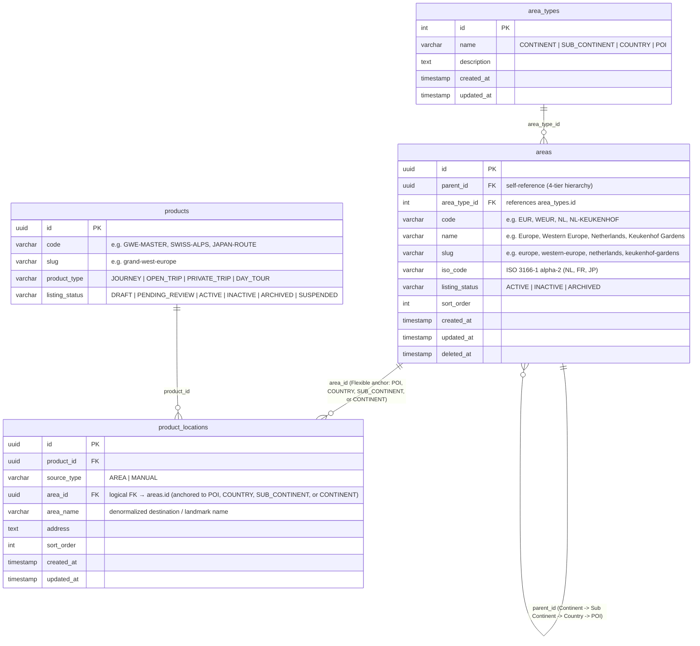
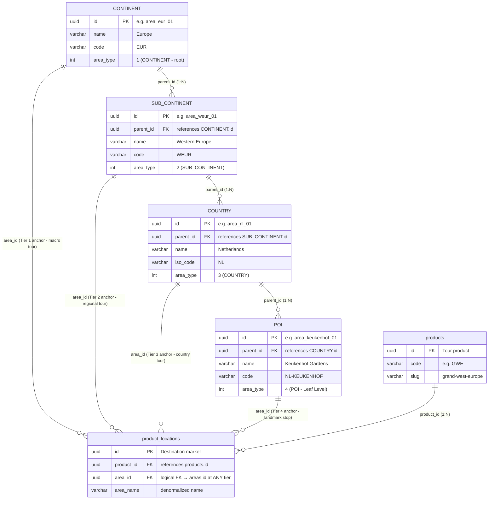
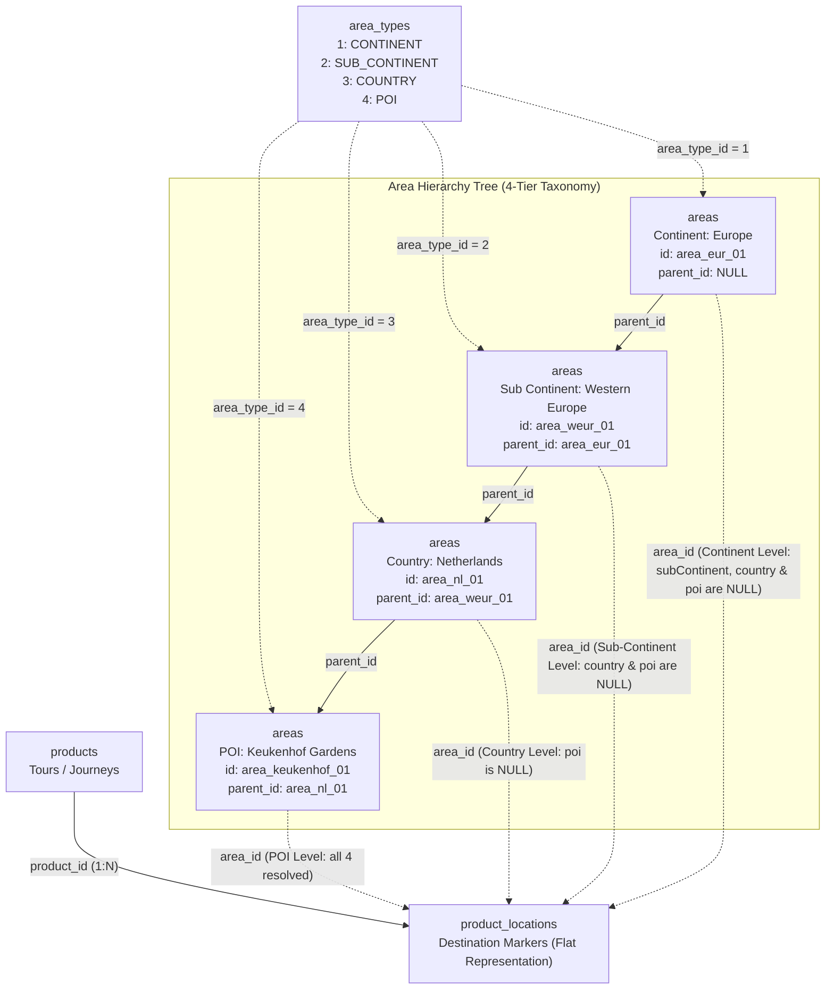

# Area Domain - Technical Data Model & Architecture

> **Overview**
> Technical documentation for the Area/Geography Domain data model. This architecture is centered around managing hierarchical geographical regions, destinations, and administrative boundaries (Continents, Sub Continents, Countries, and POIs / Points of Interest) to support multi-level location mapping across tours, variants, trips, and itinerary stops.
>
> _Engineered for High Scalability, Hierarchical Tree Traversal, and optimized for a NestJS + PostgreSQL stack._

> **See Also:**
> - [Product Technical Design](./product-technical-design.md) — Cross-domain `product_locations` reference
> - [Search & Filter Architecture](./product-search-filter-technical-design.md) — Area hierarchy joins in search SQL
> - [SEO Technical Design](./seo-technical-design.md) — Destination landing page SEO (`target_type = 'AREA'`)
> - [Area Domain Contracts](../contracts/area-contract.md) — API endpoints, autocomplete, destination landing
> - [Backend Guide](../backend/area-backend-guide.md) — Hierarchical tree assembly and caching
> - [Frontend Guide](../frontend/area-frontend-guide.md) — "Where To?" autocomplete widget and destination landing pages

---

## 🏗️ Architecture, Scalability & Engineering Principles

The following architectural guidelines must be strictly adhered to during implementation to ensure enterprise-grade reliability, optimal client consumption, and seamless deployment.

### 1. Hierarchical Closure Pattern & Pure Relational Adjacency List (Continent → Sub Continent → Country → POI)

The geography tree follows a standardized 4-tier taxonomy: **Continent (Tier 1) → Sub Continent (Tier 2) → Country (Tier 3) → POI (Point of Interest, Tier 4)**. To handle multi-level geographical relationships efficiently without recursive performance hits on deep reads, the architecture combines an **Adjacency List (`parent_id`)** with composite B-Tree indexing on `(parent_id, area_type_id, slug)` for rapid subtree lookups and traversal. POIs represent individual landmarks, attractions, or specific visiting spots (e.g., *Keukenhof Gardens*, *Eiffel Tower*, *Mount Fuji*).

### 2. Pure Relational Multi-Tier Geography (Decouple PostGIS & Spatial Types)

The platform deliberately decouples PostGIS and spatial dependencies:
- **No PostGIS Extensions:** `CREATE EXTENSION IF NOT EXISTS "postgis";` is strictly omitted. Only standard PostgreSQL extensions (`"uuid-ossp"` and `"pg_trgm"`) are retained.
- **No Spatial Geometry Types or GiST Indexes:** PostGIS geometry columns (`GEOMETRY`), GiST spatial indexes, and coordinate dependencies are removed.
- **No Spatial Functions:** Spatial queries like `ST_Contains` or `ST_Within` are not used.
- **Pure Relational Hierarchy:** All geographic classification, search, and navigation rely purely on relational B-Tree indexing on `(parent_id, area_type_id, slug)` and trigram text search.

### 3. Safe & Idempotent Catalog Lifecycle (No Hard Cascade Delete Required)

- **Non-Destructive Synchronization:** Catalog synchronization from ATW (All Tours Website) must be non-destructive and idempotent.
- **State Machine & Soft Deletion:** Geographic and catalog entities are governed by `listing_status` (`'ACTIVE'`, `'INACTIVE'`, `'ARCHIVED'`) and soft-delete timestamps (`deleted_at TIMESTAMP NULL`).
- **Cascade Independence:** Archiving or deactivating a master entity (`listing_status = 'ARCHIVED'`) automatically excludes child variants, trips, and locations from public search feeds without requiring destructive database drops (`DELETE CASCADE`).

### 4. Flexible Flat Anchoring & Dynamic Upward Traversal

While the master geography taxonomy supports 4 tiers, **products are not locked into requiring all 4 tiers**. In actual travel catalog operations:
- **Multi-Tier Anchoring:** A product can anchor its destination marker (`product_locations.area_id`) to **any level in the tree**: a specific **POI** (*Keukenhof Gardens*), a **Country** (*Japan*, *Netherlands*), a **Sub-Continent** (*Western Europe*, *Nordic*), or even a **Continent** (*Europe*).
- **Flat DTO Presentation:** Storefront feeds and API contracts maintain a flat structure (`continent`, `subContinent`, `country`, `poi`), where tiers below the linked anchor node evaluate to `NULL` / optional, and ancestors are resolved dynamically upward to the root `Continent`.
- **Search & Rollup Symmetry:** Filtering by a higher-level node (e.g. `continentSlug = 'europe'` or `countrySlug = 'netherlands'`) matches all products anchored directly to that node as well as any descendant child nodes.

### 5. DevOps & Automated Migrations

The provided PostgreSQL DDL scripts serve as the foundational schema. These migration scripts must be version-controlled and integrated directly into CI/CD deployment pipelines to maintain consistent geographic reference data states across staging and production environments.

### 6. Concurrency & Reference Data Integrity

Geographic master data is largely read-heavy and updated infrequently by administrative jobs. Implement **Read-Through Caching** (via Redis) in NestJS for area hierarchies and popular destination nodes to reduce database load to near-zero for search widget autocomplete endpoints.

---

## 🛠️ PostgreSQL DDL Migration Script

Use this schema as the baseline for your ORM migrations.

```sql
-- =========================================================================
-- 1. EXTENSIONS SETUP (Standard Extensions Only - No PostGIS)
-- =========================================================================
CREATE EXTENSION IF NOT EXISTS "uuid-ossp";
CREATE EXTENSION IF NOT EXISTS "pg_trgm";

-- =========================================================================
-- 2. AREA / GEOGRAPHY CORE TABLES
-- =========================================================================
CREATE TABLE area_types (
    id SERIAL PRIMARY KEY,
    name VARCHAR(50) NOT NULL UNIQUE, -- 'CONTINENT' | 'SUB_CONTINENT' | 'COUNTRY' | 'POI'
    description TEXT,
    created_at TIMESTAMP NOT NULL DEFAULT CURRENT_TIMESTAMP,
    updated_at TIMESTAMP NOT NULL DEFAULT CURRENT_TIMESTAMP,

    CONSTRAINT chk_area_types_name CHECK (name IN ('CONTINENT', 'SUB_CONTINENT', 'COUNTRY', 'POI'))
);

CREATE TABLE areas (
    id UUID PRIMARY KEY DEFAULT uuid_generate_v4(),
    parent_id UUID REFERENCES areas(id) ON DELETE RESTRICT, -- Adjacency list for 4-tier hierarchy
    area_type_id INT NOT NULL REFERENCES area_types(id) ON DELETE RESTRICT,
    code VARCHAR(50) UNIQUE NOT NULL, -- e.g., 'EUR', 'WEUR', 'NL', 'NL-KEUKENHOF'
    name VARCHAR(255) NOT NULL,
    slug VARCHAR(255) UNIQUE NOT NULL,
    iso_code VARCHAR(10), -- ISO 3166-1 alpha-2 for countries (e.g. NL, FR, JP)
    listing_status VARCHAR(50) NOT NULL DEFAULT 'ACTIVE', -- ACTIVE | INACTIVE | ARCHIVED
    sort_order INT DEFAULT 0,
    created_at TIMESTAMP NOT NULL DEFAULT CURRENT_TIMESTAMP,
    updated_at TIMESTAMP NOT NULL DEFAULT CURRENT_TIMESTAMP,
    deleted_at TIMESTAMP NULL,

    CONSTRAINT chk_areas_listing_status CHECK (listing_status IN ('ACTIVE', 'INACTIVE', 'ARCHIVED'))
);

-- COMPOSITE INDEXES & B-TREE ACCELERATION
CREATE INDEX idx_areas_hierarchy_traversal ON areas(parent_id, area_type_id, slug);
CREATE INDEX idx_areas_parent_id ON areas(parent_id);
CREATE INDEX idx_areas_type ON areas(area_type_id);
CREATE INDEX idx_areas_slug ON areas(slug);
CREATE INDEX idx_areas_name_trgm ON areas USING GIN (name gin_trgm_ops);

-- =========================================================================
-- 3. AUDIT TRIGGER AUTOMATION
-- =========================================================================
CREATE OR REPLACE FUNCTION set_updated_at_timestamp()
RETURNS TRIGGER AS $$
BEGIN
    NEW.updated_at = CURRENT_TIMESTAMP;
    RETURN NEW;
END;
$$ LANGUAGE plpgsql;

CREATE TRIGGER trg_area_types_updated_at BEFORE UPDATE ON area_types FOR EACH ROW EXECUTE FUNCTION set_updated_at_timestamp();
CREATE TRIGGER trg_areas_updated_at      BEFORE UPDATE ON areas      FOR EACH ROW EXECUTE FUNCTION set_updated_at_timestamp();
```

---

## 📊 Domain Data Scenario

**Area Hierarchy:** Europe (Continent) -> Western Europe (Sub Continent) -> Netherlands (Country) -> Keukenhof Gardens (POI)  
**Root Area ID:** `area_eur_01`

_(Sample data is included below each respective ERD block to illustrate context)._

### 1. Core Area & Cross-Domain Entity Relationship Diagram (ERD)



**Sample Data**

> _(Note: Standard audit timestamps `created_at`, `updated_at`, and `deleted_at` are defined in the schema and ERD above, but omitted from the sample data tables below for readability)._

**`area_types`**

| id | name | description |
| :--- | :--- | :--- |
| 1 | CONTINENT | Global continental landmasses and geographic macro-regions (root level) |
| 2 | SUB_CONTINENT | Sub-continental regions and geopolitical sub-divisions |
| 3 | COUNTRY | Sovereign states and independent nations |
| 4 | POI | Point of Interest, landmark, attraction, or specific activity spot |

**`areas`**

| id | parent_id | area_type_id | code | name | slug | iso_code | listing_status | sort_order |
| :--- | :--- | :--- | :--- | :--- | :--- | :--- | :--- | :--- |
| area_eur_01 | NULL | 1 | EUR | Europe | europe | NULL | ACTIVE | 1 |
| area_weur_01 | area_eur_01 | 2 | WEUR | Western Europe | western-europe | NULL | ACTIVE | 2 |
| area_nl_01 | area_weur_01 | 3 | NL | Netherlands | netherlands | NL | ACTIVE | 3 |
| area_keukenhof_01 | area_nl_01 | 4 | NL-KEUKENHOF | Keukenhof Gardens | keukenhof-gardens | NULL | ACTIVE | 4 |

**`product_locations` (Flexible Cross-Domain Anchoring Sample)**

| id | product_id | source_type | area_id | area_name | Anchored Tier | Resolved Upward Flat Hierarchy |
| :--- | :--- | :--- | :--- | :--- | :--- | :--- |
| loc_01 | prod_gwe_01 | AREA | area_keukenhof_01 | Keukenhof Gardens | **POI** (Tier 4) | `continent: Europe, subContinent: Western Europe, country: Netherlands, poi: Keukenhof Gardens` |
| loc_02 | prod_gwe_01 | AREA | area_nl_01 | Netherlands | **COUNTRY** (Tier 3) | `continent: Europe, subContinent: Western Europe, country: Netherlands, poi: NULL` |
| loc_03 | prod_weur_01 | AREA | area_weur_01 | Western Europe | **SUB_CONTINENT** (Tier 2) | `continent: Europe, subContinent: Western Europe, country: NULL, poi: NULL` |

---

### 2. Flexible Area Hierarchy ERD (Conceptual Level View)

This conceptual ERD illustrates how the 4 geographical tiers relate hierarchically via `parent_id`, and how tour products can link directly at **any tier** (terminating with nullable child levels in flat DTOs):



---

### 3. High-Level Global Area Hierarchy Tree (Architecture Flowchart)



---

## 🔍 Dynamic Upward Traversal Query

The following SQL query resolves product location markers anchored to any level dynamically upwards to `CONTINENT` with flat nullable leaves:

```sql
SELECT
  pl.id AS location_id,
  pl.area_id,
  target_area.name AS target_area_name,
  target_area.area_type_id,
  CASE WHEN target_area.area_type_id = 4 THEN COALESCE(pl.area_name, target_area.name) ELSE NULL END AS poi,
  country_area.name AS country,
  country_area.code AS country_code,
  subcont_area.name AS sub_continent,
  continent_area.name AS continent,
  pl.sort_order
FROM product_locations pl
INNER JOIN areas target_area ON target_area.id = pl.area_id
LEFT JOIN areas country_area ON country_area.id = CASE
  WHEN target_area.area_type_id = 4 THEN target_area.parent_id
  WHEN target_area.area_type_id = 3 THEN target_area.id
  ELSE NULL
END
LEFT JOIN areas subcont_area ON subcont_area.id = CASE
  WHEN target_area.area_type_id = 4 THEN country_area.parent_id
  WHEN target_area.area_type_id = 3 THEN target_area.parent_id
  WHEN target_area.area_type_id = 2 THEN target_area.id
  ELSE NULL
END
LEFT JOIN areas continent_area ON continent_area.id = CASE
  WHEN target_area.area_type_id = 4 THEN subcont_area.parent_id
  WHEN target_area.area_type_id = 3 THEN subcont_area.parent_id
  WHEN target_area.area_type_id = 2 THEN target_area.parent_id
  WHEN target_area.area_type_id = 1 THEN target_area.id
  ELSE NULL
END
WHERE pl.product_id = :productId
ORDER BY pl.sort_order ASC;
```

### Standard Flat DTO Contract

```typescript
export interface DestinationHierarchyDto {
  continent: string;              // Always resolved (Root)
  subContinent?: string | null;   // Null when anchored directly to CONTINENT
  country?: string | null;        // Null when anchored to CONTINENT or SUB_CONTINENT
  poi?: string | null;            // Null when anchored to CONTINENT, SUB_CONTINENT, or COUNTRY
}
```

