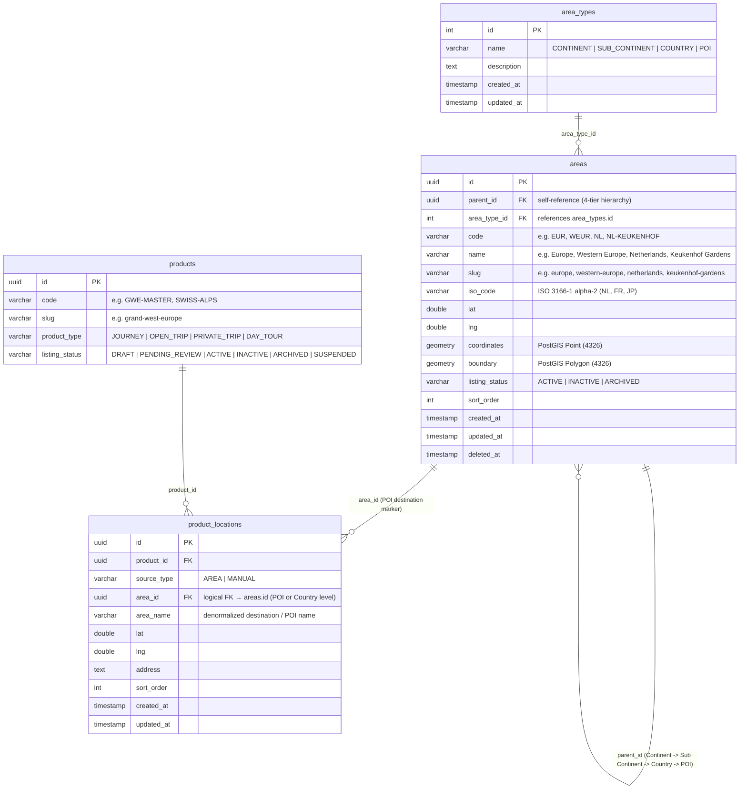
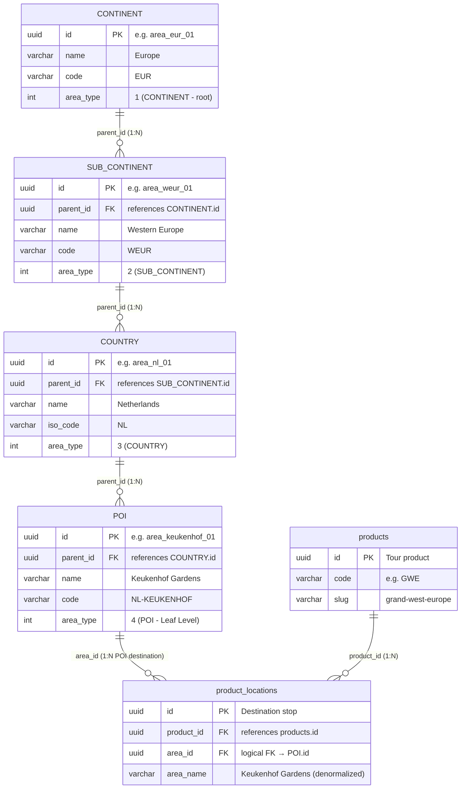
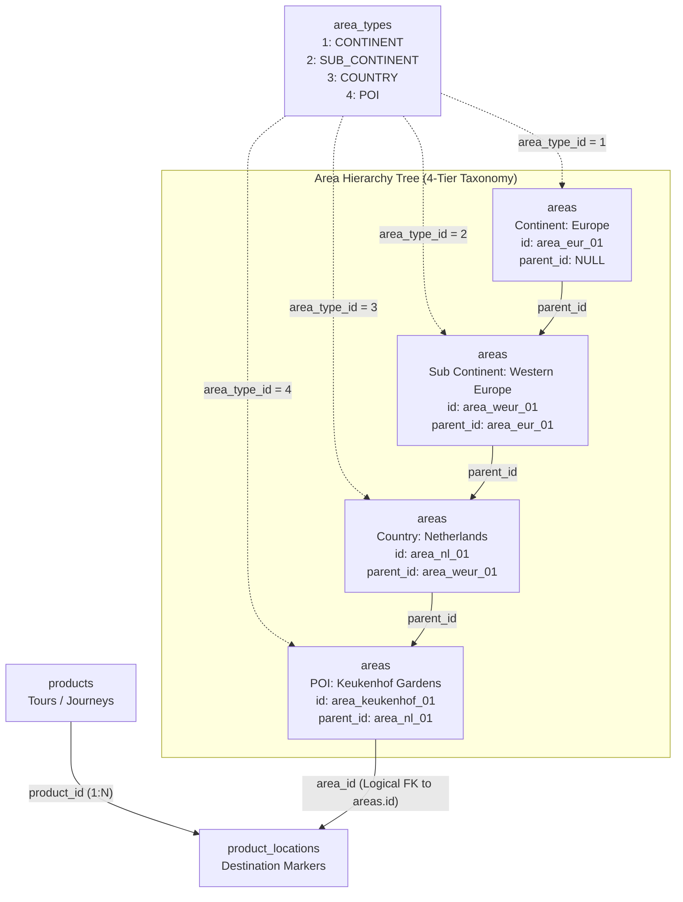

# Area Domain - Technical Data Model & Architecture

> **Overview**
> Technical documentation for the Area/Geography Domain data model. This architecture is centered around managing hierarchical geographical regions, destinations, and administrative boundaries (Continents, Sub Continents, Countries, and POIs / Points of Interest) to support multi-level location mapping across tours, variants, trips, and itinerary stops.
>
> _Engineered for High Scalability, Hierarchical Tree Traversal, and optimized for a NestJS + PostgreSQL stack._

> **See Also:**
> - [Product Technical Design](./product-technical-design.md) — Cross-domain `product_locations` reference
> - [Search & Filter Architecture](./product-search-filter-technical-design.md) — Area hierarchy joins in search SQL
> - [SEO Technical Design](./seo-technical-design.md) — Destination landing page SEO (`target_type = 'AREA'`)
> - [Area Domain Contracts](../contracts/area-contract.md) — API endpoints, autocomplete, destination landing
> - [Backend Guide](../backend/area-backend-guide.md) — Recursive CTE traversal, PostGIS spatial queries, and caching
> - [Frontend Guide](../frontend/area-frontend-guide.md) — "Where To?" autocomplete widget and destination landing pages

---

## 🏗️ Architecture, Scalability & Engineering Principles

The following architectural guidelines must be strictly adhered to during implementation to ensure enterprise-grade reliability, optimal client consumption, and seamless deployment.

### 1. Hierarchical Closure Pattern & Adjacency List (Continent → Sub Continent → Country → POI)

The geography tree follows a strict 4-tier hierarchy: **Continent → Sub Continent → Country → POI (Point of Interest)**. To handle multi-level geographical relationships efficiently without recursive CTE performance hits on deep reads, the architecture combines an **Adjacency List (`parent_id`)** for simple CRUD operations with composite indexing for rapid subtree lookups. POIs represent individual landmarks, attractions, or specific visiting spots (e.g., *Keukenhof Gardens*, *Eiffel Tower*, *Mount Fuji*).

### 2. DevOps & Automated Migrations

The provided PostgreSQL DDL scripts serve as the foundational schema. These migration scripts must be version-controlled and integrated directly into CI/CD deployment pipelines to maintain consistent geographic reference data states across staging and production environments.

### 3. Handling Polymorphic & Spatial Extensions

Areas act as anchor points for multiple entities (`products`, `product_locations`, `hotels`, `airports`).

- **Geospatial Indexing:** We utilize PostgreSQL's **PostGIS** extension (`GEOMETRY` / `GEOGRAPHY` types) alongside spatial B-Tree/GiST indexes (`USING GIST`) to support high-performance radius searches and boundary containment queries (e.g., "Find all products within a 50km radius of Central Jakarta").
- **Denormalized Redundancy:** To minimize complex multi-table joins during high-traffic product catalog rendering, child records (such as `product_locations`) store denormalized metadata (`area_name`, `country_code`) while maintaining strict foreign-key references to `areas.id`.

### 4. Concurrency & Reference Data Integrity

Geographic master data is largely read-heavy and updated infrequently by administrative jobs. Implement **Read-Through Caching** (via Redis) in NestJS for area hierarchies and popular destination nodes to reduce database load to near-zero for search widget autocomplete endpoints.

### 5. Precision & Geospatial Standards

Geographic coordinates (`lat`, `lng`) are strictly cast as `DOUBLE PRECISION` (or `GEOMETRY(Point, 4326)` using standard WGS 84 spatial reference systems). Bounding boxes and polygons use standard GeoJSON formatting for seamless frontend map rendering (Mapbox / Google Maps integration).

---

## 🛠️ PostgreSQL DDL Migration Script

Use this schema as the baseline for your ORM migrations.

```sql
-- =========================================================================
-- 1. EXTENSIONS & SPATIAL SETUP
-- =========================================================================
CREATE EXTENSION IF NOT EXISTS "uuid-ossp";
CREATE EXTENSION IF NOT EXISTS "postgis"; -- Required for advanced spatial queries

-- =========================================================================
-- 2. AREA / GEOGRAPHY CORE TABLES
-- =========================================================================
CREATE TABLE area_types (
    id SERIAL PRIMARY KEY,
    name VARCHAR(50) NOT NULL UNIQUE, -- 'CONTINENT' | 'SUB_CONTINENT' | 'COUNTRY' | 'POI'
    description TEXT,
    created_at TIMESTAMP NOT NULL DEFAULT CURRENT_TIMESTAMP,
    updated_at TIMESTAMP NOT NULL DEFAULT CURRENT_TIMESTAMP,

    CONSTRAINT chk_area_types_name CHECK (name IN ('CONTINENT', 'SUB_CONTINENT', 'COUNTRY', 'POI'))
);

CREATE TABLE areas (
    id UUID PRIMARY KEY DEFAULT uuid_generate_v4(),
    parent_id UUID REFERENCES areas(id) ON DELETE CASCADE, -- Adjacency list for 4-tier hierarchy
    area_type_id INT NOT NULL REFERENCES area_types(id) ON DELETE RESTRICT,
    code VARCHAR(50) UNIQUE NOT NULL, -- e.g., 'EUR', 'WEUR', 'NL', 'NL-KEUKENHOF'
    name VARCHAR(255) NOT NULL,
    slug VARCHAR(255) UNIQUE NOT NULL,
    iso_code VARCHAR(10), -- ISO 3166-1 alpha-2 for countries (e.g. NL, FR, JP)
    lat DOUBLE PRECISION,
    lng DOUBLE PRECISION,
    coordinates GEOMETRY(Point, 4326), -- PostGIS point for POI exact location
    boundary GEOMETRY(Polygon, 4326),  -- PostGIS polygon for countries / sub-continents
    listing_status VARCHAR(50) NOT NULL DEFAULT 'ACTIVE', -- ACTIVE | INACTIVE | ARCHIVED
    sort_order INT DEFAULT 0,
    created_at TIMESTAMP NOT NULL DEFAULT CURRENT_TIMESTAMP,
    updated_at TIMESTAMP NOT NULL DEFAULT CURRENT_TIMESTAMP,
    deleted_at TIMESTAMP NULL,

    CONSTRAINT chk_areas_listing_status CHECK (listing_status IN ('ACTIVE', 'INACTIVE', 'ARCHIVED'))
);

-- COMPOSITE & SPATIAL INDEXES
CREATE INDEX idx_areas_parent_id ON areas(parent_id);
CREATE INDEX idx_areas_type ON areas(area_type_id);
CREATE INDEX idx_areas_boundary_gist ON areas USING GIST (boundary);
CREATE INDEX idx_areas_coordinates_gist ON areas USING GIST (coordinates);
CREATE INDEX idx_areas_slug ON areas(slug);

-- =========================================================================
-- 3. AUDIT TRIGGER AUTOMATION
-- =========================================================================
CREATE OR REPLACE FUNCTION set_updated_at_timestamp()
RETURNS TRIGGER AS $$
BEGIN
    NEW.updated_at = CURRENT_TIMESTAMP;
    RETURN NEW;
END;
$$ LANGUAGE plpgsql;

CREATE TRIGGER trg_area_types_updated_at BEFORE UPDATE ON area_types FOR EACH ROW EXECUTE FUNCTION set_updated_at_timestamp();
CREATE TRIGGER trg_areas_updated_at      BEFORE UPDATE ON areas      FOR EACH ROW EXECUTE FUNCTION set_updated_at_timestamp();
```

---

## 📊 Domain Data Scenario

**Area Hierarchy:** Europe (Continent) -> Western Europe (Sub Continent) -> Netherlands (Country) -> Keukenhof Gardens (POI)  
**Root Area ID:** `area_eur_01`

_(Sample data is included below each respective ERD block to illustrate context)._

### 1. Core Area & Cross-Domain Entity Relationship Diagram (ERD)



**Sample Data**

> _(Note: Standard audit timestamps `created_at`, `updated_at`, and `deleted_at` are defined in the schema and ERD above, but omitted from the sample data tables below for readability)._

**`area_types`**

| id | name | description |
| :--- | :--- | :--- |
| 1 | CONTINENT | Global continental landmasses and geographic macro-regions (root level) |
| 2 | SUB_CONTINENT | Sub-continental regions and geopolitical sub-divisions |
| 3 | COUNTRY | Sovereign states and independent nations |
| 4 | POI | Point of Interest, landmark, attraction, or specific activity spot |

**`areas`**

| id | parent_id | area_type_id | code | name | slug | iso_code | lat | lng | listing_status | sort_order |
| :--- | :--- | :--- | :--- | :--- | :--- | :--- | :--- | :--- | :--- | :--- |
| area_eur_01 | NULL | 1 | EUR | Europe | europe | NULL | 54.5260 | 15.2551 | ACTIVE | 1 |
| area_weur_01 | area_eur_01 | 2 | WEUR | Western Europe | western-europe | NULL | 48.8566 | 2.3522 | ACTIVE | 2 |
| area_nl_01 | area_weur_01 | 3 | NL | Netherlands | netherlands | NL | 52.1326 | 5.2913 | ACTIVE | 3 |
| area_keukenhof_01 | area_nl_01 | 4 | NL-KEUKENHOF | Keukenhof Gardens | keukenhof-gardens | NULL | 52.2699 | 4.5463 | ACTIVE | 4 |

**`product_locations` (Cross-Domain Mapping Sample)**

| id | product_id | source_type | area_id | area_name | lat | lng | address | sort_order |
| :--- | :--- | :--- | :--- | :--- | :--- | :--- | :--- | :--- |
| loc_nl_01 | prod_gwe_01 | AREA | area_keukenhof_01 | Keukenhof Gardens | 52.2699 | 4.5463 | Stationsweg 166A, 2161 AM Lisse, Netherlands | 1 |

---

### 2. 4-Tier Area Hierarchy ERD (Conceptual Level View)

This conceptual ERD illustrates how the 4 geographical tiers relate hierarchically via `parent_id` and terminate at the `POI` level where tour products and itinerary stops anchor their visits:



---

### 3. High-Level Global Area Hierarchy Tree (Architecture Flowchart)


