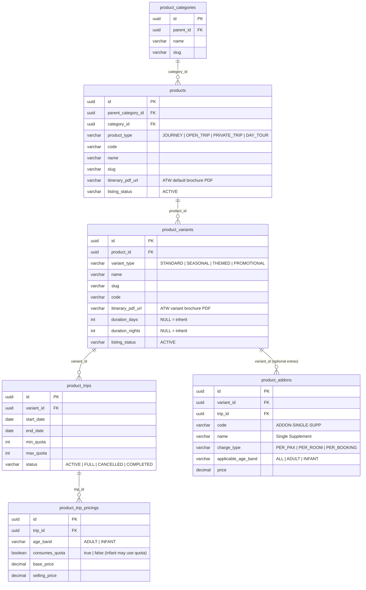
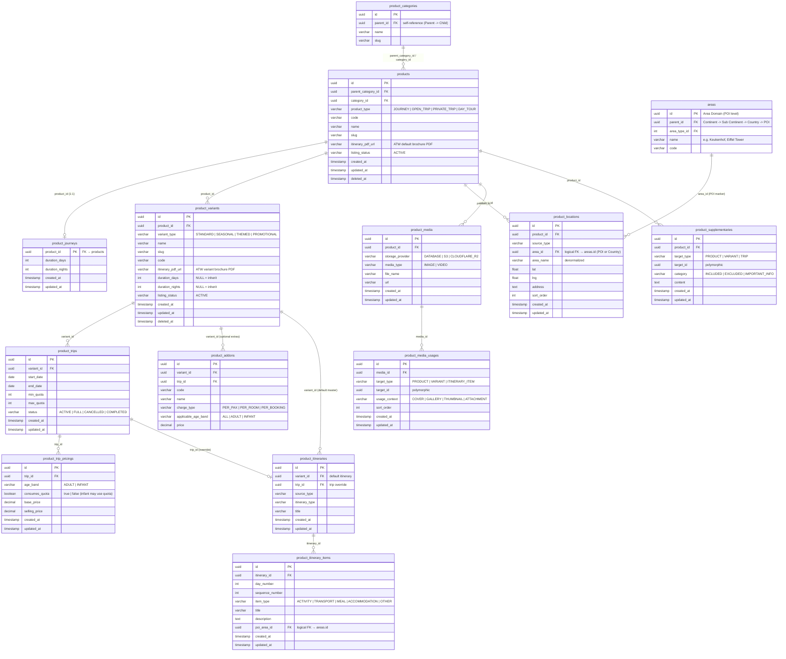
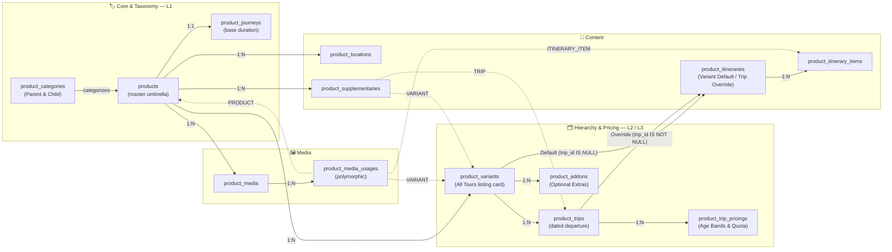

# Product Hierarchy — Technical Data Model & Architecture

> **Overview**
> The **3-level Product Hierarchy** (`products` → `product_variants` → `product_trips`) is the backbone of how tours are structured and surfaced on the website. The **All Tours** listing page renders one card per **variant**, not per product.

**Document Map:**

| Document                                                       | Responsibility                                                                                |
| -------------------------------------------------------------- | --------------------------------------------------------------------------------------------- |
| **This file**                                                  | Hierarchy mental model, ERDs, engineering principles, GWE sample data, relationship reference |
| [Product Technical Design](./product-technical-design.md)      | **Complete DDL schema** (authoritative), per-table ERDs, Grand West Europe sample data         |
| [Product Media](./product-media-technical-design.md)           | Media asset repository, polymorphic usages, presigned uploads, CDN delivery                   |
| [Search & Filter](./product-search-filter-technical-design.md) | Search API contract, SQL search query, indexing strategy                                      |
| [Area Domain](./area-technical-design.md)                      | 4-tier geography tree (Continent → Sub Continent → Country → POI), PostGIS spatial model     |
| [Contracts](../contracts/product-hierarchy-contract.md)        | All Tours listing feed, variant detail view API contracts                                     |
| [Backend Guide](../backend/product-hierarchy-backend-guide.md)  | Duration COALESCE resolution, pessimistic booking lock (SELECT FOR UPDATE)                    |
| [Frontend Guide](../frontend/product-hierarchy-frontend-guide.md)| All Tours catalog card, variant type badging, age-band pricing breakdown selector           |

---

## 🧠 Hierarchy Mental Model

```
products  (master brand / program umbrella + Parent & Child Category taxonomy)
  └── product_variants  (bookable listing card on All Tours + DEFAULT Master Itinerary + Base Add-ons)
        └── product_trips  (concrete dated departure + OVERRIDE Itinerary + Age-Band Pricings & Inclusions)
```

**Real-world example — Grand West Europe (GWE):**

```
products [prod_gwe_01]
├── Category: Travel Style (Parent) -> Popular Group Tours (Child)
├── Name: Grand West Europe
│
├── product_variants (Each variant is strictly one card on All Tours)
│   ├── GWE Classic All-Year [var_gwe_std_26]  (variant_type = 'STANDARD')    ← card 1: Core recurring package
│   │     ├── Default Itinerary: 11D Western Europe Classic Program (Amsterdam, Paris, Swiss Alps)
│   │     ├── Add-ons: Single Supplement (Rp 8.5M), Mount Titlis & Ice Flyer (Rp 2.4M)
│   │     └── product_trips: 05 Aug 2026 → 15 Aug 2026 (max 30 pax)
│   │           └── All-Inclusive Pricings & Age Bands:
│   │                 ├── ADULT: Rp 28.5M (consumes_quota = TRUE) [All-inclusive base package]
│   │                 └── INFANT: Rp 6.5M (consumes_quota = FALSE for lap infant, or TRUE if seat allocated)
│   │
│   ├── GWE Spring 2026      [var_gwe_spr_26]  (variant_type = 'SEASONAL')    ← card 2: Spring season series
│   │     ├── Default Itinerary: 11D Spring Blossom Western Europe
│   │     └── product_trips: 10 Sept 2026 → 20 Sept 2026 (max 30 pax)
│   │           ├── Itinerary: Inherits Variant Default Itinerary
│   │           └── All-Inclusive Pricings & Age Bands:
│   │                 ├── ADULT: Rp 28.0M (consumes_quota = TRUE)
│   │                 └── INFANT: Rp 6.5M (consumes_quota = FALSE for lap infant, or TRUE if seat allocated)
│   │
│   ├── GWE Summer 2026      [var_gwe_sum_26]  (variant_type = 'SEASONAL')    ← card 3: Summer school holiday
│   ├── GWE Tulip Keukenhof  [var_gwe_tlp_26]  (variant_type = 'THEMED')      ← card 4: Keukenhof tulip festival
│   │     └── product_trips: 15 Apr 2026 → 25 Apr 2026 (max 25 pax)
│   │           ├── Itinerary: OVERRIDE -> 11D Tulip Special Keukenhof Peak Itinerary
│   │           └── All-Inclusive Pricings & Age Bands:
│   │                 ├── ADULT: Rp 31.0M (consumes_quota = TRUE)
│   │                 └── INFANT: Rp 7.0M (consumes_quota = FALSE for lap infant, or TRUE if seat allocated)
│   │
│   └── Early Bird Europe    [var_gwe_eb_26]   (variant_type = 'PROMOTIONAL') ← card 5: Flash promotional package
```

**Key rules:**
| Layer | Entity | Role | Key Classification / Type |
|---|---|---|---|
| **L1** | `products` | Master brand umbrella & taxonomy. Owns categories, base duration, locations, media, supplementary content | `product_type` (`JOURNEY`, `OPEN_TRIP`, `PRIVATE_TRIP`, `DAY_TOUR`), `listing_status` (`DRAFT`, `PENDING_REVIEW`, `ACTIVE`, `INACTIVE`, `ARCHIVED`, `SUSPENDED`) |
| **L2** | `product_variants` | Primary storefront listing card on All Tours. Owns default master itinerary & optional add-on configurations | `variant_type` (`STANDARD`, `SEASONAL`, `THEMED`, `PROMOTIONAL`), `listing_status` (inherits / independent status) |
| **L3** | `product_trips` | Concrete dated departure window with quota & optional trip override itinerary | `status` (`ACTIVE`, `FULL`, `CANCELLED`, `COMPLETED`) |
| **L3+** | `product_trip_pricings` | Price tiers per trip resolved by age band and dynamic capacity quota rules | `age_band` (`ADULT`, `INFANT`), `consumes_quota` (`BOOLEAN`) |

### Variant Types & Frontend Presentation

| `variant_type`    | Purpose & Characteristics                                                                                | Real-World Example in Hobiholidays                              | UI Badging on All Tours Card            |
| ----------------- | -------------------------------------------------------------------------------------------------------- | --------------------------------------------------------------- | --------------------------------------- |
| **`STANDARD`**    | Core year-round package with fixed recurring departures; unaffected by seasonal or promotional gimmicks. | _GWE Classic 11D_, _GWE Signature All-Year_                      | None / `⭐ Classic`                     |
| **`SEASONAL`**    | Tied strictly to natural seasons & regional climate windows (Spring, Summer, Autumn, Winter).            | _GWE Spring 2026_, _GWE Summer Keukenhof_, _Swiss Winter Alps_  | `🌸 Spring` / `🍂 Autumn` / `❄️ Winter` |
| **`THEMED`**      | Centered around special events, foliage, festivals, or cultural attractions.                             | _Tulip Edition (Keukenhof)_, _Swiss Glacier Wonderland_         | `🌷 Tulip Edition` / `🎌 Festival`      |
| **`PROMOTIONAL`** | Limited-seat commercial releases, early bird launches, or flash sale campaigns.                          | _Early Bird Europe 2026_, _Flash Sale GWE IDR 24.9M_             | `🔥 Flash Sale` / `⚡ Early Bird`       |

---

## 🏗️ Engineering Principles

### 1. Cascade Integrity

All FK relationships use `ON DELETE CASCADE` downward through the hierarchy. Deleting a product auto-removes all its variants, their trips, and pricings in a single transactional operation.

### 2. Duration Inheritance

`product_variants.duration_days / duration_nights` are **nullable**. `NULL` = inherit from `product_journeys`. Overrides are explicitly set on the variant row. Application layer must resolve using `COALESCE(pv.duration_days, pj.duration_days)`.

### 3. Quota Concurrency & Age-Band Seat Allocation

`product_trips.max_quota` represents the maximum bookable seat capacity. During booking:
- Use **Pessimistic Locking** (`SELECT ... FOR UPDATE`) on the trip row to prevent overselling.
- **Seat Allocation Rule:** Quota consumption is governed dynamically by `product_trip_pricings.consumes_quota` (`BOOLEAN NOT NULL DEFAULT TRUE`).
  - For **`ADULT`**: Typically `consumes_quota = TRUE` (deducts 1 seat from available quota).
  - For **`INFANT` (< 24 months)**: Configurable `BOOLEAN`. If the infant is allocated a dedicated seat on the flight/bus or an infant cot, `consumes_quota = TRUE`. If travelling as a lap infant without dedicated seat capacity, `consumes_quota = FALSE`.
- Concurrency equation:
  ```sql
  required_seats = COUNT(*) FILTER (WHERE ptp.consumes_quota = TRUE)
  ASSERT (current_booked_seats + required_seats <= trip.max_quota)
  ```

### 4. Trip-Scoped Departures

`product_trips` are owned by a **variant**, not directly by a product. This allows different variants under the same product umbrella (e.g., "Spring" vs "Summer") to have entirely independent departure calendars, quotas, and pricing.

### 5. Itinerary Ownership & Fallback (Variant Default → Trip Override)

Itineraries are decoupled from base products and anchored to variants:
- **Variant Default (`trip_id IS NULL`):** Every variant maintains a standard master itinerary.
- **Trip Override (`trip_id IS NOT NULL`):** Individual trips may override the master itinerary for date-specific variations (e.g. holiday parades, seasonal closures).
- **Application Fallback:** `resolved_itinerary = trip.itinerary ?? variant.itinerary`.

### 6. All-Inclusive Base Pricing & Excluded Add-on Architecture

- **All-Inclusive Base Package Price:** The base selling price on `product_trip_pricings` represents the complete tour package (international flights, accommodations, transport, meals, tour guide, and entrance tickets). Textual inclusions and exclusions are documented transparently via `product_supplementaries` (`INCLUDED` and `EXCLUDED`).
- **Excluded Add-ons (`product_addons`):** Configured at Variant level (and optionally supplemented at Trip level) for elective traveler upgrades that are **excluded** from the base price (Single Supplement, Hot Air Balloon, Extra Baggage). Add-ons specify `applicable_age_band` (`ADULT`, `INFANT`, or `ALL`) and supplement base pricing during booking checkout.

### 7. Polymorphic Target Resolution

Media usages and supplementary content target entities via `(target_type, target_id)`:

| `target_type`    | Resolves to                  |
| ---------------- | ---------------------------- |
| `PRODUCT`        | `products.id`                |
| `VARIANT`        | `product_variants.id`        |
| `TRIP`           | `product_trips.id`           |
| `ITINERARY_ITEM` | `product_itinerary_items.id` |

---

## 🛠️ DDL Schema Reference

> [!NOTE]
> The complete, authoritative PostgreSQL DDL for all hierarchy tables lives in **[Product Technical Design](./product-technical-design.md#-postgresql-ddl-schema)**.

Key schema decisions specific to this hierarchy:

| Decision                                                                 | Detail                                                                                                              |
| ------------------------------------------------------------------------ | ------------------------------------------------------------------------------------------------------------------- |
| `product_categories` 2-tier tree                                        | Parent (`parent_id IS NULL`) and Child (`parent_id NOT NULL`)                                                        |
| `product_variants.duration_days` nullable                                | `NULL` = inherit from `product_journeys` via `COALESCE`                                                             |
| `product_variants.itinerary_pdf_url` nullable                            | ATW brochure PDF URL; `COALESCE(v.itinerary_pdf_url, p.itinerary_pdf_url)`                                          |
| `product_variants.variant_type` classification                           | Enforced via `CHECK (variant_type IN ('STANDARD', 'SEASONAL', 'THEMED', 'PROMOTIONAL'))`                            |
| `listing_status` lifecycle states                                        | Enforced via `CHECK (listing_status IN ('DRAFT', 'PENDING_REVIEW', 'ACTIVE', 'INACTIVE', 'ARCHIVED', 'SUSPENDED'))` |
| `age_band` pricing tiers (`consumes_quota`)                              | Enforced via `CHECK (age_band IN ('ADULT', 'INFANT'))`                                             |
| `UNIQUE(variant_id, start_date)` on `product_trips`                      | One departure per variant per calendar date                                                                         |
| `UNIQUE(trip_id, age_band)` on `product_trip_pricings`                   | One price row per trip per age band                                                                                 |
| `uq_itinerary_variant_default` partial index                             | Exactly 1 master itinerary per variant where `trip_id IS NULL`                                                      |
| `CHECK (end_date > start_date)` on `product_trips`                       | DB-level sanity guard on date windows                                                                               |
| `CHECK (status IN ('ACTIVE', 'FULL', 'CANCELLED', 'COMPLETED'))`         | DB-level trip lifecycle guard                                                                                       |
| `CHECK (selling_price > 0 AND base_price >= selling_price)`              | DB-level price sanity guard                                                                                         |

---

## 📊 Entity Relationship Diagrams

### ERD 1 — Core Hierarchy Chain


---

### ERD 2 — Full Product Domain (All Tables)



---

### ERD 3 — Architecture Overview (Flowchart)


---

## 📋 Sample Data — Grand West Europe (GWE)

> _(Note: Standard audit timestamps `created_at`, `updated_at`, and `deleted_at` are defined in the schema and ERDs above, but omitted from the sample data tables below for readability)._

### `product_categories`

| id | parent_id | name | slug |
| :--- | :--- | :--- | :--- |
| cat_travel_style | NULL | Travel Style | travel-style |
| cat_cultural_heritage | cat_travel_style | Cultural & Heritage | cultural-heritage |

### `products`

| id | parent_category_id | category_id | product_type | code | slug | listing_status |
| :--- | :--- | :--- | :--- | :--- | :--- | :--- |
| prod_gwe_01 | cat_travel_style | cat_cultural_heritage | JOURNEY | GWE | grand-west-europe | ACTIVE |

### `product_journeys`

| product_id | duration_days | duration_nights |
| :--- | :--- | :--- |
| prod_gwe_01 | 7 | 6 |

---

### `product_variants`

| id | product_id | variant_type | name | slug | code | duration_days | duration_nights | listing_status |
| :--- | :--- | :--- | :--- | :--- | :--- | :--- | :--- | :--- |
| var_gwe_std_26 | prod_gwe_01 | STANDARD | GWE Classic All-Year | gwe-classic-all-year | GWE-STD-2026 | NULL (7) | NULL (6) | ACTIVE |
| var_gwe_spr_26 | prod_gwe_01 | SEASONAL | GWE Spring 2026 | gwe-spring-2026 | GWE-SPR-2026 | NULL (7) | NULL (6) | ACTIVE |
| var_gwe_sum_26 | prod_gwe_01 | SEASONAL | GWE Summer 2026 | gwe-summer-2026 | GWE-SUM-2026 | NULL (7) | NULL (6) | ACTIVE |
| var_tulip_26 | prod_gwe_01 | THEMED | Tulip Edition | tulip | GWE-TLP-2026 | 8 (override) | 7 (override) | ACTIVE |
| var_gwe_eb_26 | prod_gwe_01 | PROMOTIONAL | GWE Early Bird 2026 | gwe-early-bird-2026 | GWE-EB-2026 | NULL (7) | NULL (6) | ACTIVE |

> 💡 `NULL` duration_days means the variant **inherits** from `product_journeys` via `COALESCE`.
> **All Tours** page renders **5 cards** — one per variant across all 4 `variant_type` classifications.

---

### `product_trips`

| id | variant_id | start_date | end_date | min_quota | max_quota | status |
| :--- | :--- | :--- | :--- | :--- | :--- | :--- |
| trip_std_01 | var_gwe_std_26 | 2026-08-05 | 2026-08-12 | 5 | 30 | ACTIVE |
| trip_spr_01 | var_gwe_spr_26 | 2026-09-10 | 2026-09-17 | 5 | 30 | ACTIVE |
| trip_spr_02 | var_gwe_spr_26 | 2026-09-17 | 2026-09-24 | 5 | 30 | ACTIVE |
| trip_sum_01 | var_gwe_sum_26 | 2026-07-10 | 2026-07-17 | 5 | 30 | ACTIVE |
| trip_sum_02 | var_gwe_sum_26 | 2026-07-17 | 2026-07-24 | 5 | 30 | ACTIVE |
| trip_tlp_01 | var_tulip_26 | 2026-09-10 | 2026-09-17 | 5 | 25 | ACTIVE |
| trip_tlp_02 | var_tulip_26 | 2026-09-17 | 2026-09-24 | 5 | 25 | ACTIVE |
| trip_eb_01 | var_gwe_eb_26 | 2026-10-15 | 2026-10-22 | 5 | 15 | ACTIVE |

---

### 2. Variants, Trips, Age-Band Pricing & Add-ons

| id | trip_id | age_band | consumes_quota | base_price | selling_price |
| :--- | :--- | :--- | :--- | :--- | :--- |
| price_std_adult | trip_std_01 | ADULT | TRUE | 33000000.00 | 29500000.00 |
| price_std_infant | trip_std_01 | INFANT | FALSE (or TRUE if seat allocated) | 8000000.00 | 6500000.00 |
| price_spr_adult | trip_spr_01 | ADULT | TRUE | 32000000.00 | 28000000.00 |
| price_sum_adult | trip_sum_01 | ADULT | TRUE | 30000000.00 | 26500000.00 |
| price_tlp_adult | trip_tlp_01 | ADULT | TRUE | 35000000.00 | 31000000.00 |
| price_eb_adult | trip_eb_01 | ADULT | TRUE | 29500000.00 | 24500000.00 |

### `product_addons` (Optional Extras for Variant `var_gwe_std_26`)

| id | variant_id | trip_id | code | name | charge_type | price | applicable_age_band | is_mandatory |
| :--- | :--- | :--- | :--- | :--- | :--- | :--- | :--- | :--- |
| addon_gwe_01 | var_gwe_std_26 | NULL | ADDON-SINGLE-SUPP | Single Supplement (Kamar Sendiri) | PER_ROOM | 8500000.00 | ADULT | FALSE |
| addon_gwe_02 | var_gwe_std_26 | NULL | ADDON-EXTRA-BAG-10KG| Bagasi Ekstra +10kg | PER_PAX | 1500000.00 | NULL (ALL) | FALSE |

---

## 🔍 Search Query Reference

> [!NOTE]
> The complete search SQL query, API contract (NestJS DTO), and full indexing strategy are documented in **[Search & Filter Architecture](./product-search-filter-technical-design.md)**.

**Quick summary:** The search query drives the **All Tours listing page**. It takes `product_variants` as the primary FROM clause (not `products`) and returns **one row per variant**, with the following join chain:

```
product_variants
  → products              (parent product status check, product name filter)
    → product_categories  (Parent Category & Child Category filter)
  → product_journeys      (COALESCE duration fallback)
  → product_locations     (destination markers)
    → areas poi           (POI destination marker)
    → areas country       (Country parent)
    → areas sub_continent (Sub Continent parent)
    → areas continent     (Continent root)
  → product_trips         (date range + total pack / pax quota filter)
  → product_trip_pricings (filter ADULT price range [minPrice..maxPrice] + MIN starting price per card)
```

---

## 🗺️ Complete Relationship Reference

| Relationship                                      | Type              | Cardinality | Constraint                                                 |
| :------------------------------------------------ | :---------------- | :---------- | :--------------------------------------------------------- |
| `product_categories` → `products`                 | Hard FK           | 1 : N       | `ON DELETE SET NULL` (parent & child category)             |
| `products` → `product_journeys`                   | Hard FK           | 1 : 1       | `ON DELETE CASCADE`                                        |
| `products` → `product_variants`                   | Hard FK           | 1 : N       | `ON DELETE CASCADE`                                        |
| `product_variants` → `product_trips`              | Hard FK           | 1 : N       | `ON DELETE CASCADE` + `UNIQUE(variant_id, start_date)`     |
| `product_trips` → `product_trip_pricings`         | Hard FK           | 1 : N       | `ON DELETE CASCADE` + `UNIQUE(trip_id, age_band)`          |
| `product_variants` → `product_addons`             | Hard FK           | 1 : N       | `ON DELETE CASCADE` (optional extras)                      |
| `product_variants` → `product_itineraries`        | Hard FK           | 1 : 1       | `ON DELETE CASCADE` + `uq_itinerary_variant_default`       |
| `product_trips` → `product_itineraries`           | Hard FK           | 1 : 1       | `ON DELETE CASCADE` + `uq_itinerary_trip_override`         |
| `product_itineraries` → `items`                   | Hard FK           | 1 : N       | `ON DELETE CASCADE` (`product_itinerary_items`)            |
| `products` → `product_locations`                  | Hard FK           | 1 : N       | `ON DELETE CASCADE`                                        |
| `areas` → `product_locations`                     | Logical FK        | 1 : N       | Inter-domain reference (POI destination marker)            |
| `products` → `product_media`                      | Hard FK           | 1 : N       | `ON DELETE CASCADE`                                        |
| `product_media` → `product_media_usages`          | Hard FK           | 1 : N       | `ON DELETE CASCADE`                                        |
| `products` → `product_supplementaries`            | Hard FK           | 1 : N       | `ON DELETE CASCADE`                                        |

---

## 📌 Schema Design Notes

> [!NOTE]
> This is an **initial schema design** — there are no legacy tables to migrate from. The hierarchy `products → product_variants → product_trips` is the canonical data model from day one.

> [!NOTE]
> `product_journeys` stores the **base duration** at the product level. It is not deleted or superseded. The application layer resolves effective duration using:
>
> ```sql
> COALESCE(pv.duration_days, pj.duration_days) AS duration_days
> ```
>
> This allows individual variants to override duration without touching the product-level default.

> [!NOTE]
> **Audit Timestamps Standard:** All tables enforce `created_at TIMESTAMP NOT NULL DEFAULT CURRENT_TIMESTAMP` and `updated_at TIMESTAMP NOT NULL DEFAULT CURRENT_TIMESTAMP`. Core catalog entities (`products`, `product_variants`, `areas`) also support soft deletes via nullable `deleted_at TIMESTAMP NULL`. Row mutations automatically update `updated_at` via PostgreSQL trigger function `set_updated_at_timestamp()`.
