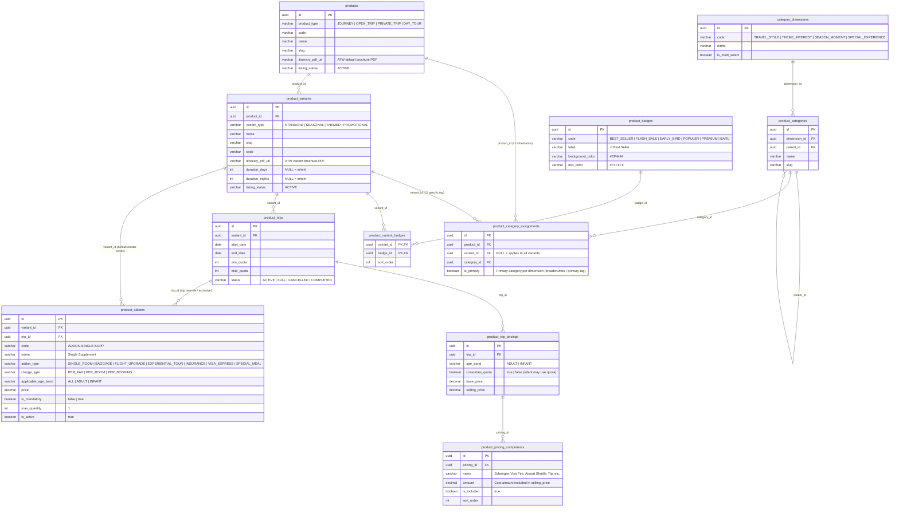
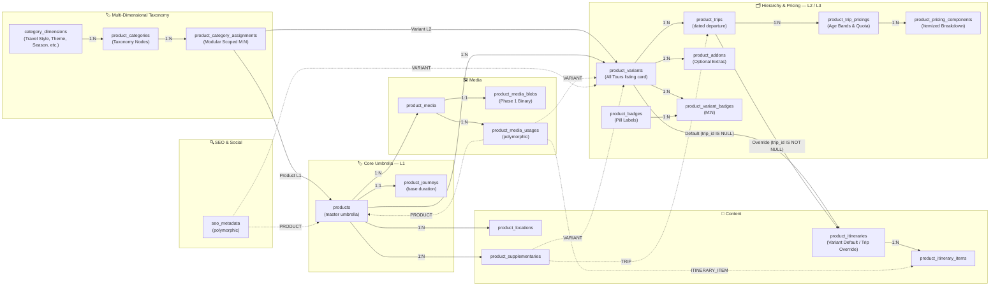

# Product Hierarchy — Technical Data Model & Architecture

> **Overview**
> The **3-level Product Hierarchy** (`products` → `product_variants` → `product_trips`) is the backbone of how tours are structured and surfaced on the website. The **All Tours** listing page renders one card per **variant**, not per product.

**Document Map:**

| Document                                                       | Responsibility                                                                                |
| -------------------------------------------------------------- | --------------------------------------------------------------------------------------------- |
| **This file**                                                  | Hierarchy mental model, ERDs, engineering principles, GWE sample data, relationship reference |
| [Product Technical Design](./product-technical-design.md)      | **Complete DDL schema** (authoritative), per-table ERDs, Grand West Europe sample data         |
| [Product Media](./product-media-technical-design.md)           | Media asset repository, polymorphic usages, presigned uploads, CDN delivery                   |
| [Search & Filter](./product-search-filter-technical-design.md) | Search API contract, SQL search query, indexing strategy                                      |
| [Area Domain](./area-technical-design.md)                      | 4-tier geography tree (Continent → Sub Continent → Country → POI), pure relational model |
| [Contracts](../contracts/product-hierarchy-contract.md)        | All Tours listing feed, variant detail view API contracts                                     |
| [Backend Guide](../backend/product-hierarchy-backend-guide.md)  | Duration COALESCE resolution, catalog aggregation                                             |
| [Frontend Guide](../frontend/product-hierarchy-frontend-guide.md)| All Tours catalog card, variant type badging, age-band pricing breakdown selector           |

---

## 🧠 Hierarchy Mental Model

```
category_dimensions  (Taxonomy Dimensions: Travel Style, Theme, Season & Moments, Special Experience)
  └── product_categories  (Faceted Category Nodes with optional intra-dimension hierarchy)
        └── product_category_assignments  (Modular Scoped M:N: Product L1 & Variant L2)

product_badges  (Visual Marketing Badges: Best Seller, Flash Sale, Early Bird, Populer, Baru)
  └── product_variant_badges  (M:N Promotional ribbons/pills on Variant Cards)

products  (master brand / program umbrella + Multi-Dimensional Product-level categories)
  └── product_variants  (bookable listing card + Variant-specific category tags + Badges + DEFAULT Master Itinerary + DEFAULT Master Add-ons)
        └── product_trips  (concrete dated departure + OVERRIDE Itinerary + OVERRIDE / EXCLUSIVE Add-ons)
              └── product_trip_pricings  (Age-Band Pricings & Quota: ADULT / INFANT)
                    └── product_pricing_components  (Bundled Inclusions Breakdown: Base Tour, Visa, Shuttle, Tip)
```

**Real-world catalog examples from Hobiholidays Storefront:**

```
products [prod_gwe_01] (Grand West Europe)
├── Multi-Dimensional Product Categories (L1 - Inherited by all variants):
│   ├── Format Operasional (Travel Style): Popular Group Tours (Primary) [Parent: Travel Style]
│   ├── Tema Wisata (Theme & Interest): Cultural & Wonders (Primary)
│   └── Preferensi Layanan (Special Experience): Halal / Muslim Friendly (Primary)
├── Base Duration: 7 Hari 6 Malam
│
├── product_variants (Each variant is strictly one card on All Tours)
│   ├── GWE Classic All-Year [var_gwe_std_26]  (variant_type = 'STANDARD')    ← card 1: Core recurring package
│   │     ├── Badges / Tags: 🔥 Best Seller
│   │     ├── Default Itinerary: 7D/6N Western Europe Classic Program (Amsterdam, Paris, Swiss Alps)
│   │     ├── Default Add-ons: Single Supplement (Rp 8.5M), Mount Titlis & Ice Flyer (Rp 2.4M), Eiffel Summit (Rp 850k), Schengen Visa VIP (Rp 2.5M)
│   │     └── product_trips: 05 Aug 2026 → 11 Aug 2026 (max 30 pax)
│   │           ├── Itinerary: Inherits Variant Default Itinerary
│   │           ├── Add-ons: Inherits Variant Default Add-ons
│   │           └── All-Inclusive Pricings & Age Bands:
│   │                 ├── ADULT: Rp 28.5M (consumes_quota = TRUE) [All-inclusive base package]
│   │                 │     ├── International Flight & Hotel (Twin-share): Rp 22.0M
│   │                 │     ├── Schengen Visa Fee & Assistance: Rp 2.5M
│   │                 │     ├── Airport Shuttle & Private Coach: Rp 2.5M
│   │                 │     └── Tour Leader & Driver Tipping: Rp 1.5M
│   │                 └── INFANT: Rp 6.5M (consumes_quota = FALSE for lap infant, or TRUE if seat allocated)
│   │
│   ├── GWE Spring 2026      [var_gwe_spr_26]  (variant_type = 'SEASONAL')    ← card 2: Spring season series
│   │     ├── Badges / Tags: 🌸 Spring Edition
│   │     ├── Variant Categories: Season -> Spring & Sakura Season (Primary)
│   │     ├── Default Itinerary: 7D/6N Spring Blossom Western Europe
│   │     ├── Default Add-ons: Inherits GWE catalog standard add-on options
│   │     └── product_trips: 10 Sept 2026 → 16 Sept 2026 (max 30 pax)
│   │           ├── Itinerary: Inherits Variant Default Itinerary
│   │           ├── Add-ons: Inherits Variant Default Add-ons
│   │           └── All-Inclusive Pricings & Age Bands:
│   │                 ├── ADULT: Rp 28.0M (consumes_quota = TRUE)
│   │                 └── INFANT: Rp 6.5M (consumes_quota = FALSE for lap infant, or TRUE if seat allocated)
│   │
│   ├── GWE Summer 2026      [var_gwe_sum_26]  (variant_type = 'SEASONAL')    ← card 3: Summer school holiday
│   │     ├── Badges / Tags: ☀️ Summer Holiday
│   │     ├── Variant Categories: Season -> Summer Holiday (Primary)
│   │     ├── Default Itinerary: 7D/6N Western Europe Summer Vacation Program
│   │     ├── Default Add-ons: Inherits GWE catalog standard add-on options
│   │     └── product_trips: 10 Jul 2026 → 16 Jul 2026 (max 35 pax)
│   │           ├── Itinerary: Inherits Variant Default Itinerary
│   │           ├── Add-ons: Inherits Variant Default Add-ons
│   │           └── All-Inclusive Pricings & Age Bands:
│   │                 ├── ADULT: Rp 10.0M (consumes_quota = TRUE) [Itemized Bundled Rate]
│   │                 │     ├── Biaya Keberangkatan & Land Tour: Rp 9.35M
│   │                 │     ├── Schengen Visa Fee: Rp 500K
│   │                 │     ├── Airport Shuttle & Transfer: Rp 100K
│   │                 │     └── Tour Leader & Driver Tipping: Rp 50K
│   │                 └── INFANT: Rp 6.5M (consumes_quota = FALSE)
│   │                       ├── Infant Airline Ticket & Tax: Rp 5.5M
│   │                       └── Infant Travel Insurance & Admin: Rp 1.0M
│   │
│   ├── GWE Tulip Keukenhof  [var_gwe_tlp_26]  (variant_type = 'THEMED')      ← card 4: Keukenhof tulip festival
│   │     ├── Badges / Tags: 🌷 Tulip Edition
│   │     ├── Variant Categories: Season -> Spring & Sakura Season, Theme -> Sakura & Flower Blooms (Primary)
│   │     ├── Default Itinerary: 7D/6N Tulip Festival Base Itinerary
│   │     └── product_trips: 15 Apr 2026 → 21 Apr 2026 (max 25 pax)
│   │           ├── Itinerary: OVERRIDE -> 7D/6N Tulip Special Keukenhof Peak Itinerary
│   │           ├── Add-ons: OVERRIDE -> Single Supplement (Rp 11.5M - Peak Hotel Surcharge) + EXCLUSIVE Keukenhof Flower Parade VIP Stand (Rp 1.5M)
│   │           └── All-Inclusive Pricings & Age Bands:
│   │                 ├── ADULT: Rp 31.0M (consumes_quota = TRUE)
│   │                 └── INFANT: Rp 7.0M (consumes_quota = FALSE for lap infant, or TRUE if seat allocated)
│   │
│   └── Early Bird Europe    [var_gwe_eb_26]   (variant_type = 'PROMOTIONAL') ← card 5: Flash promotional package
│         ├── Badges / Tags: ⚡ Early Bird
│         ├── Variant Categories: Theme -> Cultural & Wonders (Primary)
│         ├── Default Itinerary: 7D/6N Western Europe Classic Program
│         └── product_trips: 01 Nov 2026 → 07 Nov 2026 (max 20 pax)
│               ├── Itinerary: Inherits Variant Default Itinerary
│               ├── Add-ons: Inherits Variant Default Add-ons
│               └── All-Inclusive Pricings & Age Bands:
│                     ├── ADULT: Rp 24.9M (consumes_quota = TRUE)
│                     └── INFANT: Rp 6.0M (consumes_quota = FALSE for lap infant, or TRUE if seat allocated)
```

**Key rules:**
| Layer | Entity | Role | Key Classification / Type |
|---|---|---|---|
| **L1** | `products` | Master brand umbrella & taxonomy. Owns multi-dimensional category assignments, base duration, locations, media, supplementary content | `product_type` (`JOURNEY`, `OPEN_TRIP`, `PRIVATE_TRIP`, `DAY_TOUR`), `listing_status` (`DRAFT`, `PENDING_REVIEW`, `ACTIVE`, `INACTIVE`, `ARCHIVED`, `SUSPENDED`) |
| **L2** | `product_variants` | Primary storefront listing card on All Tours. Owns variant-specific category overrides/additions, default master itinerary & optional add-on configurations | `variant_type` (`STANDARD`, `SEASONAL`, `THEMED`, `PROMOTIONAL`), `listing_status` (inherits / independent status) |
| **L3** | `product_trips` | Concrete dated departure window with quota & optional trip override itinerary | `status` (`ACTIVE`, `FULL`, `CANCELLED`, `COMPLETED`) |
| **L3+** | `product_trip_pricings` | Price tiers per trip resolved by age band and dynamic capacity quota rules | `age_band` (`ADULT`, `INFANT`), `consumes_quota` (`BOOLEAN`) |
| **L3++**| `product_pricing_components`| Itemized cost components included within the selling price (Visa, Shuttle, Tipping, Flights) | `name`, `amount`, `is_included` (`BOOLEAN`) |

### Variant Types & Frontend Presentation

| `variant_type`    | Purpose & Characteristics                                                                                | Real-World Example in Hobiholidays                              | UI Badging on All Tours Card            |
| ----------------- | -------------------------------------------------------------------------------------------------------- | --------------------------------------------------------------- | --------------------------------------- |
| **`STANDARD`**    | Core year-round package with fixed recurring departures; unaffected by seasonal or promotional gimmicks. | _GWE Classic All-Year_, _GWE Signature All-Year_                 | None / `⭐ Classic` / `🔥 Best Seller`   |
| **`SEASONAL`**    | Tied strictly to natural seasons & regional climate windows (Spring, Summer, Autumn, Winter).            | _GWE Spring 2026_, _GWE Summer 2026_, _Swiss Winter Alps_       | `🌸 Spring` / `☀️ Summer` / `❄️ Winter`  |
| **`THEMED`**      | Centered around special events, foliage, festivals, or cultural attractions.                             | _GWE Tulip Keukenhof_, _Swiss Glacier Wonderland_               | `🌷 Tulip Edition` / `🎌 Festival`      |
| **`PROMOTIONAL`** | Limited-seat commercial releases, early bird launches, or flash sale campaigns.                          | _Early Bird Europe 2026_, _Flash Sale GWE IDR 24.9M_             | `🔥 Flash Sale` / `⚡ Early Bird`       |

---

## 🏗️ Engineering Principles

### 1. Safe & Idempotent Catalog Lifecycle (No Hard Cascade Delete Required)

To preserve data integrity during catalog synchronization from ATW, entities are governed by `listing_status` (`ACTIVE`, `INACTIVE`, `ARCHIVED`) and soft-delete timestamps (`deleted_at`). Synchronization from ATW is non-destructive and idempotent. Deactivating or archiving at higher levels (e.g. archiving a master product `listing_status = 'ARCHIVED'`) automatically prevents child variants and trips from surfacing in search feeds without requiring destructive database drops (`DELETE CASCADE`).

### 2. Duration Inheritance

`product_variants.duration_days / duration_nights` are **nullable**. `NULL` = inherit from `product_journeys`. Overrides are explicitly set on the variant row. Application layer must resolve using `COALESCE(pv.duration_days, pj.duration_days)`.

### 3. Read-Only Catalog Availability & Decoupled Concurrency Locking

`product_trips.max_quota` and `product_trips.min_quota` represent nominal departure capacity limits surfaced to travelers on variant cards and PDP schedules:
$$\text{availableSeats} = \max(0, \text{max\_quota} - \text{booked\_seats})$$
- **Downstream Delegation:** Real-time pessimistic concurrency locks (`SELECT ... FOR UPDATE`), mutex quota deductions, and lock TTL mechanisms are strictly decoupled from the catalog domain and delegated downstream to Phase 3 (Booking & Checkout Domain).
- **Seat Allocation Classification:** `product_trip_pricings.consumes_quota` (`BOOLEAN NOT NULL DEFAULT TRUE`) categorizes seat consumption for reporting and catalog display (`ADULT` = `TRUE`, `INFANT` = configurable).

### 4. Decoupled PostGIS & Pure Relational Multi-Tier Geography

- **No PostGIS / Spatial Types:** Spatial geometry extensions (`postgis`), geometry types (`GEOMETRY`), and spatial queries (`ST_Contains`, `ST_Within`) are omitted.
- **Pure Relational B-Tree Traversal:** Geographic classification and traversal rely on composite B-Tree indexing on `(parent_id, area_type_id, slug)`. Retains only standard extensions (`"uuid-ossp"`, `"pg_trgm"`).
- **Multi-Tier Anchoring:** `product_locations.area_id` anchors to any tier (`CONTINENT`, `SUB_CONTINENT`, `COUNTRY`, `POI`), resolved dynamically upwards to `CONTINENT` via SQL `CASE` joins.

### 5. Trip-Scoped Departures

`product_trips` are owned by a **variant**, not directly by a product. This allows different variants under the same product umbrella (e.g., "Spring" vs "Summer") to have entirely independent departure calendars, quotas, and pricing.

### 6. Itinerary Architecture, Hierarchical Fallback & Scheduling Subsystem

The **Itinerary Subsystem** (`product_itineraries` and `product_itinerary_items`) manages the day-by-day travel programme for tour packages. Rather than anchoring schedules rigidly to top-level products, Hobiholidays employs a two-tiered hierarchical fallback architecture anchored to Variants (L2) and Trips (L3).

#### Architectural Rationale & Decoupling
- **Decoupled from Base Products (L1):** Base products (`products`) encapsulate high-level brand umbrellas, descriptive copy, and multi-dimensional category taxonomy. Different variants under the same product (e.g., *GWE Classic All-Year* vs. *GWE Spring Blossom* vs. *GWE Tulip Keukenhof*) feature distinct seasonal timings, routing, and pacing. Therefore, itineraries are strictly anchored to **Variants (L2)** and **Trips (L3)**.
- **Variant Master Default (`trip_id IS NULL`):** Every tour variant maintains exactly one authoritative master itinerary. This baseline itinerary defines the standard day-by-day schedule, attractions, transport, and meal arrangements shared across all standard dated departures under that variant.
- **Trip Date-Specific Override (`trip_id IS NOT NULL`):** Specific departures may face calendar events (such as the Keukenhof Flower Parade on a specific Saturday, local national holidays, temporary venue closures, or seasonal routing). Instead of creating a duplicate variant, an operational team attaches a custom trip override itinerary to that specific `trip_id`.
- **Atomic Program Replacement Semantics:** Unlike add-ons (which resolve independently per code), itineraries are resolved as an **atomic, cohesive unit**. When a trip defines an override itinerary, the system substitutes the entire schedule:
  $$\text{effective\_itinerary} = \text{trip.itinerary} \mathbin{??} \text{variant.itinerary}$$
  If a trip has its own itinerary record, all day-by-day items are loaded exclusively from that record; it does not merge or stitch individual days from the master variant.

#### Relational Schema & Database Integrity
1. **Itinerary Header (`product_itineraries`):**
   - `variant_id UUID NOT NULL REFERENCES product_variants(id) ON DELETE RESTRICT`: Guarantees every itinerary belongs to an established variant.
   - `trip_id UUID NULL REFERENCES product_trips(id) ON DELETE SET NULL`: Optional departure pointer. When `NULL`, designates the variant's master default.
   - `source_type VARCHAR(50) NOT NULL DEFAULT 'INTERNAL'`: Enforces source tracking (`MERCHANT` or `INTERNAL`) via `CHECK (source_type IN ('MERCHANT', 'INTERNAL'))`.
   - `itinerary_type VARCHAR(50) NOT NULL DEFAULT 'STANDARD'`: Distinguishes standard master programs from custom overrides via `CHECK (itinerary_type IN ('STANDARD', 'CUSTOM'))`.
   - `title VARCHAR(255) NOT NULL` and `summary TEXT`: Descriptive metadata surfaced in PDP itinerary headers and downloadable materials.
2. **Partial Unique Indexes (Guaranteed Singularity):**
   - *Master default uniqueness:*
     ```sql
     CREATE UNIQUE INDEX uq_itinerary_variant_default 
         ON product_itineraries (variant_id) 
         WHERE trip_id IS NULL;
     ```
     Guarantees that each variant can have at most one baseline default itinerary.
   - *Departure override uniqueness:*
     ```sql
     CREATE UNIQUE INDEX uq_itinerary_trip_override 
         ON product_itineraries (trip_id) 
         WHERE trip_id IS NOT NULL;
     ```
     Guarantees that each concrete departure date can have at most one custom override itinerary.
3. **Day-by-Day Granular Items (`product_itinerary_items`):**
   - `itinerary_id UUID NOT NULL REFERENCES product_itineraries(id) ON DELETE RESTRICT`: Foreign key link to the itinerary header.
   - `day_number INT NOT NULL` & `sequence_number INT NOT NULL`: Establishes chronologically ordered timeline milestones.
   - Sequential uniqueness constraint: `CONSTRAINT uq_itinerary_item_order UNIQUE (itinerary_id, day_number, sequence_number)`.
   - Activity classification: `CONSTRAINT chk_itinerary_item_type CHECK (item_type IN ('ACTIVITY', 'TRANSPORT', 'MEAL', 'ACCOMMODATION', 'OTHER'))`.
   - Geographic Anchoring: `poi_area_id UUID NULL REFERENCES areas(id)` anchors activities directly to POI landmark nodes in the 4-tier geography tree without spatial overhead.
   - Daily Inclusions & Lodging: `meals_included VARCHAR(100)` (e.g., `"Breakfast, Dinner"`) and `accommodation VARCHAR(150)` (e.g., `"Novotel Paris Centre Tour Eiffel or similar 4-star"`).

#### Canonical PostgreSQL Resolution Query
The application resolves the effective itinerary header and its complete day-by-day program for any given departure date using an efficient CTE query:

```sql
-- Resolve effective itinerary header and chronological daily schedule for a dated departure:
WITH effective_itinerary AS (
    SELECT 
        id,
        variant_id,
        trip_id,
        source_type,
        itinerary_type,
        title,
        summary,
        CASE 
            WHEN trip_id IS NOT NULL THEN 'TRIP_OVERRIDE'
            ELSE 'VARIANT_DEFAULT'
        END AS resolution_source
    FROM product_itineraries
    WHERE trip_id = :tripId OR (variant_id = :variantId AND trip_id IS NULL)
    ORDER BY trip_id ASC NULLS LAST
    LIMIT 1
)
SELECT 
    ei.id                AS itinerary_id,
    ei.resolution_source,
    ei.itinerary_type,
    ei.title             AS itinerary_title,
    ei.summary           AS itinerary_summary,
    pii.id               AS item_id,
    pii.day_number,
    pii.sequence_number,
    pii.item_type,
    pii.title            AS item_title,
    pii.description      AS item_description,
    pii.poi_area_id,
    a.name               AS poi_name,
    pii.meals_included,
    pii.accommodation
FROM effective_itinerary ei
LEFT JOIN product_itinerary_items pii 
       ON pii.itinerary_id = ei.id
LEFT JOIN areas a 
       ON a.id = pii.poi_area_id
ORDER BY pii.day_number ASC, pii.sequence_number ASC;
```

#### Operational Itinerary Lifecycle Patterns
1. **Master Variant Default Pattern:**
   - *Use Case:* Standard recurring departures (e.g., regular May 10 and June 14 dates) inherit the variant master 7D/6N program. Zero redundant database rows are created.
2. **Event & Festival Date-Specific Override Pattern:**
   - *Use Case:* The Keukenhof Tulip Festival departure (`trip_gwe_tlp_01` on April 18, 2026).
   - *Implementation:* An override row in `product_itineraries` is created with `trip_id = 'trip_gwe_tlp_01'` and `itinerary_type = 'CUSTOM'`. Day 3 replaces the standard Amsterdam leisure day with reserved grandstand seating for the Bloemencorso Bollenstreek flower parade and Keukenhof Gardens admission.
3. **Operational Seasonal Reroute Pattern:**
   - *Use Case:* Late autumn or winter departures encountering mountain pass closures (e.g., Grimsel/Furka Pass winter snow closures in the Swiss Alps).
   - *Implementation:* A trip override replaces the alpine scenic drive with an alternate route via the GoldenPass Express train and Montreux, maintaining strict schedule accuracy without altering the summer/standard master variant.

---

### 7. Add-on Architecture, Pricing Governance & Lifecycle Subsystem

The **Add-on Subsystem** (`product_addons`) manages elective traveler upgrades, optional excursions, and supplemental accommodations. It operates independently of the base tour package pricing to provide granular booking customization.

#### Architectural Purpose & Decoupling from Base Pricing
- **Decoupled from All-Inclusive Base Fare (`product_trip_pricings`):** In Hobiholidays, catalog search cards and listing feeds surface all-inclusive starting rates (e.g., `ADULT = IDR 10.000.000`). Add-ons are strictly excluded from this baseline price, preventing price distortions in search filters while allowing travelers to customize their booking.
- **Distinct from Bundled Inclusions (`product_pricing_components`):** `product_pricing_components` itemizes costs that are *already bundled* into the base selling price (e.g., Schengen visa fee, airport transfer, tipping). In contrast, `product_addons` represents *optional extras* that increment the order total during booking checkout.
- **Hierarchical Tier Placement:**
  - **Variant Master Default (`trip_id IS NULL`):** Baseline catalog of elective add-ons available across all departure dates for a given variant (e.g., Single Room Supplement, Titlis Cable Car, Paris Summit Elevator).
  - **Trip Departure Override / Exclusive (`trip_id IS NOT NULL`):** Departure-specific pricing adjustments, date-restricted exclusive activities, or temporary availability blacklisting.

#### Relational Schema & Integrity Constraints
1. **Add-on Entity (`product_addons`):**
   - `variant_id UUID NOT NULL REFERENCES product_variants(id) ON DELETE RESTRICT`: Hard foreign key anchoring to the parent variant.
   - `trip_id UUID NULL REFERENCES product_trips(id) ON DELETE SET NULL`: Scoping foreign key. `NULL` denotes a variant-wide baseline option.
   - `code VARCHAR(50) NOT NULL`: Unique functional identifier (e.g., `'ADDON-SINGLE-SUPP'`, `'ADDON-TITLIS-ICEFLYER'`).
   - `name VARCHAR(255) NOT NULL` & `description TEXT`: Customer-facing marketing and operational details.
2. **Classification & Domain Constraints:**
   - Categorization constraint:
     ```sql
     CONSTRAINT chk_addon_type CHECK (addon_type IN (
         'SINGLE_ROOM', 'BAGGAGE', 'FLIGHT_UPGRADE', 'EXPERIENTIAL_TOUR', 
         'INSURANCE', 'VISA_EXPRESS', 'SPECIAL_MEAL'
     ))
     ```
   - Billing model constraint:
     ```sql
     CONSTRAINT chk_addon_charge_type CHECK (charge_type IN ('PER_PAX', 'PER_ROOM', 'PER_BOOKING'))
     ```
   - Demographic eligibility:
     ```sql
     CONSTRAINT chk_addon_age_band CHECK (applicable_age_band IS NULL OR applicable_age_band IN ('ADULT', 'INFANT'))
     ```
     `NULL` designates availability to all travelers regardless of age band.
   - Monetary sanity guard:
     ```sql
     CONSTRAINT chk_addon_price CHECK (price >= 0)
     ```
3. **Partial Unique Indexes (Per-Code Uniqueness):**
   - *Master default code uniqueness:*
     ```sql
     CREATE UNIQUE INDEX uq_addon_variant_code 
         ON product_addons (variant_id, code) 
         WHERE trip_id IS NULL;
     ```
     Ensures that each add-on code is defined at most once as a default under a variant.
   - *Departure override code uniqueness:*
     ```sql
     CREATE UNIQUE INDEX uq_addon_trip_code 
         ON product_addons (trip_id, code) 
         WHERE trip_id IS NOT NULL;
     ```
     Ensures that each add-on code is overridden at most once for a specific departure.

#### Per-Code Fallback Resolution Mechanics
Unlike the Itinerary Subsystem (which resolves as an all-or-nothing single schedule replacement), Add-ons resolve **item-by-item across the unique `code` set**. For each functional code, a departure-specific record supersedes the variant default:
$$\forall \text{code}: \text{resolved\_addon}(\text{code}) = \text{trip.addon}(\text{code}) \mathbin{??} \text{variant.addon}(\text{code})$$

This granular resolution ensures that overriding a single add-on (such as a peak-season single room surcharge) does not require duplicating or re-declaring all other standard add-on options.

#### Canonical PostgreSQL Resolution Query
Active add-ons for any departure date are resolved using PostgreSQL's high-performance `DISTINCT ON (code)` clause:

```sql
-- Resolve effective active Add-ons for a dated departure:
SELECT 
    id,
    variant_id,
    trip_id,
    code,
    name,
    description,
    addon_type,
    charge_type,
    price,
    currency,
    applicable_age_band,
    is_mandatory,
    max_quantity,
    is_active,
    CASE 
        WHEN trip_id IS NOT NULL THEN 'TRIP_OVERRIDE'
        ELSE 'VARIANT_DEFAULT'
    END AS resolution_source
FROM (
    SELECT DISTINCT ON (code) *
    FROM product_addons
    WHERE trip_id = :tripId OR (variant_id = :variantId AND trip_id IS NULL)
    ORDER BY code, trip_id ASC NULLS LAST
) resolved_addons
WHERE is_active = TRUE
ORDER BY code ASC;
```

#### 3 Operational Override Patterns for Add-ons
1. **Price / Quota Override (Same `code`):**
   - *Scenario:* Peak-season hotel single room surcharges during high-demand dates (e.g., Keukenhof Tulip Festival departure `trip_gwe_tlp_01`).
   - *Variant Default:* `code = 'ADDON-SINGLE-SUPP'`, `trip_id = NULL`, `price = 8,500,000`.
   - *Trip Override:* `code = 'ADDON-SINGLE-SUPP'`, `trip_id = 'trip_gwe_tlp_01'`, `price = 11,500,000`.
   - *Result:* When booking `trip_gwe_tlp_01`, the traveler is charged IDR 11.5M instead of IDR 8.5M.
2. **Trip-Exclusive Add-on (New `code` strictly on dated trip):**
   - *Scenario:* Festival or seasonal activity tied strictly to one specific departure window.
   - *Trip Exclusive Row:* `code = 'ADDON-KEUKENHOF-VIP'`, `trip_id = 'trip_gwe_tlp_01'`, `price = 1,500,000`.
   - *Result:* Surfaced in checkout exclusively for the April Tulip Festival departure; other departures under the same variant do not see this option.
3. **Trip Suppression / Blacklist (`is_active = FALSE`):**
   - *Scenario:* A cable car or landmark attraction is temporarily closed for maintenance during a specific departure date.
   - *Trip Suppression Row:* `code = 'ADDON-TITLIS-ICEFLYER'`, `trip_id = 'trip_gwe_tlp_01'`, `is_active = FALSE`.
   - *Result:* Cleanly filtered out during checkout resolution (`WHERE is_active = TRUE`), disabling it for that specific departure without modifying the variant default.

#### Checkout Calculation & Billing Governance
During booking checkout, the platform calculates total add-on liabilities based on `charge_type`:
$$\text{Total Addon Cost} = \sum_{a \in \text{selected\_addons}} \text{CalculateAddonCharge}(a, \text{party})$$

| `charge_type` | Computation Formula | Typical Use Case |
| :--- | :--- | :--- |
| **`PER_PAX`** | $\text{price} \times \text{eligible\_passengers} \times \text{quantity}$ | Excursions (Titlis Rotair, Eiffel Summit), Travel Insurance, Visa Express |
| **`PER_ROOM`** | $\text{price} \times \text{number\_of\_rooms} \times \text{quantity}$ | Single Room Supplement (`ADDON-SINGLE-SUPP`), Hotel Room Category Upgrades |
| **`PER_BOOKING`** | $\text{price} \times \text{quantity}$ | Private airport transfer vehicle booking, expedited group document dispatch |

### 8. All-Inclusive Base Pricing, Itemized Component Breakdown & Excluded Add-on Architecture

Hobiholidays establishes clear architectural boundaries between bundled cost components, elective upgrades, and marketing copy:

- **All-Inclusive Tier Selling Price (`product_trip_pricings`):** The effective bookable rate per passenger age band (e.g. `ADULT = IDR 10.000.000`).
- **Bundled Itemized Components (`product_pricing_components`):** Explains exactly what the package tier covers besides base departure costs ($\text{selling\_price} = \text{base\_departure\_amount} + \sum \text{included\_components}$). In GWE Summer Adult (IDR 10M), this details:
  - *Biaya Keberangkatan & Land Tour:* IDR 9.350.000
  - *Schengen Visa Fee:* IDR 500.000 (`is_included = TRUE`)
  - *Airport Shuttle & Transfer:* IDR 100.000 (`is_included = TRUE`)
  - *Tour Leader & Driver Tip:* IDR 50.000 (`is_included = TRUE`)
- **Excluded Add-ons (`product_addons`):** Configured at Variant level (and optionally supplemented at Trip level) for elective traveler upgrades that are **strictly excluded** from the base price (Single Supplement, Hot Air Balloon, Extra Baggage). Add-ons specify `applicable_age_band` (`ADULT`, `INFANT`, or `ALL`) and supplement base pricing during booking checkout.
- **Narrative Inclusions/Exclusions (`product_supplementaries`):** High-level qualitative bullet points rendered on PDP marketing tabs.

### 9. Polymorphic Target Resolution

Media usages and supplementary content target entities via `(target_type, target_id)`:

| `target_type`    | Resolves to                  |
| ---------------- | ---------------------------- |
| `PRODUCT`        | `products.id`                |
| `VARIANT`        | `product_variants.id`        |
| `TRIP`           | `product_trips.id`           |
| `ITINERARY_ITEM` | `product_itinerary_items.id` |

---

## 🛠️ DDL Schema Reference

> [!NOTE]
> The complete, authoritative PostgreSQL DDL for all hierarchy tables lives in **[Product Technical Design](./product-technical-design.md#-postgresql-ddl-schema)**.

Key schema decisions specific to this hierarchy:

| Decision | Detail |
| ------------------------------------------------------------------------ | ------------------------------------------------------------------------------------------------------------------- |
| `category_dimensions` multi-dimensional taxonomy                        | 4 core facets (`TRAVEL_STYLE`, `THEME_INTEREST`, `SEASON_MOMENT`, `SPECIAL_EXPERIENCE`) |
| `product_categories` intra-dimension tree                               | `dimension_id` FK + optional `parent_id` hierarchy within dimension                                                 |
| `product_category_assignments` modular M:N                               | Scoped mapping to `products` (L1 product inheritance) and `product_variants` (L2 variant overrides) with `is_primary` |
| `product_variants.duration_days` nullable                                | `NULL` = inherit from `product_journeys` via `COALESCE`                                                             |
| `product_variants.itinerary_pdf_url` nullable                            | ATW brochure PDF URL; `COALESCE(v.itinerary_pdf_url, p.itinerary_pdf_url)`                                          |
| `product_variants.variant_type` classification                           | Enforced via `CHECK (variant_type IN ('STANDARD', 'SEASONAL', 'THEMED', 'PROMOTIONAL'))`                            |
| `listing_status` lifecycle states                                        | Enforced via `CHECK (listing_status IN ('DRAFT', 'PENDING_REVIEW', 'ACTIVE', 'INACTIVE', 'ARCHIVED', 'SUSPENDED'))` |
| `age_band` pricing tiers (`consumes_quota`)                              | Enforced via `CHECK (age_band IN ('ADULT', 'INFANT'))`                                                             |
| `product_pricing_components` itemized breakdown                          | Bundled inclusions inside selling price (`pricing_id` FK + `amount` + `is_included = TRUE`)                         |
| `UNIQUE(variant_id, start_date)` on `product_trips`                      | One departure per variant per calendar date                                                                         |
| `UNIQUE(trip_id, age_band)` on `product_trip_pricings`                   | One price row per trip per age band                                                                                 |
| `uq_itinerary_variant_default` partial index                             | Exactly 1 master itinerary per variant where `trip_id IS NULL`                                                      |
| `uq_itinerary_trip_override` partial index                                | At most 1 custom override itinerary per trip where `trip_id IS NOT NULL`                                            |
| `uq_addon_variant_code` partial unique index                              | At most 1 default add-on per unique code per variant where `trip_id IS NULL`                                        |
| `uq_addon_trip_code` partial unique index                                 | At most 1 override/exclusive add-on per unique code per trip where `trip_id IS NOT NULL`                              |
| `CHECK (end_date > start_date)` on `product_trips`                       | DB-level sanity guard on date windows                                                                               |
| `CHECK (status IN ('ACTIVE', 'FULL', 'CANCELLED', 'COMPLETED'))`         | DB-level trip lifecycle guard                                                                                       |
| `CHECK (selling_price > 0 AND base_price >= selling_price)`              | DB-level price sanity guard                                                                                         |

---

## 📊 Entity Relationship Diagrams

### ERD 1 — Core Hierarchy Chain


---

### ERD 2 — Full Product Domain (All 17 Domain Tables)

> [!TIP]
> **Domain Clustering Guide:**
> To make the 17-table architecture easy to navigate and digest, the diagram and entities below are organized into **7 functional clusters**:
> 1. 🏷️ **Multi-Dimensional Taxonomy:** `category_dimensions` → `product_categories` → `product_category_assignments`
> 2. 🏛️ **Core Umbrella (Level 1):** `products` (Master) & `product_journeys` (1:1 Base Duration)
> 3. 🗂️ **Bookable Variants (Level 2) & Badges:** `product_variants` (Listing Card) + `product_badges` & `product_variant_badges` (M:N)
> 4. 📅 **Dated Departures (Level 3), Pricing, Components & Addons:** `product_trips` → `product_trip_pricings` → `product_pricing_components` & `product_addons`
> 5. 🗺️ **Itinerary & Daily Schedule:** `product_itineraries` (Variant Master / Trip Override) → `product_itinerary_items`
> 6. 🌍 **Geography & Location Anchors:** `areas` (4-Tier Tree) → `product_locations` (Anchored to POI/Country/Sub-Continent/Continent)
> 7. 🖼️ **Media Assets, Supplementaries & SEO:** `product_media`, `product_media_blobs`, `product_media_usages`, `product_supplementaries`, `seo_metadata`

```mermaid
erDiagram
    %% =========================================================================
    %% 1. MULTI-DIMENSIONAL TAXONOMY RELATIONSHIPS
    %% =========================================================================
    category_dimensions          ||--o{ product_categories           : "dimension_id (1:N)"
    product_categories           ||--o{ product_categories           : "parent_id (intra-dimension tree)"
    products                     ||--o{ product_category_assignments : "product_id (L1 inheritance)"
    product_variants             ||--o{ product_category_assignments : "variant_id (L2 specific tag)"
    product_categories           ||--o{ product_category_assignments : "category_id (assigned category)"

    %% =========================================================================
    %% 2. CORE HIERARCHY CHAIN (L1 -> L2 -> L3)
    %% =========================================================================
    products                     ||--o| product_journeys             : "product_id (1:1 metadata)"
    products                     ||--o{ product_variants             : "product_id (1:N variants)"
    product_variants             ||--o{ product_trips                : "variant_id (1:N departures)"

    %% =========================================================================
    %% 3. PROMOTIONAL BADGES RELATIONSHIPS (M:N)
    %% =========================================================================
    product_variants             ||--o{ product_variant_badges       : "variant_id (M:N)"
    product_badges               ||--o{ product_variant_badges       : "badge_id (M:N)"

    %% =========================================================================
    %% 4. PRICING & ADDONS RELATIONSHIPS
    %% =========================================================================
    product_trips                ||--o{ product_trip_pricings        : "trip_id (ADULT / INFANT tiers)"
    product_trip_pricings        ||--o{ product_pricing_components   : "pricing_id (1:N bundled inclusions)"
    product_variants             ||--o{ product_addons               : "variant_id (default master extras)"
    product_trips                ||--o{ product_addons               : "trip_id (trip override / exclusive)"

    %% =========================================================================
    %% 5. ITINERARY & DAILY SCHEDULE RELATIONSHIPS
    %% =========================================================================
    product_variants             ||--o{ product_itineraries          : "variant_id (default master)"
    product_trips                ||--o| product_itineraries          : "trip_id (date-specific override)"
    product_itineraries          ||--o{ product_itinerary_items      : "itinerary_id (Day 1..N)"

    %% =========================================================================
    %% 6. GEOGRAPHY & LOCATIONS RELATIONSHIPS
    %% =========================================================================
    products                     ||--o{ product_locations            : "product_id (1:N destinations)"
    areas                        ||--o{ product_locations            : "area_id (flexible anchor at any tier)"
    areas                        ||--o{ product_itinerary_items      : "poi_area_id (POI activity link)"

    %% =========================================================================
    %% 7. MEDIA, SUPPLEMENTARIES & SEO RELATIONSHIPS
    %% =========================================================================
    products                     ||--o{ product_media                : "product_id (media library)"
    product_media                ||--o| product_media_blobs          : "media_id (Phase 1 DB blob)"
    product_media                ||--o{ product_media_usages         : "media_id (polymorphic binding)"
    products                     ||--o{ product_supplementaries      : "product_id (inclusions / exclusions)"
    products                     ||--o| seo_metadata                 : "polymorphic target (PRODUCT)"
    product_variants             ||--o| seo_metadata                 : "polymorphic target (VARIANT)"
    areas                        ||--o| seo_metadata                 : "polymorphic target (AREA)"

    %% =========================================================================
    %% ENTITY DEFINITIONS — CLUSTER 1: MULTI-DIMENSIONAL TAXONOMY
    %% =========================================================================
    category_dimensions {
        uuid      id              PK  "Primary Key"
        varchar   code            UK  "TRAVEL_STYLE | THEME_INTEREST | SEASON_MOMENT | SPECIAL_EXPERIENCE"
        varchar   name                "e.g. Travel Style, Theme & Interest"
        boolean   is_multi_select     "Single-select vs Multi-select UI filter hint"
        int       sort_order          "Display ordering"
        boolean   is_active           "Active status"
    }

    product_categories {
        uuid      id           PK  "Primary Key"
        uuid      dimension_id FK  "FK -> category_dimensions.id"
        uuid      parent_id    FK  "Self-reference (intra-dimension 2-tier tree)"
        varchar   name             "e.g. Paket Tour, Sakura Blooms, Halal Friendly"
        varchar   slug             "URL slug within dimension"
        int       sort_order       "Display ordering"
        boolean   is_active        "Active status"
    }

    product_category_assignments {
        uuid      id          PK  "Primary Key"
        uuid      product_id  FK  "FK -> products.id"
        uuid      variant_id  FK  "FK -> product_variants.id (NULL = L1 inheritance)"
        uuid      category_id FK  "FK -> product_categories.id"
        boolean   is_primary      "Primary category per dimension (breadcrumbs / primary chip)"
    }

    %% =========================================================================
    %% ENTITY DEFINITIONS — CLUSTER 2: CORE UMBRELLA (LEVEL 1)
    %% =========================================================================
    products {
        uuid      id                 PK  "Primary Key"
        varchar   product_type           "JOURNEY | OPEN_TRIP | PRIVATE_TRIP | DAY_TOUR"
        varchar   code               UK  "Unique Product Code (e.g. PRD-GWE)"
        varchar   name                   "Master Tour Name (e.g. Grand West Europe)"
        varchar   slug               UK  "Unique URL Slug"
        varchar   itinerary_pdf_url      "ATW default master brochure PDF"
        varchar   listing_status         "DRAFT | PENDING_REVIEW | ACTIVE | INACTIVE | ARCHIVED"
        timestamp created_at             "Record creation timestamp"
        timestamp updated_at             "Record last update timestamp"
    }

    product_journeys {
        uuid      product_id        PK  "PK/FK -> products.id (1:1)"
        int       duration_days         "Default journey duration in days"
        int       duration_nights       "Default journey duration in nights"
        timestamp created_at            "Record creation timestamp"
        timestamp updated_at            "Record last update timestamp"
    }

    %% =========================================================================
    %% ENTITY DEFINITIONS — CLUSTER 3: BOOKABLE VARIANTS (LEVEL 2) & BADGES
    %% =========================================================================
    product_variants {
        uuid      id                 PK  "Primary Key (Bookable Unit on All Tours)"
        uuid      product_id         FK  "FK -> products.id"
        varchar   variant_type           "STANDARD | SEASONAL | THEMED | PROMOTIONAL"
        varchar   code               UK  "Unique Variant Code (e.g. VAR-GWE-SPR26)"
        varchar   name                   "Variant Title (e.g. GWE Spring 2026)"
        varchar   slug               UK  "Unique URL Slug"
        varchar   itinerary_pdf_url      "ATW variant-specific brochure PDF (nullable)"
        int       duration_days          "Override duration days (NULL = inherit L1)"
        int       duration_nights        "Override duration nights (NULL = inherit L1)"
        varchar   listing_status         "DRAFT | PENDING_REVIEW | ACTIVE | INACTIVE | ARCHIVED"
        timestamp created_at             "Record creation timestamp"
        timestamp updated_at             "Record last update timestamp"
    }

    product_badges {
        uuid      id                 PK  "Primary Key"
        varchar   code               UK  "BEST_SELLER | FLASH_SALE | EARLY_BIRD | POPULER | PREMIUM | BARU"
        varchar   label                  "UI Pill Label (e.g. 🔥 Best Seller, ⚡ Flash Sale)"
        varchar   background_color       "Hex Color Code (e.g. #EF4444)"
        varchar   text_color             "Hex Color Code (e.g. #FFFFFF)"
        varchar   icon_url               "Optional icon/emoji asset URL"
        int       sort_order             "Display ordering"
        boolean   is_active              "Active status"
    }

    product_variant_badges {
        uuid      variant_id         PK  "PK/FK -> product_variants.id"
        uuid      badge_id           PK  "PK/FK -> product_badges.id"
        int       sort_order             "Display priority on card"
    }

    %% =========================================================================
    %% ENTITY DEFINITIONS — CLUSTER 4: DATED DEPARTURES (LEVEL 3), PRICING, COMPONENTS & ADDONS
    %% =========================================================================
    product_trips {
        uuid      id         PK  "Primary Key (Concrete Dated Departure)"
        uuid      variant_id FK  "FK -> product_variants.id"
        date      start_date     "Departure start date"
        date      end_date       "Return end date (end_date > start_date)"
        int       min_quota      "Minimum passenger quota to guarantee departure"
        int       max_quota      "Maximum seat capacity"
        varchar   status         "ACTIVE | FULL | CANCELLED | COMPLETED"
        timestamp created_at     "Record creation timestamp"
        timestamp updated_at     "Record last update timestamp"
    }

    product_trip_pricings {
        uuid      id             PK  "Primary Key"
        uuid      trip_id        FK  "FK -> product_trips.id"
        varchar   age_band           "ADULT | INFANT"
        boolean   consumes_quota     "true (ADULT) | false (INFANT optionally)"
        decimal   base_price         "Original list price / strikethrough (IDR)"
        decimal   selling_price      "Effective bookable selling price (IDR)"
        timestamp created_at         "Record creation timestamp"
        timestamp updated_at         "Record last update timestamp"
    }

    product_pricing_components {
        uuid      id             PK  "Primary Key"
        uuid      pricing_id     FK  "FK -> product_trip_pricings.id"
        varchar   name               "Component Title (e.g. Schengen Visa Fee, Tip)"
        text      description        "Detailed inclusion explanation"
        decimal   amount             "Component cost amount in IDR"
        boolean   is_included        "Bundled inside selling_price (default true)"
        int       sort_order         "Display ordering in pricing breakdown"
        timestamp created_at         "Record creation timestamp"
        timestamp updated_at         "Record last update timestamp"
    }

    product_addons {
        uuid      id                  PK  "Primary Key"
        uuid      variant_id          FK  "FK -> product_variants.id (default variant addon)"
        uuid      trip_id             FK  "FK -> product_trips.id (optional trip override)"
        varchar   code                UK  "Addon code (e.g. ADDON-SINGLE-SUPP)"
        varchar   name                    "Addon title (e.g. Single Supplement Room)"
        varchar   addon_type              "SINGLE_ROOM | BAGGAGE | FLIGHT_UPGRADE | EXPERIENTIAL_TOUR | INSURANCE | VISA_EXPRESS | SPECIAL_MEAL"
        varchar   charge_type             "PER_PAX | PER_ROOM | PER_BOOKING"
        varchar   applicable_age_band     "ALL | ADULT | INFANT"
        decimal   price                   "Addon price in IDR"
        boolean   is_mandatory            "Enforce mandatory inclusion (default false)"
        int       max_quantity            "Max purchasable units"
        boolean   is_active               "Active status flag"
    }

    %% =========================================================================
    %% ENTITY DEFINITIONS — CLUSTER 5: ITINERARY & DAILY SCHEDULE
    %% =========================================================================
    product_itineraries {
        uuid      id             PK  "Primary Key"
        uuid      variant_id     FK  "FK -> product_variants.id (default master itinerary)"
        uuid      trip_id        FK  "FK -> product_trips.id (optional date override)"
        varchar   source_type        "INTERNAL | EXTERNAL_SUPPLIER"
        varchar   itinerary_type     "STANDARD | SPECIAL_EVENT | CONTINGENCY"
        varchar   title              "Itinerary Version Title"
        timestamp created_at         "Record creation timestamp"
        timestamp updated_at         "Record last update timestamp"
    }

    product_itinerary_items {
        uuid      id              PK  "Primary Key"
        uuid      itinerary_id    FK  "FK -> product_itineraries.id"
        int       day_number          "Day index (1..N)"
        int       sequence_number     "Sequence ordering within the day"
        varchar   item_type           "ACTIVITY | TRANSPORT | MEAL | ACCOMMODATION | OTHER"
        varchar   title               "Activity / Highlight Title"
        text      description         "Detailed breakdown of activities"
        uuid      poi_area_id     FK  "Logical FK -> areas.id (POI landmark tag)"
        timestamp created_at          "Record creation timestamp"
        timestamp updated_at          "Record last update timestamp"
    }

    %% =========================================================================
    %% ENTITY DEFINITIONS — CLUSTER 6: GEOGRAPHY & LOCATION ANCHORS
    %% =========================================================================
    areas {
        uuid      id           PK  "Primary Key (4-Tier Area Tree)"
        uuid      parent_id    FK  "Parent area (Continent -> SubCont -> Country -> POI)"
        int       area_type_id FK  "1: CONTINENT, 2: SUB_CONTINENT, 3: COUNTRY, 4: POI"
        varchar   code         UK  "Area code (e.g. EU, W-EU, NLD, POI-KEUKENHOF)"
        varchar   name             "Display name (e.g. Netherlands, Keukenhof)"
        varchar   slug             "URL slug for SEO & filtering"
    }

    product_locations {
        uuid      id           PK  "Primary Key"
        uuid      product_id   FK  "FK -> products.id"
        uuid      area_id      FK  "Logical FK -> areas.id (flexible anchor at any tier)"
        varchar   source_type      "INTERNAL | MANUAL"
        varchar   area_name        "Denormalized area name for fast search"
        text      address          "Physical address / meeting location details"
        int       sort_order       "Display ordering in destination list"
        timestamp created_at       "Record creation timestamp"
        timestamp updated_at       "Record last update timestamp"
    }

    %% =========================================================================
    %% ENTITY DEFINITIONS — CLUSTER 7: MEDIA ASSETS, SUPPLEMENTARIES & SEO
    %% =========================================================================
    product_media {
        uuid      id               PK  "Primary Key (Media Asset Library)"
        uuid      product_id       FK  "FK -> products.id"
        varchar   storage_provider     "DATABASE (Phase 1) | S3 (Phase 2) | CLOUDFLARE_R2"
        varchar   media_type           "IMAGE | VIDEO | DOCUMENT"
        varchar   file_name            "Original file name"
        varchar   url                  "Access URL (or API endpoint /media/{id}/blob)"
        bigint    file_size_bytes      "File size in bytes"
        timestamp created_at           "Record creation timestamp"
        timestamp updated_at           "Record last update timestamp"
    }

    product_media_blobs {
        uuid      media_id         PK  "PK/FK -> product_media.id (1:1 Phase 1 DB Blob)"
        bytea     file_data            "Binary stream data"
        timestamp created_at           "Record creation timestamp"
    }

    product_media_usages {
        uuid      id            PK  "Primary Key"
        uuid      media_id      FK  "FK -> product_media.id"
        varchar   target_type       "PRODUCT | VARIANT | ITINERARY_ITEM"
        uuid      target_id         "Polymorphic FK -> target entity ID"
        varchar   usage_context     "COVER | GALLERY | THUMBNAIL | ATTACHMENT"
        int       sort_order        "Display ordering"
        timestamp created_at        "Record creation timestamp"
        timestamp updated_at        "Record last update timestamp"
    }

    product_supplementaries {
        uuid      id          PK  "Primary Key"
        uuid      product_id  FK  "FK -> products.id"
        varchar   target_type     "PRODUCT | VARIANT | TRIP"
        uuid      target_id       "Polymorphic FK -> target entity ID"
        varchar   category        "INCLUDED | EXCLUDED | IMPORTANT_INFO | TERMS"
        text      content         "Rich description or list item"
        int       sort_order      "Display ordering"
        timestamp created_at      "Record creation timestamp"
        timestamp updated_at      "Record last update timestamp"
    }

    seo_metadata {
        uuid      id          PK  "Primary Key"
        varchar   target_type     "PRODUCT | VARIANT | AREA"
        uuid      target_id       "Polymorphic FK -> target entity ID"
        varchar   meta_title      "HTML Meta Title"
        text      meta_description"HTML Meta Description"
        varchar   canonical_url   "Canonical link URL"
        varchar   og_title        "OpenGraph Title"
        text      og_description  "OpenGraph Description"
        varchar   og_image_url    "OpenGraph Social Card Image URL"
        boolean   no_index        "Search engine robots noindex flag"
        boolean   no_follow       "Search engine robots nofollow flag"
        jsonb     structured_data "Schema.org TouristTrip JSON-LD payload"
        timestamp created_at      "Record creation timestamp"
        timestamp updated_at      "Record last update timestamp"
    }
```

---

### ERD 3 — Architecture Overview (Flowchart)



---

### 📋 Sample Data — Grand West Europe (GWE)

> _(Note: Standard audit timestamps `created_at`, `updated_at`, and `deleted_at` are defined in the schema and ERDs above, but omitted from the sample data tables below for readability)._

### `category_dimensions`

| id | code | name | is_multi_select | sort_order |
| :--- | :--- | :--- | :--- | :--- |
| `dim_travel_style` | `TRAVEL_STYLE` | Format Operasional (Travel Style) | FALSE | 1 |
| `dim_theme` | `THEME_INTEREST` | Tema Wisata & Minat | TRUE | 2 |
| `dim_season` | `SEASON_MOMENT` | Musim & Momen Liburan (Holiday Peak) | TRUE | 3 |
| `dim_special` | `SPECIAL_EXPERIENCE` | Preferensi Layanan & Dietary | TRUE | 4 |

### `product_categories`

| id | dimension_id | parent_id | name | slug |
| :--- | :--- | :--- | :--- | :--- |
| `cat_travel_style` | `dim_travel_style` | NULL | Travel Style | travel-style |
| `cat_pop_group_tours` | `dim_travel_style` | `cat_travel_style` | Popular Group Tours | popular-group-tours |
| `cat_private_trip` | `dim_travel_style` | `cat_travel_style` | Private Trip | private-trip |
| `cat_corporate_mice` | `dim_travel_style` | `cat_travel_style` | Corporate & MICE | corporate-mice |
| `cat_signature_premium` | `dim_travel_style` | `cat_travel_style` | Signature 5-Star Tour | signature-5star-tour |
| `cat_cultural_wonders` | `dim_theme` | NULL | Cultural & Wonders | cultural-wonders |
| `cat_nature_scenic` | `dim_theme` | NULL | Nature & Alpine Scenery | nature-alpine-scenery |
| `cat_flower_bloom` | `dim_theme` | NULL | Sakura & Flower Blooms | sakura-flower-blooms |
| `cat_city_shopping` | `dim_theme` | NULL | City Highlights & Shopping | city-highlights-shopping |
| `cat_safari_wildlife` | `dim_theme` | NULL | Safari & Wildlife | safari-wildlife |
| `cat_spring_sakura` | `dim_season` | NULL | Spring & Sakura Season | spring-sakura-season |
| `cat_summer_holiday` | `dim_season` | NULL | Summer Holiday | summer-holiday |
| `cat_autumn_foliage` | `dim_season` | NULL | Autumn Leaves & Foliage | autumn-foliage-leaves |
| `cat_winter_snow` | `dim_season` | NULL | Winter Snow & Glacier | winter-snow-glacier |
| `cat_nataru` | `dim_season` | NULL | Natal & Tahun Baru (NATARU) | nataru-year-end |
| `cat_libur_lebaran` | `dim_season` | NULL | Liburan Lebaran (Eid) | liburan-lebaran-eid |
| `cat_libur_sekolah` | `dim_season` | NULL | Liburan Sekolah | liburan-sekolah |
| `cat_halal_friendly` | `dim_special` | NULL | Halal / Muslim Friendly | halal-muslim-friendly |
| `cat_family_friendly` | `dim_special` | NULL | Family Friendly | family-friendly |
| `cat_senior_friendly` | `dim_special` | NULL | Senior & Leisure Friendly | senior-leisure-friendly |

### `products`

| id | product_type | code | slug | listing_status |
| :--- | :--- | :--- | :--- | :--- |
| `prod_gwe_01` | JOURNEY | GWE-MASTER | grand-west-europe | ACTIVE |

### `product_journeys` (L1 Master Duration Base)

| product_id | duration_days | duration_nights |
| :--- | :--- | :--- |
| `prod_gwe_01` | 7 | 6 |

### `product_category_assignments` (Multi-Dimensional Product & Variant Mappings)

| id | product_id | variant_id | category_id | Category Name | Dimension | is_primary | Level & Target |
| :--- | :--- | :--- | :--- | :--- | :--- | :--- | :--- |
| `pca_01` | `prod_gwe_01` | **NULL** | `cat_pop_group_tours` | Popular Group Tours | `TRAVEL_STYLE` | **TRUE** | **L1: Product Umbrella (Grand West Europe)** |
| `pca_02` | `prod_gwe_01` | **NULL** | `cat_cultural_wonders` | Cultural & Wonders | `THEME_INTEREST` | **TRUE** | **L1: Product Umbrella (Grand West Europe)** |
| `pca_03` | `prod_gwe_01` | **NULL** | `cat_halal_friendly` | Halal / Muslim Friendly | `SPECIAL_EXPERIENCE` | **TRUE** | **L1: Product Umbrella (Grand West Europe)** |
| `pca_04` | `prod_gwe_01` | `var_gwe_std_26` | `cat_cultural_wonders` | Cultural & Wonders | `THEME_INTEREST` | **TRUE** | **L2: Variant (`var_gwe_std_26` Classic All-Year)** |
| `pca_05` | `prod_gwe_01` | `var_gwe_spr_26` | `cat_spring_sakura` | Spring & Sakura Season | `SEASON_MOMENT` | **TRUE** | **L2: Variant (`var_gwe_spr_26` Spring 2026)** |
| `pca_06` | `prod_gwe_01` | `var_gwe_sum_26` | `cat_summer_holiday` | Summer Holiday | `SEASON_MOMENT` | **TRUE** | **L2: Variant (`var_gwe_sum_26` Summer 2026)** |
| `pca_07` | `prod_gwe_01` | `var_gwe_tlp_26` | `cat_spring_sakura` | Spring & Sakura Season | `SEASON_MOMENT` | FALSE | **L2: Variant (`var_gwe_tlp_26` Tulip Keukenhof)** |
| `pca_08` | `prod_gwe_01` | `var_gwe_tlp_26` | `cat_flower_bloom` | Sakura & Flower Blooms | `THEME_INTEREST` | **TRUE** | **L2: Variant (`var_gwe_tlp_26` Tulip Keukenhof)** |
| `pca_09` | `prod_gwe_01` | `var_gwe_eb_26` | `cat_cultural_wonders` | Cultural & Wonders | `THEME_INTEREST` | **TRUE** | **L2: Variant (`var_gwe_eb_26` Early Bird Europe)** |

### `product_badges` (Visual Floating Marketing Labels)

| id | code | label | background_color | text_color | icon_url | is_active |
| :--- | :--- | :--- | :--- | :--- | :--- | :--- |
| `badge_best_seller` | `BEST_SELLER` | 🔥 Best Seller | `#004FC0` | `#FFFFFF` | NULL | TRUE |
| `badge_spring` | `SPRING_EDITION` | 🌸 Spring Edition | `#FDF2F8` | `#9D174D` | NULL | TRUE |
| `badge_summer` | `SUMMER_HOLIDAY` | ☀️ Summer Holiday | `#FEF3C7` | `#92400E` | NULL | TRUE |
| `badge_tulip` | `TULIP_SPECIAL` | 🌷 Tulip Edition | `#F0FDF4` | `#166534` | NULL | TRUE |
| `badge_early_bird` | `EARLY_BIRD` | ⚡ Early Bird | `#FFA80F` | `#0A1426` | NULL | TRUE |
| `badge_flash_sale` | `FLASH_SALE` | ⚡ Flash Sale | `#E8352A` | `#FFFFFF` | NULL | TRUE |
| `badge_populer` | `POPULER` | ✨ Populer | `#FFA80F` | `#0A1426` | NULL | TRUE |
| `badge_premium` | `PREMIUM` | ⭐ Premium | `#0A1426` | `#FFA80F` | NULL | TRUE |
| `badge_baru` | `BARU` | 🆕 Baru | `#188a42` | `#FFFFFF` | NULL | TRUE |

### `product_variant_badges` (M:N Badges to Variants)

| variant_id | badge_id | Applied Variant Card | Visual Presentation on Storefront |
| :--- | :--- | :--- | :--- |
| `var_gwe_std_26` | `badge_best_seller` | GWE Classic All-Year | Blue pill `🔥 Best Seller` on top-left card thumbnail & PDP header |
| `var_gwe_spr_26` | `badge_spring` | GWE Spring 2026 | Pink pill `🌸 Spring Edition` |
| `var_gwe_sum_26` | `badge_summer` | GWE Summer 2026 | Yellow pill `☀️ Summer Holiday` |
| `var_gwe_tlp_26` | `badge_tulip` | GWE Tulip Keukenhof | Green pill `🌷 Tulip Edition` |
| `var_gwe_eb_26` | `badge_early_bird` | Early Bird Europe | Orange pill `⚡ Early Bird` |

---

### `product_variants`

| id | product_id | variant_type | name | slug | code | duration_days | duration_nights | listing_status |
| :--- | :--- | :--- | :--- | :--- | :--- | :--- | :--- | :--- |
| `var_gwe_std_26` | `prod_gwe_01` | STANDARD | GWE Classic All-Year | gwe-classic-all-year | GWE-STD-2026 | NULL (7) | NULL (6) | ACTIVE |
| `var_gwe_spr_26` | `prod_gwe_01` | SEASONAL | GWE Spring 2026 | gwe-spring-2026 | GWE-SPR-2026 | NULL (7) | NULL (6) | ACTIVE |
| `var_gwe_sum_26` | `prod_gwe_01` | SEASONAL | GWE Summer 2026 | gwe-summer-2026 | GWE-SUM-2026 | NULL (7) | NULL (6) | ACTIVE |
| `var_gwe_tlp_26` | `prod_gwe_01` | THEMED | GWE Tulip Keukenhof | gwe-tulip-keukenhof | GWE-TLP-2026 | NULL (7) | NULL (6) | ACTIVE |
| `var_gwe_eb_26` | `prod_gwe_01` | PROMOTIONAL | Early Bird Europe | early-bird-europe-2026 | GWE-EB-2026 | NULL (7) | NULL (6) | ACTIVE |

> 💡 `NULL` duration_days means the variant **inherits** from `product_journeys` (7D/6N) via `COALESCE`.
> **All Tours** page renders **5 cards** — one per variant across all 4 `variant_type` classifications.

---

### `product_trips`

| id | variant_id | start_date | end_date | min_quota | max_quota | status |
| :--- | :--- | :--- | :--- | :--- | :--- | :--- |
| `trip_gwe_std_01` | `var_gwe_std_26` | 2026-08-05 | 2026-08-11 | 15 | 30 | ACTIVE |
| `trip_gwe_spr_01` | `var_gwe_spr_26` | 2026-09-10 | 2026-09-16 | 15 | 30 | ACTIVE |
| `trip_gwe_sum_01` | `var_gwe_sum_26` | 2026-07-10 | 2026-07-16 | 20 | 35 | ACTIVE |
| `trip_gwe_tlp_01` | `var_gwe_tlp_26` | 2026-04-15 | 2026-04-21 | 15 | 25 | ACTIVE |
| `trip_gwe_eb_01` | `var_gwe_eb_26` | 2026-11-01 | 2026-11-07 | 10 | 20 | ACTIVE |

---

### `product_trip_pricings`

| id | trip_id | age_band | consumes_quota | base_price | selling_price |
| :--- | :--- | :--- | :--- | :--- | :--- |
| `pricing_std_ad` | `trip_gwe_std_01` | ADULT | TRUE | 32000000.00 | 28500000.00 |
| `pricing_std_inf` | `trip_gwe_std_01` | INFANT | FALSE (or TRUE if seat allocated) | 8000000.00 | 6500000.00 |
| `pricing_spr_ad` | `trip_gwe_spr_01` | ADULT | TRUE | 31500000.00 | 28000000.00 |
| `pricing_spr_inf` | `trip_gwe_spr_01` | INFANT | FALSE (or TRUE if seat allocated) | 8000000.00 | 6500000.00 |
| `pricing_sum_ad` | `trip_gwe_sum_01` | ADULT | TRUE | 12000000.00 | 10000000.00 |
| `pricing_sum_inf` | `trip_gwe_sum_01` | INFANT | FALSE | 8000000.00 | 6500000.00 |
| `pricing_tlp_ad` | `trip_gwe_tlp_01` | ADULT | TRUE | 35000000.00 | 31000000.00 |
| `pricing_tlp_inf` | `trip_gwe_tlp_01` | INFANT | FALSE (or TRUE if seat allocated) | 8500000.00 | 7000000.00 |
| `pricing_eb_ad` | `trip_gwe_eb_01` | ADULT | TRUE | 30000000.00 | 24900000.00 |
| `pricing_eb_inf` | `trip_gwe_eb_01` | INFANT | FALSE | 7500000.00 | 6000000.00 |

### `product_pricing_components` (Itemized Bundled Inclusions)

| id | pricing_id | Target Tier & Variant | Component Name | amount (IDR) | is_included | Description / Rationale |
| :--- | :--- | :--- | :--- | :--- | :--- | :--- |
| `comp_sum_01` | `pricing_sum_ad` | **GWE Summer Adult (IDR 10M)** | Biaya Keberangkatan & Land Tour | 9,350,000.00 | TRUE | Bundled international flight, 4-star hotels, coach & guided tours |
| `comp_sum_02` | `pricing_sum_ad` | **GWE Summer Adult (IDR 10M)** | Schengen Visa Fee | 500,000.00 | TRUE | Official consular visa application processing fee |
| `comp_sum_03` | `pricing_sum_ad` | **GWE Summer Adult (IDR 10M)** | Airport Shuttle & Transfer | 100,000.00 | TRUE | Dedicated airport transfer between terminal and hotel |
| `comp_sum_04` | `pricing_sum_ad` | **GWE Summer Adult (IDR 10M)** | Tour Leader & Driver Tip | 50,000.00 | TRUE | Mandatory gratuity for tour leader and local bus driver |
| `comp_sum_inf_01` | `pricing_sum_inf` | **GWE Summer Infant (IDR 6.5M)** | Infant Airline Ticket & Tax | 5,500,000.00 | TRUE | Lap infant international airline ticket & government airport taxes |
| `comp_sum_inf_02` | `pricing_sum_inf` | **GWE Summer Infant (IDR 6.5M)** | Infant Travel Insurance & Admin | 1,000,000.00 | TRUE | Comprehensive medical travel insurance and administrative handling |
| `comp_std_01` | `pricing_std_ad` | **GWE Classic Adult (IDR 28.5M)**| International Flight & Accommodation | 22,000,000.00 | TRUE | Economy return flight with Qatar Airways + 6 nights twin-share hotel |
| `comp_std_02` | `pricing_std_ad` | **GWE Classic Adult (IDR 28.5M)**| Schengen Visa Fee & Assistance | 2,500,000.00 | TRUE | Full Schengen Visa consular processing and appointment handling |
| `comp_std_03` | `pricing_std_ad` | **GWE Classic Adult (IDR 28.5M)**| Airport Shuttle & Private Coach | 2,500,000.00 | TRUE | Private luxury coach for all inter-city transfers |
| `comp_std_04` | `pricing_std_ad` | **GWE Classic Adult (IDR 28.5M)**| Tour Leader & Driver Tipping | 1,500,000.00 | TRUE | Full tour duration tipping for Indonesian Tour Leader & European driver |

### `product_addons` (Variant Default vs Trip Override / Exclusive)

| id | variant_id | trip_id | code | name | addon_type | charge_type | price | applicable_age_band | is_mandatory | notes |
| :--- | :--- | :--- | :--- | :--- | :--- | :--- | :--- | :--- | :--- | :--- |
| `addon_gwe_01` | `var_gwe_std_26` | NULL | `ADDON-SINGLE-SUPP` | Single Supplement (Kamar Sendiri) | `SINGLE_ROOM` | `PER_ROOM` | 8500000.00 | `ADULT` | `FALSE` | **VARIANT DEFAULT:** Baseline single room rate |
| `addon_gwe_02` | `var_gwe_std_26` | NULL | `ADDON-TITLIS-ICEFLYER` | Mount Titlis Rotair Cable Car & Ice Flyer Experience | `EXPERIENTIAL_TOUR` | `PER_PAX` | 2400000.00 | `NULL` (ALL) | `FALSE` | **VARIANT DEFAULT:** Year-round alpine excursion |
| `addon_gwe_03` | `var_gwe_std_26` | NULL | `ADDON-EIFFEL-SUMMIT` | Eiffel Tower Top Summit Elevator Access | `EXPERIENTIAL_TOUR` | `PER_PAX` | 850000.00 | `NULL` (ALL) | `FALSE` | **VARIANT DEFAULT:** Paris summit access |
| `addon_gwe_04` | `var_gwe_std_26` | NULL | `ADDON-SCHENGEN-VIP` | Schengen Visa Express Consular Appointment Assistance | `VISA_EXPRESS` | `PER_PAX` | 2500000.00 | `NULL` (ALL) | `FALSE` | **VARIANT DEFAULT:** Expedited visa filing |
| `addon_tlp_ovr_01` | `var_gwe_tlp_26` | `trip_gwe_tlp_01` | `ADDON-SINGLE-SUPP` | Single Supplement (Kamar Sendiri - Peak Hotel Surcharge) | `SINGLE_ROOM` | `PER_ROOM` | 11500000.00 | `ADULT` | `FALSE` | **TRIP OVERRIDE:** Peak season hotel surcharge for Tulip Festival departure |
| `addon_tlp_exc_02` | `var_gwe_tlp_26` | `trip_gwe_tlp_01` | `ADDON-KEUKENHOF-VIP` | Keukenhof Flower Parade VIP Grandstand Access | `EXPERIENTIAL_TOUR` | `PER_PAX` | 1500000.00 | `NULL` (ALL) | `FALSE` | **TRIP EXCLUSIVE:** Special reserved grandstand seat for Bloemencorso Bollenstreek |

### `product_itineraries` (Variant Default vs Trip Override)

| id | variant_id | trip_id | itinerary_type | title | summary |
| :--- | :--- | :--- | :--- | :--- | :--- |
| `itin_var_std_01` | `var_gwe_std_26` | NULL | `STANDARD` | 7D/6N Western Europe Classic Program (Amsterdam, Paris, Swiss Alps) | Variant default master itinerary covering Amsterdam, Paris, and Swiss Alps. |
| `itin_var_spr_01` | `var_gwe_spr_26` | NULL | `STANDARD` | 7D/6N Spring Blossom Western Europe | Variant default spring blooming season itinerary. |
| `itin_var_sum_01` | `var_gwe_sum_26` | NULL | `STANDARD` | 7D/6N Western Europe Summer Vacation Program | Variant default summer holiday program. |
| `itin_trip_tlp_ovr` | `var_gwe_tlp_26` | `trip_gwe_tlp_01` | `CUSTOM` | 7D/6N Tulip Special Keukenhof Peak Itinerary | **TRIP OVERRIDE:** Special peak-season Tulip Flower Parade & Keukenhof VIP program. |

---

## 🔍 Search Query Reference

> [!NOTE]
> The complete search SQL query, API contract (NestJS DTO), and full indexing strategy are documented in **[Search & Filter Architecture](./product-search-filter-technical-design.md)**.

**Quick summary:** The search query drives the **All Tours listing page**. It takes `product_variants` as the primary FROM clause (not `products`) and returns **one row per variant**, with the following join chain:

```
product_variants
  → products                       (parent product status check, product name filter)
  → product_variant_badges         (M:N promotional marketing ribbons/pills on variant cards)
    → product_badges               (code, label, background_color, text_color, icon_url)
  → product_category_assignments   (Product L1 & Variant L2 category filter & aggregated taxonomy facets)
    → product_categories           (dimension_id, name, slug)
      → category_dimensions        (dimension code & multi-select facets)
  → product_journeys               (COALESCE duration fallback)
  → product_locations              (destination markers anchored to POI, Country, Sub-Continent, or Continent)
    → areas target_area            (anchored Area node at any tier)
    → dynamic upward joins         (resolves country, sub_continent, continent with flat nullable leaves)
  → product_trips                  (date range + total pack / pax quota filter)
  → product_trip_pricings          (filter ADULT price range [minPrice..maxPrice] + MIN starting price per card)
```

---

## 🗺️ Complete Relationship Reference

| Relationship                                      | Type              | Cardinality | Constraint                                                 |
| :------------------------------------------------ | :---------------- | :---------- | :--------------------------------------------------------- |
| `category_dimensions` → `product_categories`      | Hard FK           | 1 : N       | `ON DELETE RESTRICT`                                       |
| `product_categories` → `product_categories`       | Hard FK           | 1 : N       | `ON DELETE RESTRICT` (intra-dimension self-reference)      |
| `products` → `product_category_assignments`       | Hard FK           | 1 : N       | `ON DELETE RESTRICT` (Product-level L1 inheritance)        |
| `product_variants` → `product_category_assignments`| Hard FK          | 1 : N       | `ON DELETE RESTRICT` (Variant-level L2 specific overrides) |
| `product_categories` → `product_category_assignments`| Hard FK        | 1 : N       | `ON DELETE RESTRICT`                                       |
| `products` → `product_journeys`                   | Hard FK           | 1 : 1       | `ON DELETE RESTRICT`                                       |
| `products` → `product_variants`                   | Hard FK           | 1 : N       | `ON DELETE RESTRICT`                                       |
| `product_variants` → `product_trips`              | Hard FK           | 1 : N       | `ON DELETE RESTRICT` + `UNIQUE(variant_id, start_date)`    |
| `product_trips` → `product_trip_pricings`         | Hard FK           | 1 : N       | `ON DELETE RESTRICT` + `UNIQUE(trip_id, age_band)`         |
| `product_trip_pricings` → `product_pricing_components`| Hard FK       | 1 : N       | `ON DELETE RESTRICT` (Itemized bundled components)         |
| `product_variants` → `product_addons`             | Hard FK           | 1 : N       | `ON DELETE RESTRICT` (Variant default extras)              |
| `product_trips` → `product_addons`                | Hard FK           | 1 : N       | `ON DELETE SET NULL` (Trip override / exclusive extras)    |
| `product_variants` → `product_itineraries`        | Hard FK           | 1 : 1       | `ON DELETE RESTRICT` + `uq_itinerary_variant_default`      |
| `product_trips` → `product_itineraries`           | Hard FK           | 1 : 1       | `ON DELETE SET NULL` + `uq_itinerary_trip_override`        |
| `product_itineraries` → `items`                   | Hard FK           | 1 : N       | `ON DELETE RESTRICT` (`product_itinerary_items`)           |
| `products` → `product_locations`                  | Hard FK           | 1 : N       | `ON DELETE RESTRICT`                                       |
| `areas` → `product_locations`                     | Logical FK        | 1 : N       | Inter-domain reference (Flexible anchor: POI, Country, Sub-Continent, or Continent) |
| `products` → `product_media`                      | Hard FK           | 1 : N       | `ON DELETE RESTRICT`                                       |
| `product_media` → `product_media_usages`          | Hard FK           | 1 : N       | `ON DELETE RESTRICT`                                       |
| `products` → `product_supplementaries`            | Hard FK           | 1 : N       | `ON DELETE RESTRICT`                                       |


---

## 📌 Schema Design Notes

> [!NOTE]
> This is an **initial schema design** — there are no legacy tables to migrate from. The hierarchy `products → product_variants → product_trips` is the canonical data model from day one.

> [!NOTE]
> `product_journeys` stores the **base duration** at the product level. It is not deleted or superseded. The application layer resolves effective duration using:
>
> ```sql
> COALESCE(pv.duration_days, pj.duration_days) AS duration_days
> ```
>
> This allows individual variants to override duration without touching the product-level default.

> [!NOTE]
> **Audit Timestamps Standard:** All tables enforce `created_at TIMESTAMP NOT NULL DEFAULT CURRENT_TIMESTAMP` and `updated_at TIMESTAMP NOT NULL DEFAULT CURRENT_TIMESTAMP`. Core catalog entities (`products`, `product_variants`, `areas`) also support soft deletes via nullable `deleted_at TIMESTAMP NULL`. Row mutations automatically update `updated_at` via PostgreSQL trigger function `set_updated_at_timestamp()`.

> [!NOTE]
> **Safe & Idempotent Catalog Lifecycle (No Hard Cascade Delete Required):** Catalog synchronization from ATW operates non-destructively and idempotently. Entities are managed via `listing_status` (`'ACTIVE'`, `'INACTIVE'`, `'ARCHIVED'`) and `deleted_at TIMESTAMP NULL`. Deactivating or archiving a master product (`listing_status = 'ARCHIVED'`) automatically excludes child variants and trips from public search feeds and storefront feeds without requiring destructive database cascading deletions (`DELETE CASCADE`).
