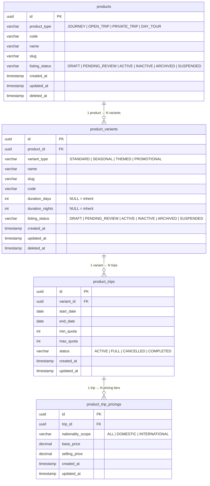
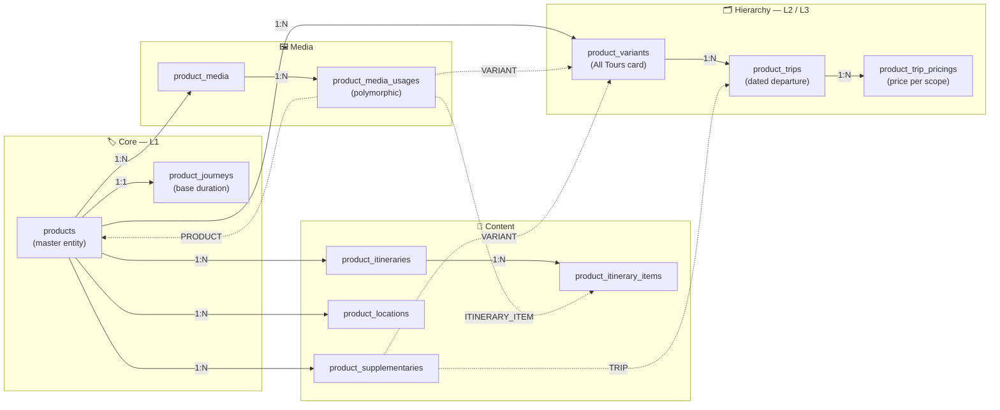

# Product Hierarchy — Technical Data Model & Architecture

> **Overview**
> The **3-level Product Hierarchy** (`products` → `product_variants` → `product_trips`) is the backbone of how tours are structured and surfaced on the website. The **All Tours** listing page renders one card per **variant**, not per product.

**Document Map:**

| Document                                                       | Responsibility                                                                                |
| -------------------------------------------------------------- | --------------------------------------------------------------------------------------------- |
| **This file**                                                  | Hierarchy mental model, ERDs, engineering principles, GWE sample data, relationship reference |
| [Product Technical Design](./product-technical-design.md)      | **Complete DDL schema** (authoritative), per-table ERDs, Turkey Wonders sample data           |
| [Product Media](./product-media-technical-design.md)           | Media asset repository, polymorphic usages, presigned uploads, CDN delivery                   |
| [Search & Filter](./product-search-filter-technical-design.md) | Search API contract, SQL search query, indexing strategy                                      |
| [Area Domain](./area-technical-design.md)                      | 3-tier geography tree (Continent → Country → City), PostGIS spatial model                     |
| [Contracts](../contracts/product-hierarchy-contract.md)        | All Tours listing feed, variant detail view API contracts                                     |
| [Backend Guide](../backend/product-hierarchy-backend-guide.md)  | Duration COALESCE resolution, pessimistic booking lock (SELECT FOR UPDATE)                    |
| [Frontend Guide](../frontend/product-hierarchy-frontend-guide.md)| All Tours catalog card, variant type badging, nationality pricing selector                   |

---

## 🧠 Hierarchy Mental Model

```
products  (master brand / program umbrella)
  └── product_variants  (bookable listing card, shown on All Tours)
        └── product_trips  (concrete dated departure with quota & price)
```

**Real-world example — Grand West Europe (GWE):**

```
products
└── Grand West Europe  [prod_gwe_01]
    │
    ├── product_variants
    │   ├── GWE Classic All-Year [var_gwe_std_26]  (variant_type = 'STANDARD')    ← card 1: Core recurring package
    │   │     ├── product_trips: 05 Aug 2026 → 12 Aug 2026  (max 30 pax)
    │   │     └── product_trip_pricings: DOMESTIC Rp 29.5M / INTERNATIONAL Rp 35M
    │   │
    │   ├── GWE Spring 2026      [var_gwe_spr_26]  (variant_type = 'SEASONAL')    ← card 2: Spring season series
    │   │     ├── product_trips: 10 Sept 2026 → 17 Sept 2026  (max 30 pax)
    │   │     └── product_trip_pricings: DOMESTIC Rp 28M / INTERNATIONAL Rp 34M
    │   │
    │   ├── GWE Summer 2026      [var_gwe_sum_26]  (variant_type = 'SEASONAL')    ← card 3: Summer season series
    │   │     ├── product_trips: 10 July 2026 → 17 July 2026  (max 30 pax)
    │   │     └── product_trip_pricings: DOMESTIC Rp 26.5M / INTERNATIONAL Rp 32.5M
    │   │
    │   ├── Tulip Edition        [var_tulip_26]    (variant_type = 'THEMED')      ← card 4: Keukenhof floral festival
    │   │     ├── product_trips: 10 Sept 2026 → 17 Sept 2026  (max 25 pax)
    │   │     └── product_trip_pricings: ALL Rp 31M
    │   │
    │   └── GWE Early Bird 2026  [var_gwe_eb_26]   (variant_type = 'PROMOTIONAL') ← card 5: Limited flash sale
    │         ├── product_trips: 15 Oct 2026 → 22 Oct 2026  (max 15 pax)
    │         └── product_trip_pricings: ALL Rp 24.5M (Flash deal tier)
    │
    └── (shared across all variants, lives at product level)
        ├── product_journeys     (base duration: 7D/6N)
        ├── product_locations    (e.g., Amsterdam, Paris, Brussels)
        ├── product_itineraries  (day-by-day programme)
        ├── itinerary_pdf_url    (1 product = 1 PDF brochure, shared across variants)
        ├── product_media        (hero images, gallery)
        └── product_supplementaries  (included/excluded lists)
```

**Key rules:**
| Layer | Entity | Role | Key Classification / Type |
|---|---|---|---|
| **L1** | `products` | Master brand umbrella. Owns locations, itinerary (day-by-day + 1 PDF brochure), media, supplementary content | `product_type` (`JOURNEY`, `OPEN_TRIP`, `PRIVATE_TRIP`, `DAY_TOUR`), `listing_status` (`DRAFT`, `PENDING_REVIEW`, `ACTIVE`, `INACTIVE`, `ARCHIVED`, `SUSPENDED`) |
| **L2** | `product_variants` | Named bookable edition (season / theme). Shown as a listing card | `variant_type` (`STANDARD`, `SEASONAL`, `THEMED`, `PROMOTIONAL`), `listing_status` (inherits / independent status) |
| **L3** | `product_trips` | Concrete dated departure window with quota | `status` (`ACTIVE`, `FULL`, `CANCELLED`, `COMPLETED`) |
| **L3+** | `product_trip_pricings` | Price tiers per trip (by nationality scope) | `nationality_scope` (`ALL`, `DOMESTIC`, `INTERNATIONAL`) |

### Variant Types & Frontend Presentation

| `variant_type`    | Purpose & Characteristics                                                                                | Real-World Example in Hobiholidays                              | UI Badging on All Tours Card            |
| ----------------- | -------------------------------------------------------------------------------------------------------- | --------------------------------------------------------------- | --------------------------------------- |
| **`STANDARD`**    | Core year-round package with fixed recurring departures; unaffected by seasonal or promotional gimmicks. | _Turkey Wonders Classic 9D_, _GWE Classic All-Year_             | None / `⭐ Classic`                     |
| **`SEASONAL`**    | Tied strictly to natural seasons & regional climate windows (Spring, Summer, Autumn, Winter).            | _GWE Spring 2026_, _Korea Autumn Leaves_, _Hokkaido Winter_     | `🌸 Spring` / `🍂 Autumn` / `❄️ Winter` |
| **`THEMED`**      | Centered around special events, foliage, festivals, or cultural attractions.                             | _Tulip Edition (Keukenhof)_, _Japan Sakura_, _Christmas Market_ | `🌷 Tulip Edition` / `🎌 Festival`      |
| **`PROMOTIONAL`** | Limited-seat commercial releases, early bird launches, or flash sale campaigns.                          | _Early Bird Europe 2026_, _Flash Sale Switzerland IDR 29.5M_    | `🔥 Flash Sale` / `⚡ Early Bird`       |

---

## 🏗️ Engineering Principles

### 1. Cascade Integrity

All FK relationships use `ON DELETE CASCADE` downward through the hierarchy. Deleting a product auto-removes all its variants, their trips, and pricings in a single transactional operation.

### 2. Duration Inheritance

`product_variants.duration_days / duration_nights` are **nullable**. `NULL` = inherit from `product_journeys`. Overrides are explicitly set on the variant row. Application layer must resolve using `COALESCE(pv.duration_days, pj.duration_days)`.

### 3. Quota Concurrency

`product_trips.max_quota` is the ceiling. During booking, use **Pessimistic Locking** (`SELECT ... FOR UPDATE`) on the trip row to prevent race conditions. Track `booked_count` in a separate `product_trip_bookings` table; never mutate `max_quota`.

### 4. Trip-Scoped Departures

`product_trips` are owned by a **variant**, not directly by a product. This is an intentional design decision: it allows different variants under the same product umbrella (e.g., "Spring" vs "Summer") to have entirely independent departure calendars, quotas, and pricing.

### 5. Polymorphic Target Resolution

Media usages and supplementary content target entities via `(target_type, target_id)`. Valid target types in this hierarchy:

| `target_type`    | Resolves to                  |
| ---------------- | ---------------------------- |
| `PRODUCT`        | `products.id`                |
| `VARIANT`        | `product_variants.id`        |
| `TRIP`           | `product_trips.id`           |
| `ITINERARY_ITEM` | `product_itinerary_items.id` |

### 6. Itinerary PDF Ownership & Media Handling (1 Product = 1 PDF File)

The official downloadable itinerary PDF brochure is managed through the centralized `product_media` asset subsystem and anchored at the **Product (L1)** level:

- **Centralized Asset Storage:** PDF brochures are stored in `product_media` with `media_type = 'PDF'`, capturing `file_name`, `file_size_bytes`, and `mime_type = 'application/pdf'` for UI file badges and browser download headers (`Content-Disposition`).
- **Database-Enforced 1:1 Cardinality:** A partial unique index on `product_media_usages` (`uq_media_usages_product_itinerary_pdf`) guarantees that a product can have at most **one** active `ITINERARY_PDF` attachment:
  ```sql
  CREATE UNIQUE INDEX uq_media_usages_product_itinerary_pdf
      ON product_media_usages(target_id, usage_context)
      WHERE target_type = 'PRODUCT' AND usage_context = 'ITINERARY_PDF';
  ```
- **Denormalized Fast Access:** `products.itinerary_pdf_url` caches the active PDF CDN URL directly on the product row for zero-join reads during catalog and PDP rendering.
- **Variant Inheritance:** All variants under a product (`product_variants`) inherit and surface this single official itinerary PDF. Variants and trips do not create separate itinerary PDF files.

---

## 🛠️ DDL Schema Reference

> [!NOTE]
> The complete, authoritative PostgreSQL DDL for all hierarchy tables (`product_variants`, `product_trips`, `product_trip_pricings`) lives in the **[Product Technical Design](./product-technical-design.md#-postgresql-ddl-schema)** document. That file is the single source of truth for all DDL — do not duplicate it here.

Key schema decisions specific to this hierarchy:

| Decision                                                         | Detail                                                                                                              |
| ---------------------------------------------------------------- | ------------------------------------------------------------------------------------------------------------------- |
| `product_variants.duration_days` nullable                        | `NULL` = inherit from `product_journeys` via `COALESCE`                                                             |
| `product_variants.variant_type` classification                   | Enforced via `CHECK (variant_type IN ('STANDARD', 'SEASONAL', 'THEMED', 'PROMOTIONAL'))`                            |
| `listing_status` lifecycle states                                | Enforced via `CHECK (listing_status IN ('DRAFT', 'PENDING_REVIEW', 'ACTIVE', 'INACTIVE', 'ARCHIVED', 'SUSPENDED'))` |
| `nationality_scope` pricing & journey tiers                      | Enforced via `CHECK (nationality_scope IN ('ALL', 'DOMESTIC', 'INTERNATIONAL'))`                                    |
| `UNIQUE(variant_id, start_date)` on `product_trips`              | One departure per variant per calendar date                                                                         |
| `UNIQUE(trip_id, nationality_scope)` on `product_trip_pricings`  | One price row per trip per nationality scope                                                                        |
| `CHECK (end_date > start_date)` on `product_trips`               | DB-level sanity guard on date windows                                                                               |
| `CHECK (status IN ('ACTIVE', 'FULL', 'CANCELLED', 'COMPLETED'))` | DB-level trip lifecycle guard                                                                                       |
| `CHECK (selling_price > 0 AND base_price >= selling_price)`      | DB-level price sanity guard                                                                                         |
| Audit timestamps (`created_at`, `updated_at`)                    | Enforced on every table (`NOT NULL DEFAULT CURRENT_TIMESTAMP`) with trigger automation                              |
| Soft deletes (`deleted_at`)                                      | Nullable on master entities (`products`, `product_variants`) with partial indexing                                  |

---

## 📊 Entity Relationship Diagrams

### ERD 1 — Core Hierarchy Chain



---

### ERD 2 — Full Product Domain (All Tables)

```mermaid
erDiagram
    products {
        uuid      id                PK
        varchar   product_type      "JOURNEY | OPEN_TRIP | PRIVATE_TRIP | DAY_TOUR"
        varchar   code
        varchar   name
        varchar   slug
        varchar   itinerary_pdf_url "1 product : 1 PDF file"
        varchar   listing_status    "DRAFT | PENDING_REVIEW | ACTIVE | INACTIVE | ARCHIVED | SUSPENDED"
        timestamp created_at
        timestamp updated_at
        timestamp deleted_at
    }

    product_journeys {
        uuid      product_id        PK  "FK → products"
        varchar   nationality_scope "ALL | DOMESTIC | INTERNATIONAL"
        int       duration_days
        int       duration_nights
        timestamp created_at
        timestamp updated_at
    }

    product_variants {
        uuid      id              PK
        uuid      product_id      FK
        varchar   variant_type    "STANDARD | SEASONAL | THEMED | PROMOTIONAL"
        varchar   name
        varchar   slug
        varchar   code
        int       duration_days   "NULL = inherit"
        int       duration_nights "NULL = inherit"
        varchar   listing_status  "DRAFT | PENDING_REVIEW | ACTIVE | INACTIVE | ARCHIVED | SUSPENDED"
        timestamp created_at
        timestamp updated_at
        timestamp deleted_at
    }

    product_trips {
        uuid      id         PK
        uuid      variant_id FK
        date      start_date
        date      end_date
        int       min_quota
        int       max_quota
        varchar   status     "ACTIVE | FULL | CANCELLED | COMPLETED"
        timestamp created_at
        timestamp updated_at
    }

    product_trip_pricings {
        uuid      id                 PK
        uuid      trip_id            FK
        varchar   nationality_scope  "ALL | DOMESTIC | INTERNATIONAL"
        decimal   base_price
        decimal   selling_price
        timestamp created_at
        timestamp updated_at
    }

    product_itineraries {
        uuid      id             PK
        uuid      product_id     FK
        varchar   source_type
        varchar   itinerary_type
        timestamp created_at
        timestamp updated_at
    }

    product_itinerary_items {
        uuid      id              PK
        uuid      itinerary_id    FK
        int       day_number
        int       sequence_number
        varchar   item_type
        varchar   title
        text      description
        timestamp created_at
        timestamp updated_at
    }

    areas {
        uuid      id           PK "Area Domain (City level)"
        uuid      parent_id    FK "Continent -> Country -> City"
        int       area_type_id FK
        varchar   name         "e.g. Amsterdam, Paris"
        varchar   code
    }

    product_locations {
        uuid      id           PK
        uuid      product_id   FK
        varchar   source_type
        uuid      area_id      FK "logical FK → areas.id (City)"
        varchar   area_name    "denormalized"
        float     lat
        float     lng
        text      address
        int       sort_order
        timestamp created_at
        timestamp updated_at
    }

    product_media {
        uuid      id               PK
        uuid      product_id       FK
        varchar   storage_provider "DATABASE | S3 | CLOUDFLARE_R2"
        varchar   source_upload_id
        varchar   media_type       "IMAGE | VIDEO | PDF"
        varchar   file_name        "original filename"
        bigint    file_size_bytes  "bytes"
        varchar   mime_type        "application/pdf etc"
        varchar   object_key
        varchar   url
        timestamp created_at
        timestamp updated_at
    }

    product_media_usages {
        uuid      id            PK
        uuid      media_id      FK
        varchar   target_type   "PRODUCT | VARIANT | ITINERARY_ITEM"
        uuid      target_id     "polymorphic"
        varchar   usage_context "COVER | GALLERY | THUMBNAIL | ITINERARY_PDF"
        int       sort_order
        timestamp created_at
        timestamp updated_at
    }

    product_supplementaries {
        uuid      id          PK
        uuid      product_id  FK
        varchar   target_type "PRODUCT | VARIANT | TRIP"
        uuid      target_id   "polymorphic"
        varchar   category    "INCLUDED | EXCLUDED | IMPORTANT_INFO"
        text      content
        timestamp created_at
        timestamp updated_at
    }

    products                 ||--o| product_journeys        : "product_id (1:1)"
    products                 ||--o{ product_variants        : "product_id"
    product_variants         ||--o{ product_trips           : "variant_id"
    product_trips            ||--o{ product_trip_pricings   : "trip_id"
    products                 ||--o{ product_itineraries     : "product_id"
    product_itineraries      ||--o{ product_itinerary_items : "itinerary_id"
    products                 ||--o{ product_locations       : "product_id"
    areas                    ||--o{ product_locations       : "area_id (City marker)"
    products                 ||--o{ product_media           : "product_id"
    product_media            ||--o{ product_media_usages    : "media_id"
    products                 ||--o{ product_supplementaries : "product_id"
```



---

### ERD 3 — Architecture Overview (Flowchart)



---

## 📋 Sample Data — Grand West Europe (GWE)

> _(Note: Standard audit timestamps `created_at`, `updated_at`, and `deleted_at` are defined in the schema and ERDs above, but omitted from the sample data tables below for readability)._

### `products`

| id          | product_type | code | slug              | itinerary_pdf_url                                              | listing_status |
| :---------- | :----------- | :--- | :---------------- | :------------------------------------------------------------- | :------------- |
| prod_gwe_01 | JOURNEY      | GWE  | grand-west-europe | https://cdn.hobiholidays.com/docs/itineraries/gwe-official.pdf | ACTIVE         |

### `product_journeys`

| product_id  | nationality_scope | duration_days | duration_nights |
| :---------- | :---------------- | :------------ | :-------------- |
| prod_gwe_01 | ALL               | 7             | 6               |

---

### `product_variants`

| id             | product_id  | variant_type | name                 | slug                 | code         | duration_days | duration_nights | listing_status |
| :------------- | :---------- | :----------- | :------------------- | :------------------- | :----------- | :------------ | :-------------- | :------------- |
| var_gwe_std_26 | prod_gwe_01 | STANDARD     | GWE Classic All-Year | gwe-classic-all-year | GWE-STD-2026 | NULL (7)      | NULL (6)        | ACTIVE         |
| var_gwe_spr_26 | prod_gwe_01 | SEASONAL     | GWE Spring 2026      | gwe-spring-2026      | GWE-SPR-2026 | NULL (7)      | NULL (6)        | ACTIVE         |
| var_gwe_sum_26 | prod_gwe_01 | SEASONAL     | GWE Summer 2026      | gwe-summer-2026      | GWE-SUM-2026 | NULL (7)      | NULL (6)        | ACTIVE         |
| var_tulip_26   | prod_gwe_01 | THEMED       | Tulip Edition        | tulip                | GWE-TLP-2026 | 8 (override)  | 7 (override)    | ACTIVE         |
| var_gwe_eb_26  | prod_gwe_01 | PROMOTIONAL  | GWE Early Bird 2026  | gwe-early-bird-2026  | GWE-EB-2026  | NULL (7)      | NULL (6)        | ACTIVE         |

> 💡 `NULL` duration_days means the variant **inherits** from `product_journeys` via `COALESCE`.
> **All Tours** page renders **5 cards** — one per variant across all 4 `variant_type` classifications.

---

### `product_trips`

| id          | variant_id     | start_date | end_date   | min_quota | max_quota | status |
| :---------- | :------------- | :--------- | :--------- | :-------- | :-------- | :----- |
| trip_std_01 | var_gwe_std_26 | 2026-08-05 | 2026-08-12 | 5         | 30        | ACTIVE |
| trip_spr_01 | var_gwe_spr_26 | 2026-09-10 | 2026-09-17 | 5         | 30        | ACTIVE |
| trip_spr_02 | var_gwe_spr_26 | 2026-09-17 | 2026-09-24 | 5         | 30        | ACTIVE |
| trip_sum_01 | var_gwe_sum_26 | 2026-07-10 | 2026-07-17 | 5         | 30        | ACTIVE |
| trip_sum_02 | var_gwe_sum_26 | 2026-07-17 | 2026-07-24 | 5         | 30        | ACTIVE |
| trip_tlp_01 | var_tulip_26   | 2026-09-10 | 2026-09-17 | 5         | 25        | ACTIVE |
| trip_tlp_02 | var_tulip_26   | 2026-09-17 | 2026-09-24 | 5         | 25        | ACTIVE |
| trip_eb_01  | var_gwe_eb_26  | 2026-10-15 | 2026-10-22 | 5         | 15        | ACTIVE |

---

### `product_trip_pricings`

| id               | trip_id     | nationality_scope | base_price  | selling_price |
| :--------------- | :---------- | :---------------- | :---------- | :------------ |
| price_std_01_dom | trip_std_01 | DOMESTIC          | 33000000.00 | 29500000.00   |
| price_std_01_int | trip_std_01 | INTERNATIONAL     | 39000000.00 | 35000000.00   |
| price_spr_01_dom | trip_spr_01 | DOMESTIC          | 32000000.00 | 28000000.00   |
| price_spr_01_int | trip_spr_01 | INTERNATIONAL     | 38000000.00 | 34000000.00   |
| price_spr_02_all | trip_spr_02 | ALL               | 32000000.00 | 28000000.00   |
| price_sum_01_dom | trip_sum_01 | DOMESTIC          | 30000000.00 | 26500000.00   |
| price_sum_01_int | trip_sum_01 | INTERNATIONAL     | 36000000.00 | 32500000.00   |
| price_sum_02_all | trip_sum_02 | ALL               | 30000000.00 | 26500000.00   |
| price_tlp_01_all | trip_tlp_01 | ALL               | 35000000.00 | 31000000.00   |
| price_tlp_02_all | trip_tlp_02 | ALL               | 35000000.00 | 31000000.00   |
| price_eb_01_all  | trip_eb_01  | ALL               | 29500000.00 | 24500000.00   |

---

## 🔍 Search Query Reference

> [!NOTE]
> The complete search SQL query, API contract (NestJS DTO), and full indexing strategy are documented in **[Search & Filter Architecture](./product-search-filter-technical-design.md)**. That document owns all search-related implementation details.

**Quick summary:** The search query drives the **All Tours listing page**. It takes `product_variants` as the primary FROM clause (not `products`) and returns **one row per variant**, with the following join chain:

```
product_variants
  → products              (parent product status check, product name filter)
  → product_journeys      (COALESCE duration fallback)
  → product_locations     (destination markers)
    → areas city          (City destination marker)
    → areas country       (Country parent)
    → areas continent     (Continent root)
  → product_trips         (date range + total pack / pax quota filter)
  → product_trip_pricings (price range filter [minPrice..maxPrice] + MIN starting price per card)
```

---

## 🗺️ Complete Relationship Reference

| Relationship                                      | Type              | Cardinality | Constraint                                                 |
| :------------------------------------------------ | :---------------- | :---------- | :--------------------------------------------------------- |
| `products` → `product_journeys`                   | Hard FK           | 1 : 1       | `ON DELETE CASCADE`                                        |
| `products` → `itinerary_pdf`                      | Embedded / Column | 1 : 1       | Stored at L1 (`itinerary_pdf_url`)                         |
| `products` → `product_variants`                   | Hard FK           | 1 : N       | `ON DELETE CASCADE`                                        |
| `product_variants` → `product_trips`              | Hard FK           | 1 : N       | `ON DELETE CASCADE` + `UNIQUE(variant_id, start_date)`     |
| `product_trips` → `product_trip_pricings`         | Hard FK           | 1 : N       | `ON DELETE CASCADE` + `UNIQUE(trip_id, nationality_scope)` |
| `products` → `product_itineraries`                | Hard FK           | 1 : N       | `ON DELETE CASCADE`                                        |
| `product_itineraries` → `product_itinerary_items` | Hard FK           | 1 : N       | `ON DELETE CASCADE`                                        |
| `products` → `product_locations`                  | Hard FK           | 1 : N       | `ON DELETE CASCADE`                                        |
| `areas` → `product_locations`                     | Logical FK        | 1 : N       | Inter-domain reference (City destination marker)           |
| `products` → `product_media`                      | Hard FK           | 1 : N       | `ON DELETE CASCADE`                                        |
| `product_media` → `product_media_usages`          | Hard FK           | 1 : N       | `ON DELETE CASCADE`                                        |
| `products` → `product_supplementaries`            | Hard FK           | 1 : N       | `ON DELETE CASCADE`                                        |
| `product_media_usages.target_id` → `*`            | **Polymorphic**   | N : 1       | App-layer enforced                                         |
| `product_supplementaries.target_id` → `*`         | **Polymorphic**   | N : 1       | App-layer enforced                                         |

---

## 📌 Schema Design Notes

> [!NOTE]
> This is an **initial schema design** — there are no legacy tables to migrate from. The hierarchy `products → product_variants → product_trips` is the canonical data model from day one.

> [!NOTE]
> `product_journeys` stores the **base duration** at the product level. It is not deleted or superseded. The application layer resolves effective duration using:
>
> ```sql
> COALESCE(pv.duration_days, pj.duration_days) AS duration_days
> ```
>
> This allows individual variants to override duration without touching the product-level default.

> [!NOTE]
> **Audit Timestamps Standard:** All tables enforce `created_at TIMESTAMP NOT NULL DEFAULT CURRENT_TIMESTAMP` and `updated_at TIMESTAMP NOT NULL DEFAULT CURRENT_TIMESTAMP`. Core catalog entities (`products`, `product_variants`, `areas`) also support soft deletes via nullable `deleted_at TIMESTAMP NULL`. Row mutations automatically update `updated_at` via PostgreSQL trigger function `set_updated_at_timestamp()`.
