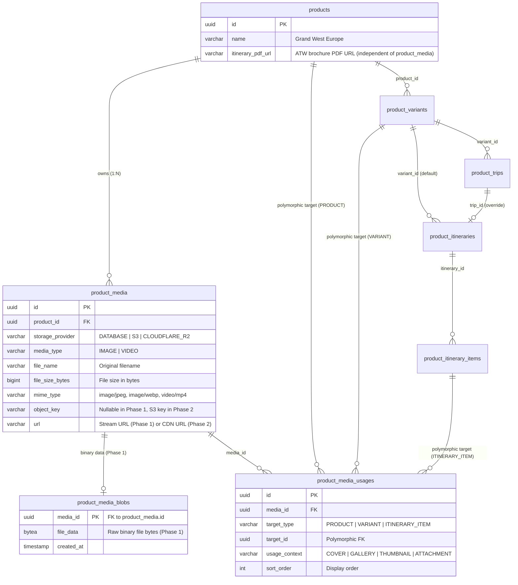
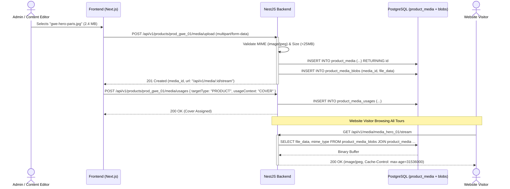
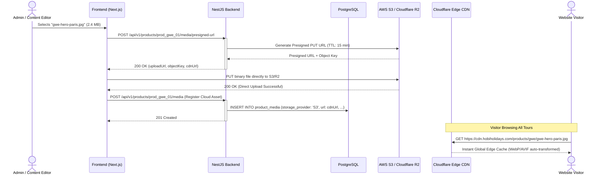

# Product Domain - Media Architecture & Technical Design

> **Overview**
> Technical documentation for the Product Media and Binary Asset subsystem. This architecture defines a **2-Phase Progressive Storage Strategy**:
> - **Phase 1 (Database-First / Zero External Infrastructure):** Binary files are stored directly within PostgreSQL using a dedicated binary blob table (`product_media_blobs`) and streamed via NestJS endpoints (`/api/v1/media/:id/stream`).
> - **Phase 2 (Cloud Storage & CDN):** High-scale offloading to Cloud Object Storage (AWS S3 / Cloudflare R2) with CDN edge delivery and direct-to-storage presigned uploads.
>
> _Engineered to guarantee zero code breaking changes between Phase 1 and Phase 2, with polymorphic visual asset binding (images and videos). Tour itinerary PDF brochures are compiled externally by ATW and referenced directly via `itinerary_pdf_url`._

> **See Also:**
> - [Product Technical Design](./product-technical-design.md)
> - [Product Hierarchy Technical Design](./product-hierarchy-technical-design.md)
> - [Search & Filter Architecture](./product-search-filter-technical-design.md)
> - [Area Domain Technical Design](./area-technical-design.md)
> - [Product Media Contracts](../contracts/product-media-contract.md) — API endpoints for upload, streaming, and usage binding
> - [Backend Guide](../backend/product-media-backend-guide.md) — Multer file streaming, S3 presigned URLs, and migration script
> - [Frontend Guide](../frontend/product-media-frontend-guide.md) — next/image setup, responsive presets, and brochure download component

---

## 🏗️ 2-Phase Progressive Storage Strategy

To enable rapid prototyping and local development without cloud dependencies, while ensuring seamless enterprise scalability in production, the media subsystem operates across two evolutionary phases:

```
========================================================================================
PHASE 1: Database-First Architecture (MVP / Staging / Local)
Zero external cloud setup. Binary files are stored in PostgreSQL BYTEA table.
========================================================================================
[Client / Browser]
       │ 1. Multipart Form Upload
       ▼
[NestJS Backend] ───► INSERT metadata ───► [PostgreSQL: product_media]
       │ 2. Stream Binary Bytes
       ▼
[PostgreSQL: product_media_blobs] (BYTEA)
       ▲
       │ 3. GET /api/v1/media/:id/stream
[Client / Browser] ◄─── Binary Stream with HTTP Caching

========================================================================================
PHASE 2: Cloud Object Store & CDN Architecture (Production Scale)
Zero database bloat. Presigned direct uploads + Cloudflare CDN edge caching.
========================================================================================
[Client / Browser]
       │ 1. Direct Presigned PUT
       ▼
[AWS S3 / Cloudflare R2] ◄── (Private Bucket, Signed Origin Access)
       │
       │ 2. Edge Caching & WebP/AVIF Dynamic Transformations
       ▼
[Cloudflare CDN]
       ▲
       │ 3. Instant Global Delivery: https://cdn.hobiholidays.com/products/...
[Client / Browser]
```

### Key Architectural Pillars

| Architectural Requirement | Phase 1: Database-First | Phase 2: Cloud Storage + CDN |
| :--- | :--- | :--- |
| **Storage Engine** | PostgreSQL `product_media_blobs` (`BYTEA`) | AWS S3 / Cloudflare R2 Bucket |
| **Delivery Mechanism** | NestJS HTTP stream (`/api/v1/media/:id/stream`) | Cloudflare CDN edge (`https://cdn...`) |
| **Upload Workflow** | Multipart Form-Data directly to NestJS | Direct presigned PUT to Cloud Storage |
| **External Cloud Setup** | **None** (Zero credentials / zero cloud cost) | AWS IAM / S3 / Cloudflare R2 API tokens |
| **Frontend Consumption** | Uses `media.url` (`/api/v1/media/:id/stream`) | Uses `media.url` (`https://cdn...`) |
| **Frontend Breaking Changes** | **Zero** — Frontend always reads `media.url` regardless of phase |

### Why Separate Metadata from Binary Data in Phase 1?
Storing binary files (`BYTEA`) directly in the main `product_media` table would cause massive database page bloat, slowing down standard product catalog queries and indexing.
- **`product_media` (Lightweight Table):** Stores only metadata (`file_name`, `mime_type`, `file_size_bytes`, `storage_provider`, `url`). Fast scans, zero bloat.
- **`product_media_blobs` (Binary Isolation Table):** Stores `(media_id PK/FK, file_data BYTEA)`. Loaded **only** when a client actually requests image pixels or video streams.

---

## 🛠️ PostgreSQL DDL Migration Scripts

```sql
-- =========================================================================
-- 1. MEDIA CORE REPOSITORY — product_media
-- Stores binary file metadata, storage provider indicator, and URL.
-- =========================================================================
CREATE TABLE product_media (
    id               UUID         PRIMARY KEY DEFAULT uuid_generate_v4(),
    product_id       UUID         NOT NULL REFERENCES products(id) ON DELETE CASCADE,
    storage_provider VARCHAR(50)  NOT NULL DEFAULT 'DATABASE', -- DATABASE (Phase 1) | S3 | CLOUDFLARE_R2 (Phase 2)
    source_upload_id VARCHAR(255),                          -- External upload service or CDN reference ID
    media_type       VARCHAR(50)  NOT NULL,                  -- IMAGE | VIDEO
    file_name        VARCHAR(255) NOT NULL,                 -- e.g. gwe-hero-paris.jpg
    file_size_bytes  BIGINT       NOT NULL,                 -- File size in bytes for UI badges
    mime_type        VARCHAR(100) NOT NULL,                 -- e.g. image/jpeg, image/webp, video/mp4
    object_key       VARCHAR(500) NULL,                     -- S3/R2 key (NULL in Phase 1, required in Phase 2)
    url              VARCHAR(500) NOT NULL,                 -- Relative URL in Phase 1, CDN URL in Phase 2
    created_at       TIMESTAMP    NOT NULL DEFAULT CURRENT_TIMESTAMP,
    updated_at       TIMESTAMP    NOT NULL DEFAULT CURRENT_TIMESTAMP,

    CONSTRAINT chk_media_type             CHECK (media_type IN ('IMAGE', 'VIDEO')),
    CONSTRAINT chk_media_storage_provider CHECK (storage_provider IN ('DATABASE', 'S3', 'CLOUDFLARE_R2'))
);

CREATE INDEX idx_media_product_id ON product_media(product_id);
CREATE INDEX idx_media_type       ON product_media(media_type);
CREATE INDEX idx_media_storage    ON product_media(storage_provider);

-- =========================================================================
-- 2. PHASE 1 BINARY STORAGE — product_media_blobs
-- Dedicated table for raw binary data during Phase 1.
-- =========================================================================
CREATE TABLE product_media_blobs (
    media_id   UUID      PRIMARY KEY REFERENCES product_media(id) ON DELETE CASCADE,
    file_data  BYTEA     NOT NULL,
    created_at TIMESTAMP NOT NULL DEFAULT CURRENT_TIMESTAMP
);

-- =========================================================================
-- 3. POLYMORPHIC USAGE BINDING — product_media_usages
-- Maps media assets to Products, Variants, or Itinerary Items across contexts.
-- =========================================================================
CREATE TABLE product_media_usages (
    id            UUID        PRIMARY KEY DEFAULT uuid_generate_v4(),
    media_id      UUID        NOT NULL REFERENCES product_media(id) ON DELETE CASCADE,
    target_type   VARCHAR(50) NOT NULL,    -- PRODUCT | VARIANT | ITINERARY_ITEM
    target_id     UUID        NOT NULL,    -- Polymorphic UUID — resolved by target_type
    usage_context VARCHAR(50) NOT NULL,    -- COVER | GALLERY | THUMBNAIL | ATTACHMENT
    sort_order    INT         NOT NULL DEFAULT 0,
    created_at    TIMESTAMP   NOT NULL DEFAULT CURRENT_TIMESTAMP,
    updated_at    TIMESTAMP   NOT NULL DEFAULT CURRENT_TIMESTAMP,

    CONSTRAINT chk_media_target_type   CHECK (target_type IN ('PRODUCT', 'VARIANT', 'ITINERARY_ITEM')),
    CONSTRAINT chk_media_usage_context CHECK (usage_context IN ('COVER', 'GALLERY', 'THUMBNAIL', 'ATTACHMENT'))
);

-- Composite index for fast polymorphic lookups
CREATE INDEX idx_media_usages_target
    ON product_media_usages(target_type, target_id);

-- Enforce single COVER image per entity target
CREATE UNIQUE INDEX uq_media_usages_single_cover
    ON product_media_usages(target_id, usage_context)
    WHERE usage_context = 'COVER';

-- =========================================================================
-- 4. AUDIT TRIGGERS
-- =========================================================================
CREATE TRIGGER trg_product_media_updated_at
    BEFORE UPDATE ON product_media
    FOR EACH ROW EXECUTE FUNCTION set_updated_at_timestamp();

CREATE TRIGGER trg_product_media_usages_updated_at
    BEFORE UPDATE ON product_media_usages
    FOR EACH ROW EXECUTE FUNCTION set_updated_at_timestamp();
```

---

## 📊 Entity Relationship Diagram



---

## 📡 API Contracts (NestJS Controllers & DTOs)

### Phase 1: Database-First Endpoints

#### 1. Multipart Upload Endpoint (`POST /api/v1/products/:productId/media/upload`)
Receives binary file upload via standard `multipart/form-data`, saves metadata to `product_media`, and binary bytes to `product_media_blobs`.

```typescript
// controllers/product-media.controller.ts (Phase 1)
import {
  Controller,
  Post,
  Param,
  UseInterceptors,
  UploadedFile,
  Body,
  ParseUUIDPipe,
} from '@nestjs/common';
import { FileInterceptor } from '@nestjs/platform-express';
import { UploadMediaDto } from './dto/upload-media.dto';
import { ProductMediaService } from './product-media.service';

@Controller('api/v1/products/:productId/media')
export class ProductMediaController {
  constructor(private readonly mediaService: ProductMediaService) {}

  @Post('upload')
  @UseInterceptors(
    FileInterceptor('file', {
      limits: { fileSize: 25 * 1024 * 1024 }, // 25 MB max limit
    }),
  )
  async uploadMedia(
    @Param('productId', ParseUUIDPipe) productId: string,
    @UploadedFile() file: Express.Multer.File,
    @Body() dto: UploadMediaDto,
  ) {
    return this.mediaService.saveToDatabase(productId, file, dto.mediaType);
  }
}
```

```typescript
// dto/upload-media.dto.ts
import { IsIn, IsString } from 'class-validator';

export class UploadMediaDto {
  @IsString()
  @IsIn(['IMAGE', 'VIDEO'])
  mediaType: 'IMAGE' | 'VIDEO';
}
```

- **Phase 1 Upload Response:**
```json
{
  "id": "550e8400-e29b-41d4-a716-446655440050",
  "productId": "550e8400-e29b-41d4-a716-446655440010",
  "storageProvider": "DATABASE",
  "mediaType": "IMAGE",
  "fileName": "gwe-hero-paris.jpg",
  "fileSizeBytes": 2410500,
  "mimeType": "image/jpeg",
  "url": "/api/v1/media/550e8400-e29b-41d4-a716-446655440050/stream"
}
```

---

#### 2. Streaming Endpoint (`GET /api/v1/media/:id/stream`)
Streams binary data from `product_media_blobs` with appropriate `Content-Type` and aggressive HTTP caching headers.

```typescript
// controllers/media-stream.controller.ts (Phase 1)
import { Controller, Get, Param, Res, ParseUUIDPipe } from '@nestjs/common';
import { Response } from 'express';
import { ProductMediaService } from './product-media.service';

@Controller('api/v1/media')
export class MediaStreamController {
  constructor(private readonly mediaService: ProductMediaService) {}

  @Get(':id/stream')
  async streamMedia(
    @Param('id', ParseUUIDPipe) id: string,
    @Res() res: Response,
  ) {
    const { metadata, blob } = await this.mediaService.getMediaWithBlob(id);

    res.set({
      'Content-Type': metadata.mime_type,
      'Content-Length': metadata.file_size_bytes,
      'Cache-Control': 'public, max-age=31536000, immutable', // 1 year cache
      'ETag': `"${metadata.id}-${metadata.updated_at.getTime()}"`,
    });

    return res.send(blob.file_data);
  }
}
```

---

### Phase 2: Cloud Object Storage Endpoints

When upgrading to Phase 2, two new endpoints are introduced for direct presigned uploads, while streaming automatically pivots to the CDN:

1. **`POST /api/v1/products/:productId/media/presigned-url`**
   - Returns temporary S3/R2 presigned upload URL.
2. **`POST /api/v1/products/:productId/media`**
   - Registers cloud asset in `product_media` with `storage_provider = 'S3'`, `object_key`, and `url = 'https://cdn.hobiholidays.com/...'`.

---

### Common Endpoints (Both Phases)

#### 1. Assign Polymorphic Media Usage (`POST /api/v1/products/:productId/media/usages`)
Works identically in both Phase 1 and Phase 2:

```typescript
// dto/attach-media-usage.dto.ts
import { IsUUID, IsString, IsIn, IsInt, Min } from 'class-validator';

export class AttachMediaUsageDto {
  @IsUUID('4')
  mediaId: string;

  @IsString()
  @IsIn(['PRODUCT', 'VARIANT', 'ITINERARY_ITEM'])
  targetType: 'PRODUCT' | 'VARIANT' | 'ITINERARY_ITEM';

  @IsUUID('4')
  targetId: string;

  @IsString()
  @IsIn(['COVER', 'GALLERY', 'THUMBNAIL', 'ATTACHMENT'])
  usageContext: 'COVER' | 'GALLERY' | 'THUMBNAIL' | 'ATTACHMENT';

  @IsInt()
  @Min(0)
  sortOrder: number = 0;
}
```

#### 2. Official Itinerary PDF Brochure Integration (ATW External Compilation)

> [!IMPORTANT]
> Official tour itinerary PDF brochures are compiled externally by **ATW**.
> They are **not** uploaded or processed through the `product_media` pipeline, nor are they stored in `product_media_blobs`.
> Instead, the external ATW brochure URL is stored directly in `products.itinerary_pdf_url` (default) and `product_variants.itinerary_pdf_url` (edition-specific override).

---

## 🔄 Sequence Diagrams: Phase 1 vs Phase 2

### Phase 1 Upload & Streaming Flow



---

### Phase 2 Cloud Upload & CDN Delivery Flow



---

## 📑 Real-World Sample Data (Phase 1 vs Phase 2 State)

### `product_media` Records

| id | product_id | storage_provider | media_type | file_name | file_size_bytes | mime_type | object_key | url |
| :--- | :--- | :--- | :--- | :--- | :--- | :--- | :--- | :--- |
| `media_hero_01` | `prod_gwe_01` | **`DATABASE`** (P1) | IMAGE | `gwe-hero-paris.jpg` | 2410500 | image/jpeg | *NULL* | `/api/v1/media/media_hero_01/stream` |
| `media_hero_01` | `prod_gwe_01` | **`S3`** (P2) | IMAGE | `gwe-hero-paris.jpg` | 2410500 | image/jpeg | `products/gwe/gwe-hero-paris.jpg` | `https://cdn.hobiholidays.com/products/gwe/gwe-hero-paris.jpg` |
| `media_gallery_01` | `prod_gwe_01` | **`DATABASE`** (P1) | IMAGE | `amsterdam-canals.jpg` | 1850000 | image/jpeg | *NULL* | `/api/v1/media/media_gallery_01/stream` |
| `media_gallery_01` | `prod_gwe_01` | **`S3`** (P2) | IMAGE | `amsterdam-canals.jpg` | 1850000 | image/jpeg | `products/gwe/amsterdam-canals.jpg` | `https://cdn.hobiholidays.com/products/gwe/amsterdam-canals.jpg` |

### `product_media_blobs` Records (Active in Phase 1)

| media_id | file_data | created_at |
| :--- | :--- | :--- |
| `media_hero_01` | `\xffd8ffe000104a464946...` *(binary bytes)* | `2026-09-04 10:00:00` |
| `media_gallery_01` | `\xffd8ffe000104a464946...` *(binary bytes)* | `2026-09-04 10:02:00` |

### `product_media_usages` Records (Identical Across Both Phases)

| id | media_id | target_type | target_id | usage_context | sort_order | UI Role |
| :--- | :--- | :--- | :--- | :--- | :--- | :--- |
| `usg_001` | `media_hero_01` | `PRODUCT` | `prod_gwe_01` | `COVER` | 0 | Default Product Hero Banner |
| `usg_002` | `media_gallery_01` | `PRODUCT` | `prod_gwe_01` | `GALLERY` | 1 | Product Gallery Photo |

---

## 🚀 Migration Guide: Upgrading from Phase 1 to Phase 2

When transitioning to Phase 2 (production cloud scale), execute this zero-downtime migration workflow:

```typescript
// scripts/migrate-media-to-cloud.ts
import { S3Client, PutObjectCommand } from '@aws-sdk/client-s3';
import { Pool } from 'pg';

const s3 = new S3Client({ region: 'ap-southeast-1' });
const pool = new Pool({ connectionString: process.env.DATABASE_URL });
const CDN_BASE_URL = 'https://cdn.hobiholidays.com';
const BUCKET_NAME = 'hobiholidays-production-bucket';

async function migrateMedia() {
  const client = await pool.connect();
  try {
    // 1. Fetch all Phase 1 DATABASE media items
    const { rows } = await client.query(`
      SELECT m.id, m.product_id, m.file_name, m.mime_type, m.media_type, b.file_data
      FROM product_media m
      INNER JOIN product_media_blobs b ON b.media_id = m.id
      WHERE m.storage_provider = 'DATABASE'
    `);

    console.log(`Found ${rows.length} assets to migrate to Cloud Storage...`);

    for (const media of rows) {
      const objectKey = `products/${media.product_id}/${media.id}/${media.file_name}`;
      const cdnUrl = `${CDN_BASE_URL}/${objectKey}`;

      // 2. Upload binary buffer to AWS S3 / Cloudflare R2
      await s3.send(
        new PutObjectCommand({
          Bucket: BUCKET_NAME,
          Key: objectKey,
          Body: media.file_data,
          ContentType: media.mime_type,
        }),
      );

      // 3. Atomically update metadata and switch storage_provider to 'S3'
      await client.query(`
        UPDATE product_media
        SET
          storage_provider = 'S3',
          object_key = $1,
          url = $2,
          updated_at = NOW()
        WHERE id = $3
      `, [objectKey, cdnUrl, media.id]);

      // 4. Delete binary from blobs table to recover database disk space
      await client.query(`DELETE FROM product_media_blobs WHERE media_id = $1`, [media.id]);

      console.log(`Migrated: ${media.file_name} -> ${cdnUrl}`);
    }

    console.log('Migration successfully completed!');
  } finally {
    client.release();
  }
}

migrateMedia().catch(console.error);
```
