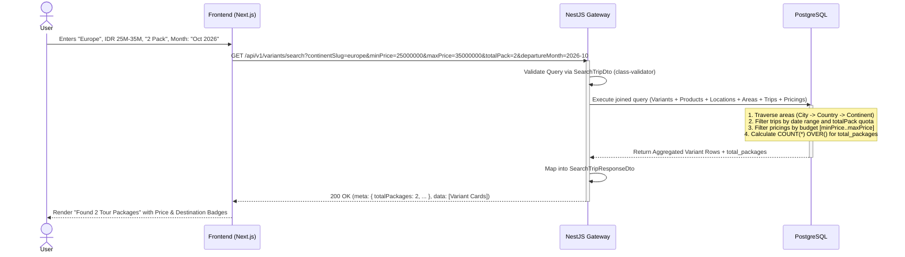

# Product Domain - Search & Filter Architecture

> **Overview**
> Technical documentation for the Trip Search & Filter engine. This architecture maps the frontend search widget and All Tours catalog filters (Product Name, Continent, Country, Destination, Departure Month, Total Pack / Pax, and Price Range) to the PostgreSQL data model with the **3-level product hierarchy** (`products → product_variants → product_trips`) joined with the **3-tier Area domain** (`Continent → Country → City`).
>
> _Optimized for fast reads, complex relational filtering, paginated result counts, and seamless integration with NestJS._

> **See Also:**
> - [Product Hierarchy Technical Design](./product-hierarchy-technical-design.md)
> - [Product Technical Design](./product-technical-design.md)
> - [Area Technical Design](./area-technical-design.md)

**Document Map:**

| Document                                                       | Responsibility                                                               |
| -------------------------------------------------------------- | ---------------------------------------------------------------------------- |
| **This file**                                                  | Search SQL query, indexing strategy, UI-to-DB mapping, real-world scenarios  |
| [Product Technical Design](./product-technical-design.md)      | **Complete DDL schema** (authoritative), per-table ERDs, sample data         |
| [Product Hierarchy](./product-hierarchy-technical-design.md)   | 3-level hierarchy mental model, All Tours card rendering rules               |
| [Area Domain](./area-technical-design.md)                      | 3-tier geography tree (Continent → Country → City), Area hierarchy joins     |
| [Product Media](./product-media-technical-design.md)           | Media asset strategy (cover images used in variant cards)                    |
| [SEO Architecture](./seo-technical-design.md)                  | SEO metadata, Schema.org rich snippets (search result integration)           |
| [Search & Filter Contracts](../contracts/product-search-filter-contract.md) | API contract: request DTO validation, response payloads, error envelopes |
| [Backend Guide](../backend/product-search-filter-backend-guide.md)         | NestJS SearchFilterService, dynamic SQL builder, and trigram matching     |
| [Frontend Guide](../frontend/product-search-filter-frontend-guide.md)       | Search & filter UI, URL query sync (useSearchParams), filter sidebar     |

---

## 🎯 UI to Database Mapping

The All Tours catalog and search widget expose multiple independent and combinable filter parameters. Here is how each frontend filter maps to the relational database schema:

| UI Filter Field | Parameter Name | Target Table & Column | Filter & Evaluation Logic |
| :--- | :--- | :--- | :--- |
| **Product Name** | `productName` | `products.name` / `product_variants.name` | Trigram / `ILIKE` partial text search matching either the parent product title (L1) or variant title (L2). |
| **Continent Filter** | `continentSlug` / `continentId` | `continent_area.slug` / `continent_area.id` | Filter through Area hierarchy (`pl.area_id → city.parent_id → country.parent_id = continent.id`). |
| **Country Filter** | `countrySlug` / `countryId` | `country_area.slug` / `country_area.id` | Filter through Area hierarchy (`pl.area_id → city.parent_id = country.id`). |
| **"Where To?" Destination** | `destination` | `continent_area.name`, `country_area.name`, `pl.area_name`, `products.slug` | Broad partial search across continental, country, city destination names, and product slugs. |
| **Departure Month** | `departureMonth` | `product_trips.start_date` | Date range query extracting all trips starting within the given month (`YYYY-MM`). |
| **Total Pack / Pax** | `totalPack` (or `pax`) | `product_trips.min_quota` & `product_trips.max_quota` | Verifies the trip capacity can accommodate the party size (`pt.max_quota >= :totalPack AND pt.min_quota <= :totalPack`). |
| **Min Price** | `minPrice` | `product_trip_pricings.selling_price` | Trip selling price satisfies `>= :minPrice` for the requested nationality scope. |
| **Max Price** | `maxPrice` | `product_trip_pricings.selling_price` | Trip selling price satisfies `<= :maxPrice` for the requested nationality scope. |
| **Variant Classification** | `variantType` | `product_variants.variant_type` | Exact match against `STANDARD`, `SEASONAL`, `THEMED`, or `PROMOTIONAL`. |
| **Nationality Tier** | `nationalityScope` | `product_trip_pricings.nationality_scope` | Scope match (`ALL`, `DOMESTIC`, `INTERNATIONAL`). |
| **Total Packages Count** | `total_packages` | `COUNT(*) OVER()` window function | Returns the total count of matching tour packages (variants) for pagination and badges. |

> [!NOTE]
> **Understanding "Total Pack" Terminology:**
> In the travel and tour industry (prominently across Southeast Asian / Indonesian operations), **"Pack"** is widely used interchangeably with **"Pax"** (e.g., *"liburan 2 pack"* = party of 2 passengers). The API accepts both `totalPack` and `pax` seamlessly as aliases.

---

## 📡 API Contract (NestJS DTO & Response Schema)

### 1. Request Query DTO

The frontend sends a `GET /api/v1/variants/search` request with query parameters. The backend validates these using NestJS `class-validator` and `class-transformer`.

```typescript
// search-trip.dto.ts
import { IsOptional, IsString, IsInt, IsNumber, Min, IsIn } from 'class-validator';
import { Type } from 'class-transformer';

export class SearchTripDto {
  @IsOptional()
  @IsString()
  productName?: string; // Search by tour name (e.g., "Grand West Europe", "Tulip")

  @IsOptional()
  @IsString()
  continentSlug?: string; // Filter by Continent slug (e.g., "europe", "asia")

  @IsOptional()
  @IsString()
  continentId?: string; // Filter by Continent UUID (e.g., "area_asia_01")

  @IsOptional()
  @IsString()
  countrySlug?: string; // Filter by Country slug (e.g., "japan", "turkey")

  @IsOptional()
  @IsString()
  countryId?: string; // Filter by Country UUID (e.g., "area_jp_01")

  @IsOptional()
  @IsString()
  destination?: string; // Generic "Where To?" search keyword

  @IsOptional()
  @IsString()
  departureMonth?: string; // Format: "YYYY-MM" (e.g., "2026-10")

  @IsOptional()
  @Type(() => Number)
  @IsInt()
  @Min(1)
  totalPack?: number; // Total passenger count / Pax (e.g., 2). Defaults to 1 if omitted.

  @IsOptional()
  @Type(() => Number)
  @IsInt()
  @Min(1)
  pax?: number; // Backward-compatible alias for totalPack

  @IsOptional()
  @Type(() => Number)
  @IsNumber()
  @Min(0)
  minPrice?: number; // Minimum price filter in IDR (e.g., 20000000)

  @IsOptional()
  @Type(() => Number)
  @IsNumber()
  @Min(0)
  maxPrice?: number; // Maximum price filter in IDR (e.g., 35000000)

  @IsOptional()
  @IsString()
  @IsIn(['STANDARD', 'SEASONAL', 'THEMED', 'PROMOTIONAL'])
  variantType?: string; // Optional variant classification filter

  @IsOptional()
  @IsString()
  @IsIn(['ALL', 'DOMESTIC', 'INTERNATIONAL'])
  nationalityScope?: string = 'ALL'; // Pricing tier (DOMESTIC = WNI, INTERNATIONAL = WNA)

  @IsOptional()
  @Type(() => Number)
  @IsInt()
  @Min(1)
  page?: number = 1;

  @IsOptional()
  @Type(() => Number)
  @IsInt()
  @Min(1)
  limit?: number = 10;
}
```

### 2. Response Data Transfer Object

```typescript
// search-trip-response.dto.ts
export interface DestinationHierarchyDto {
  continent: string;
  country: string;
  city: string;
}

export interface VariantCardDto {
  variantId: string;
  variantName: string;
  variantSlug: string;
  variantType: 'STANDARD' | 'SEASONAL' | 'THEMED' | 'PROMOTIONAL';
  productId: string;
  productName: string;
  productSlug: string;
  durationDays: number;
  durationNights: number;
  destinations: DestinationHierarchyDto[];
  availableDates: string[]; // ISO Date strings: "YYYY-MM-DD"
  startingPrice: number;    // Min selling_price across matching trips
  currency: string;         // "IDR"
}

export interface SearchTripResponseDto {
  meta: {
    totalItems: number;     // Total matching records
    itemCount: number;      // Records on current page
    itemsPerPage: number;   // Limit per page
    totalPages: number;     // Total pages available
    currentPage: number;    // Active page (1-indexed)
    totalPackages: number;  // Alias for totalItems — used in UI badges
  };
  data: VariantCardDto[];
}
```

---

## ⚙️ Query Execution Strategy

To eliminate the N+1 query penalty, the search query joins `product_variants` (the primary listing unit) with:
1. `products` (parent product status check, duration fallback, and product name search)
2. `product_journeys` (default duration)
3. `product_locations` & the 3-tier `areas` hierarchy (City → Country → Continent)
4. `product_trips` (date range and total pack / quota filter)
5. `product_trip_pricings` (nationality scope and min/max price filter)

### Comprehensive Parameterized SQL Query

```sql
SELECT
    pv.id                                           AS variant_id,
    pv.name                                         AS variant_name,
    pv.slug                                         AS variant_slug,
    pv.variant_type                                 AS variant_type,
    p.id                                            AS product_id,
    p.name                                          AS product_name,
    p.slug                                          AS product_slug,
    COALESCE(pv.duration_days, pj.duration_days)    AS duration_days,
    COALESCE(pv.duration_nights, pj.duration_nights)AS duration_nights,
    -- Aggregated destinations with Continent -> Country -> City hierarchy
    json_agg(DISTINCT jsonb_build_object(
        'continent', continent_area.name,
        'country', country_area.name,
        'city', pl.area_name
    ))                                              AS destinations,
    json_agg(DISTINCT pt.start_date ORDER BY pt.start_date ASC) AS available_dates,
    MIN(ptp.selling_price)                          AS starting_price,
    COUNT(*) OVER()                                 AS total_packages
FROM product_variants pv
-- 1. Join Parent Product
INNER JOIN products p ON p.id = pv.product_id
-- 2. Join Journey Metadata for duration fallback
LEFT JOIN product_journeys pj ON pj.product_id = p.id
-- 3. Join Locations and Area Hierarchy (City -> Country -> Continent)
INNER JOIN product_locations pl ON pl.product_id = p.id
LEFT JOIN areas city_area ON city_area.id = pl.area_id
LEFT JOIN areas country_area ON country_area.id = CASE
    WHEN city_area.area_type_id = 3 THEN city_area.parent_id
    WHEN city_area.area_type_id = 2 THEN city_area.id
    ELSE NULL
END
LEFT JOIN areas continent_area ON continent_area.id = CASE
    WHEN city_area.area_type_id = 3 THEN country_area.parent_id
    WHEN city_area.area_type_id = 2 THEN country_area.parent_id
    WHEN city_area.area_type_id = 1 THEN city_area.id
    ELSE NULL
END
-- 4. Join Trips for Date and Total Pack / Quota
INNER JOIN product_trips pt ON pt.variant_id = pv.id
-- 5. Join Pricing for Budget Range and Starting Price
INNER JOIN product_trip_pricings ptp ON ptp.trip_id = pt.id
    AND ptp.nationality_scope IN (:nationalityScope, 'ALL')
WHERE
    -- Strict publication gate: only ACTIVE items are publicly searchable
    p.listing_status = 'ACTIVE'
    AND pv.listing_status = 'ACTIVE'
    AND pt.status = 'ACTIVE'

    -- [Filter 1: Product Name Search] (optional)
    AND (
        :productName IS NULL
        OR p.name ILIKE '%' || :productName || '%'
        OR pv.name ILIKE '%' || :productName || '%'
    )

    -- [Filter 2: Continent Filter] (optional, supports ID or Slug)
    AND (
        :continentSlug IS NULL
        OR continent_area.slug = :continentSlug
    )
    AND (
        :continentId IS NULL
        OR continent_area.id = :continentId
    )

    -- [Filter 3: Country Filter] (optional, supports ID or Slug)
    AND (
        :countrySlug IS NULL
        OR country_area.slug = :countrySlug
    )
    AND (
        :countryId IS NULL
        OR country_area.id = :countryId
    )

    -- [Filter 4: "Where To?" Generic Destination] (optional)
    AND (
        :destination IS NULL
        OR continent_area.name ILIKE '%' || :destination || '%'
        OR country_area.name ILIKE '%' || :destination || '%'
        OR pl.area_name ILIKE '%' || :destination || '%'
        OR p.slug ILIKE '%' || :destination || '%'
    )

    -- [Filter 5: Departure Month] (optional, format: 'YYYY-MM')
    AND (
        :departureMonthStart IS NULL
        OR (pt.start_date >= :departureMonthStart AND pt.start_date < :departureMonthEnd)
    )

    -- [Filter 6: Total Pack / Pax Quota] (optional, party size)
    AND (
        :totalPack IS NULL
        OR (pt.max_quota >= :totalPack AND pt.min_quota <= :totalPack)
    )

    -- [Filter 7: Price Range] (optional, budget range)
    AND (
        :minPrice IS NULL
        OR ptp.selling_price >= :minPrice
    )
    AND (
        :maxPrice IS NULL
        OR ptp.selling_price <= :maxPrice
    )

    -- [Filter 8: Variant Classification Type] (optional)
    AND (
        :variantType IS NULL
        OR pv.variant_type = :variantType
    )
GROUP BY
    pv.id,
    pv.name,
    pv.slug,
    pv.variant_type,
    pv.duration_days,
    pv.duration_nights,
    p.id,
    p.name,
    p.slug,
    pj.duration_days,
    pj.duration_nights
HAVING
    -- Ensure the variant's starting price satisfies the requested maxPrice budget
    (:maxPrice IS NULL OR MIN(ptp.selling_price) <= :maxPrice)
ORDER BY starting_price ASC
LIMIT :limit OFFSET :offset;
```

---

## 🧪 Real-World Scenarios & Concrete Examples

### Scenario 1: Filter by Continent + Budget Range + Total Pack
**User Action:** A traveler browses for **Europe** tours with a budget between **IDR 25,000,000 and 35,000,000** for **2 Packs** (passengers).

#### HTTP Request
```http
GET /api/v1/variants/search?continentSlug=europe&minPrice=25000000&maxPrice=35000000&totalPack=2&page=1&limit=10 HTTP/1.1
Host: api.hobiholidays.com
```

#### Mapped DTO State
```json
{
  "continentSlug": "europe",
  "minPrice": 25000000,
  "maxPrice": 35000000,
  "totalPack": 2,
  "nationalityScope": "ALL",
  "page": 1,
  "limit": 10
}
```

#### SQL Evaluation
```sql
WHERE
    p.listing_status = 'ACTIVE' AND pv.listing_status = 'ACTIVE' AND pt.status = 'ACTIVE'
    AND continent_area.slug = 'europe'
    AND pt.max_quota >= 2 AND pt.min_quota <= 2
    AND ptp.selling_price >= 25000000.00
    AND ptp.selling_price <= 35000000.00
GROUP BY pv.id, ...
HAVING MIN(ptp.selling_price) <= 35000000.00;
```

#### JSON Response Payload
```json
{
  "meta": {
    "totalItems": 2,
    "itemCount": 2,
    "itemsPerPage": 10,
    "totalPages": 1,
    "currentPage": 1,
    "totalPackages": 2
  },
  "data": [
    {
      "variantId": "550e8400-e29b-41d4-a716-446655440020",
      "variantName": "GWE Spring 2026",
      "variantSlug": "gwe-spring-2026",
      "variantType": "SEASONAL",
      "productId": "550e8400-e29b-41d4-a716-446655440010",
      "productName": "Grand West Europe",
      "productSlug": "grand-west-europe",
      "durationDays": 11,
      "durationNights": 9,
      "destinations": [
        {
          "continent": "Europe",
          "country": "Netherlands",
          "city": "Amsterdam"
        },
        {
          "continent": "Europe",
          "country": "France",
          "city": "Paris"
        }
      ],
      "availableDates": [
        "2026-04-10",
        "2026-04-24"
      ],
      "startingPrice": 28000000.00,
      "currency": "IDR"
    },
    {
      "variantId": "550e8400-e29b-41d4-a716-446655440021",
      "variantName": "Tulip Keukenhof Special",
      "variantSlug": "tulip-keukenhof-special",
      "variantType": "THEMED",
      "productId": "550e8400-e29b-41d4-a716-446655440010",
      "productName": "Grand West Europe",
      "productSlug": "grand-west-europe",
      "durationDays": 9,
      "durationNights": 7,
      "destinations": [
        {
          "continent": "Europe",
          "country": "Netherlands",
          "city": "Amsterdam"
        },
        {
          "continent": "Europe",
          "country": "Belgium",
          "city": "Brussels"
        }
      ],
      "availableDates": [
        "2026-05-02"
      ],
      "startingPrice": 31000000.00,
      "currency": "IDR"
    }
  ]
}
```

---

### Scenario 2: Filter by Country + Departure Month + Total Pack
**User Action:** A family of **4 Packs** searches for departures to **Japan** in **October 2026**.

#### HTTP Request
```http
GET /api/v1/variants/search?countrySlug=japan&departureMonth=2026-10&totalPack=4 HTTP/1.1
Host: api.hobiholidays.com
```

#### SQL Evaluation
```sql
WHERE
    p.listing_status = 'ACTIVE' AND pv.listing_status = 'ACTIVE' AND pt.status = 'ACTIVE'
    AND country_area.slug = 'japan'
    AND pt.start_date >= '2026-10-01' AND pt.start_date < '2026-11-01'
    AND pt.max_quota >= 4 AND pt.min_quota <= 4;
```

#### JSON Response Payload
```json
{
  "meta": {
    "totalItems": 1,
    "itemCount": 1,
    "itemsPerPage": 10,
    "totalPages": 1,
    "currentPage": 1,
    "totalPackages": 1
  },
  "data": [
    {
      "variantId": "550e8400-e29b-41d4-a716-446655440030",
      "variantName": "Japan Autumn Golden Route",
      "variantSlug": "japan-autumn-golden-route",
      "variantType": "SEASONAL",
      "productId": "550e8400-e29b-41d4-a716-446655440012",
      "productName": "Japan Highlights Tour",
      "productSlug": "japan-highlights",
      "durationDays": 7,
      "durationNights": 6,
      "destinations": [
        {
          "continent": "Asia",
          "country": "Japan",
          "city": "Tokyo"
        },
        {
          "continent": "Asia",
          "country": "Japan",
          "city": "Kyoto"
        }
      ],
      "availableDates": [
        "2026-10-12",
        "2026-10-22"
      ],
      "startingPrice": 24500000.00,
      "currency": "IDR"
    }
  ]
}
```

---

### Scenario 3: Search by Product Name
**User Action:** A user types `"Tulip"` into the tour search bar.

#### HTTP Request
```http
GET /api/v1/variants/search?productName=Tulip HTTP/1.1
Host: api.hobiholidays.com
```

#### SQL Evaluation
```sql
WHERE
    p.listing_status = 'ACTIVE' AND pv.listing_status = 'ACTIVE' AND pt.status = 'ACTIVE'
    AND (
        p.name ILIKE '%Tulip%'
        OR pv.name ILIKE '%Tulip%'
    );
```

#### JSON Response Payload
```json
{
  "meta": {
    "totalItems": 1,
    "itemCount": 1,
    "itemsPerPage": 10,
    "totalPages": 1,
    "currentPage": 1,
    "totalPackages": 1
  },
  "data": [
    {
      "variantId": "550e8400-e29b-41d4-a716-446655440021",
      "variantName": "Tulip Keukenhof Special",
      "variantSlug": "tulip-keukenhof-special",
      "variantType": "THEMED",
      "productId": "550e8400-e29b-41d4-a716-446655440010",
      "productName": "Grand West Europe",
      "productSlug": "grand-west-europe",
      "durationDays": 9,
      "durationNights": 7,
      "destinations": [
        {
          "continent": "Europe",
          "country": "Netherlands",
          "city": "Amsterdam"
        }
      ],
      "availableDates": [
        "2026-05-02"
      ],
      "startingPrice": 31000000.00,
      "currency": "IDR"
    }
  ]
}
```

---

## ⚡ Database Optimization & Indexing

To ensure sub-millisecond execution times as the product catalog scales, the following indexes **MUST** be present in PostgreSQL:

### 1. Product & Variant Text Search Indexes (GIN / pg_trgm)
Accelerates `productName` and destination keyword lookups:

```sql
CREATE EXTENSION IF NOT EXISTS pg_trgm;

-- Fast partial text matching on product and variant titles
CREATE INDEX idx_products_name_trgm ON products USING GIN (name gin_trgm_ops);
CREATE INDEX idx_products_slug_trgm ON products USING GIN (slug gin_trgm_ops);
CREATE INDEX idx_variants_name_trgm ON product_variants USING GIN (name gin_trgm_ops);
CREATE INDEX idx_variants_slug_trgm ON product_variants USING GIN (slug gin_trgm_ops);

-- Location destination name matching
CREATE INDEX idx_locations_area_name_trgm ON product_locations USING GIN (area_name gin_trgm_ops);
```

### 2. Area Hierarchy & Join Indexes (B-Tree)
Accelerates the join from `product_locations` up through `areas` (City → Country → Continent):

```sql
-- Join product_locations to areas
CREATE INDEX idx_locations_area_id ON product_locations(area_id);
CREATE INDEX idx_locations_product_id ON product_locations(product_id);

-- Area hierarchy traversal
CREATE INDEX idx_areas_parent_id ON areas(parent_id);
CREATE INDEX idx_areas_type_slug ON areas(area_type_id, slug);
```

### 3. Date, Quota, & Pricing Search Indexes (B-Tree Composite & Partial)
Accelerates the `WHERE` clauses for `departureMonth`, `totalPack`, and `minPrice`/`maxPrice`:

```sql
-- Partial index: only evaluate ACTIVE trips
CREATE INDEX idx_trips_search ON product_trips (start_date, min_quota, max_quota)
    WHERE status = 'ACTIVE';

-- Pricing filter and starting price aggregation
CREATE INDEX idx_pricings_search ON product_trip_pricings (trip_id, nationality_scope, selling_price);
```

---

## 🔄 Search Flow Architecture


