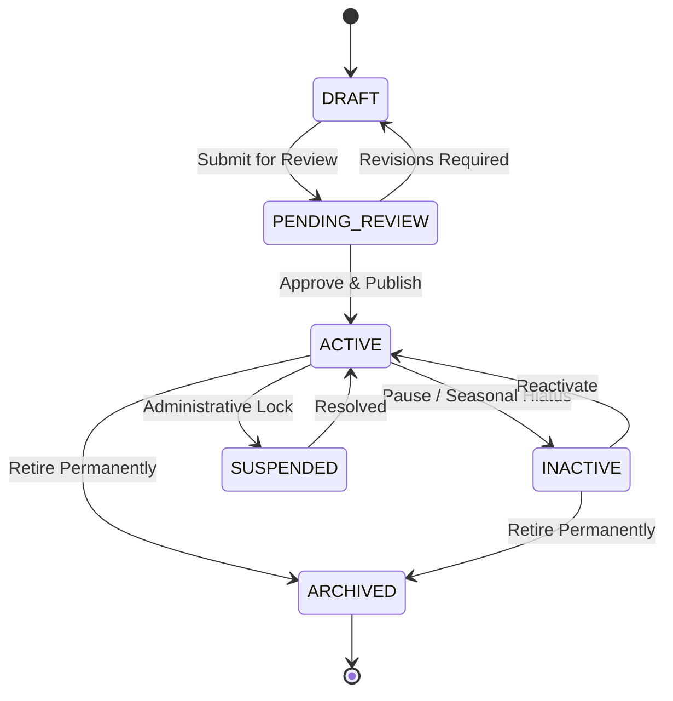
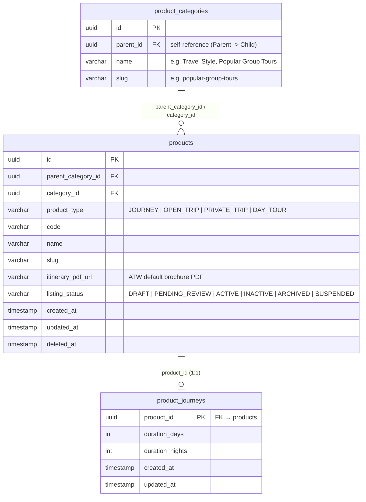
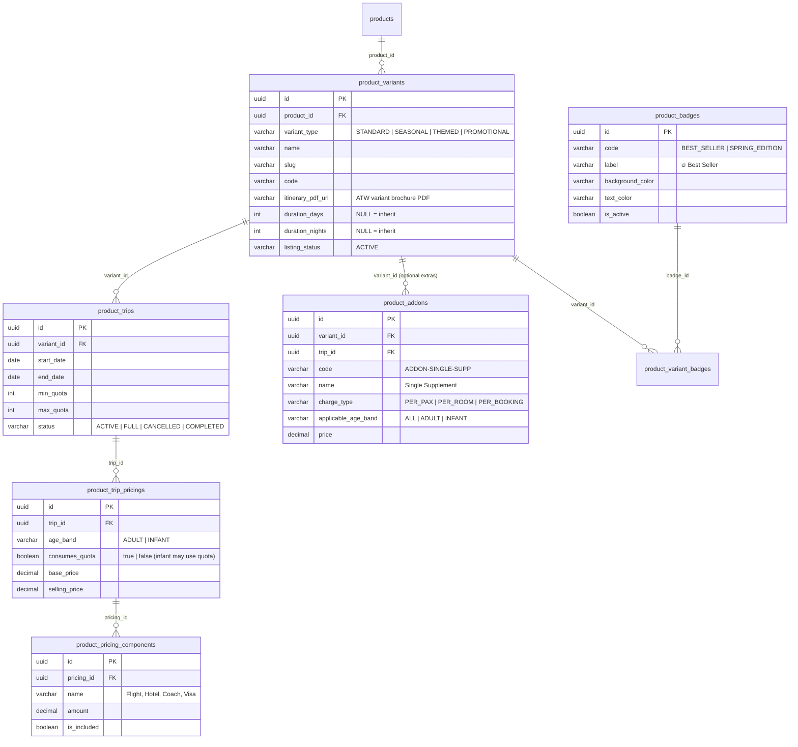
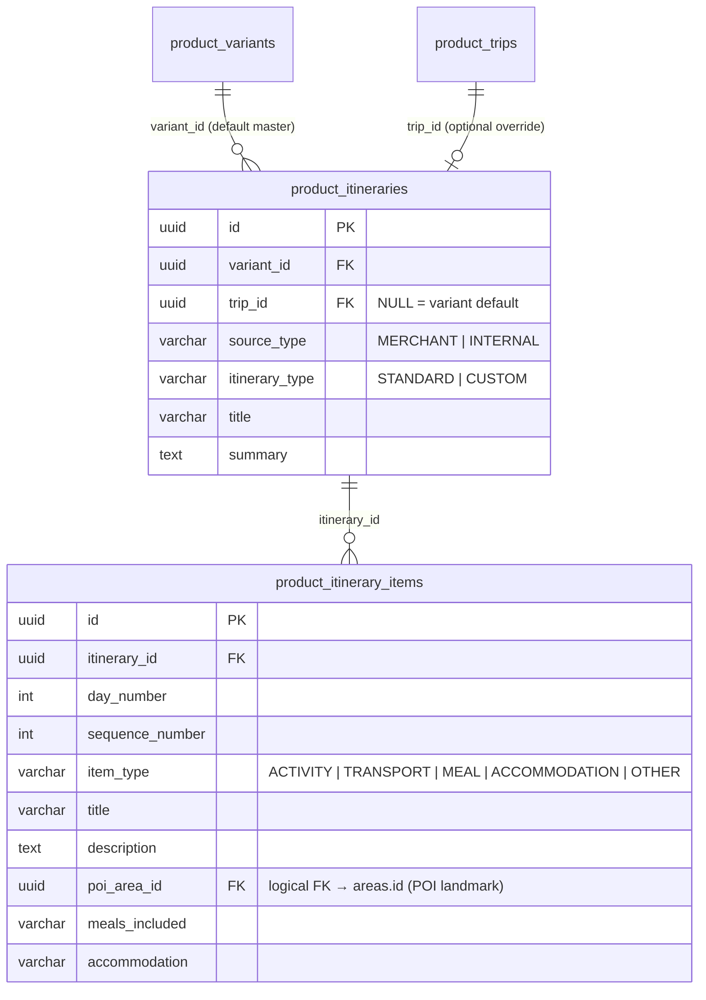
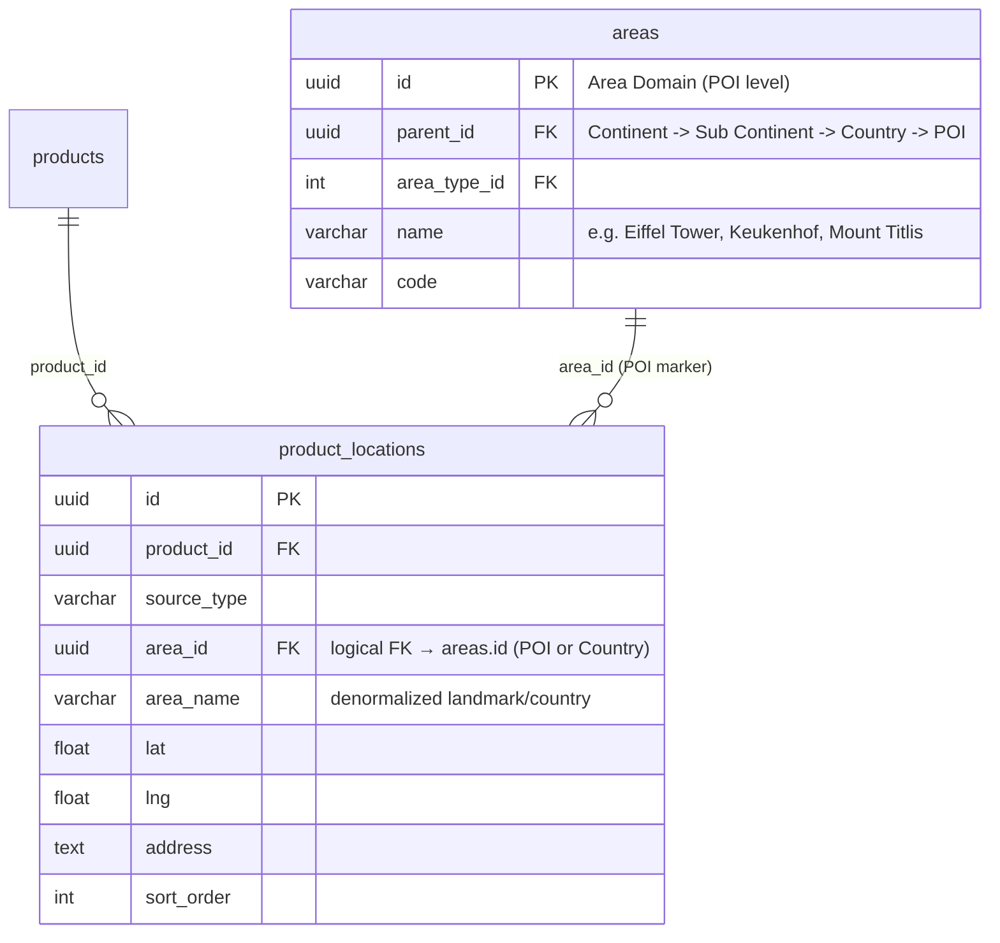
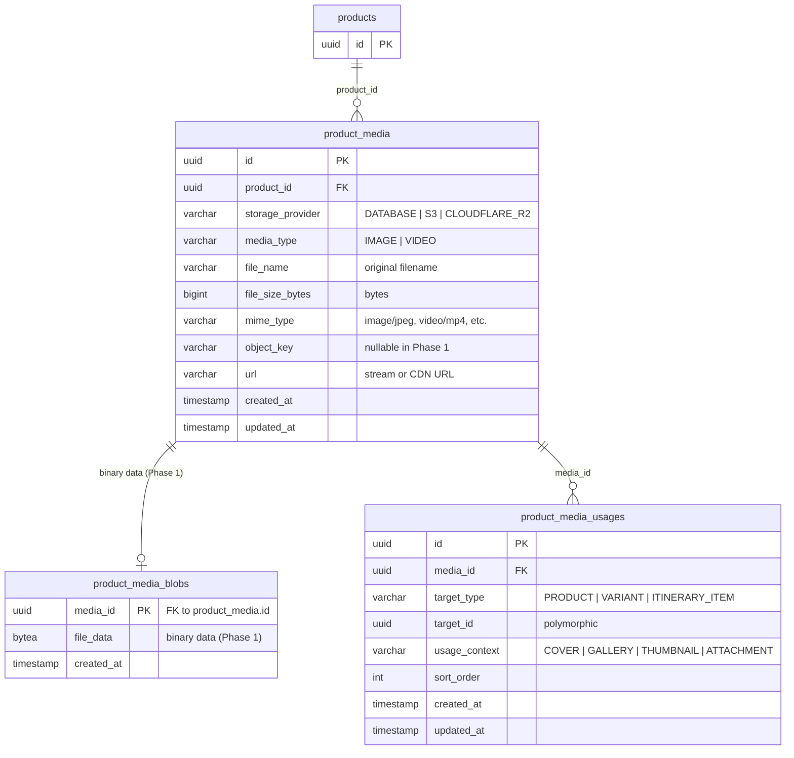
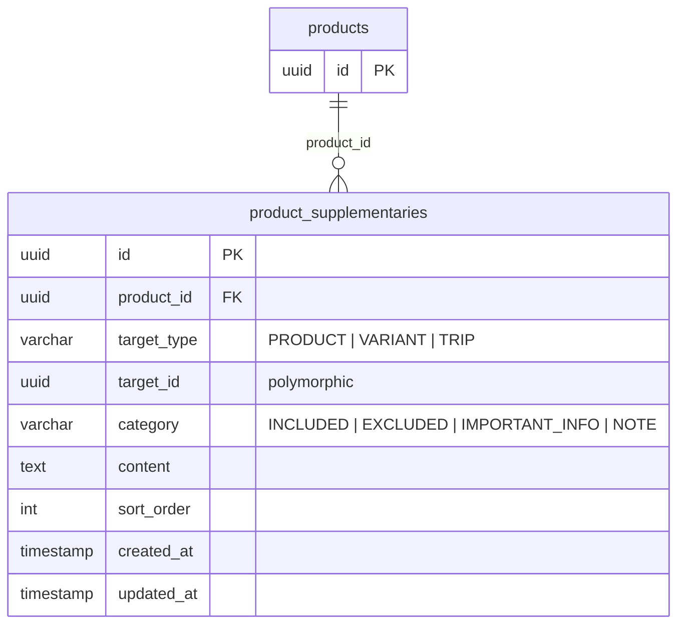
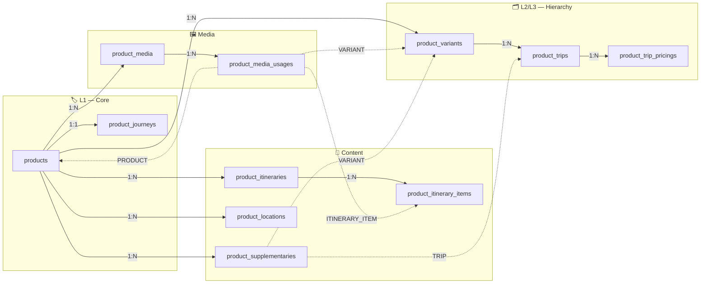

# Product Domain — Technical Data Model & Architecture

> **Overview**
> Single source of truth for the Product Domain PostgreSQL schema. This document covers the complete DDL for all product tables, architectural principles, and per-table ERDs with sample data.
>
> _Engineered for High Scalability, Data Integrity, and optimized for a NestJS + PostgreSQL stack._

**Document Map:**

| Document                                                       | Responsibility                                                               |
| -------------------------------------------------------------- | ---------------------------------------------------------------------------- |
| **This file**                                                  | Full DDL schema, per-table ERDs, sample data, architecture principles        |
| [Product Hierarchy](./product-hierarchy-technical-design.md)   | 3-level hierarchy mental model, full-domain ERD, hierarchy sample data (GWE) |
| [Product Media](./product-media-technical-design.md)           | Media asset repository, polymorphic usages, presigned uploads, CDN delivery  |
| [Search & Filter](./product-search-filter-technical-design.md) | Search API contract, SQL query, indexing strategy                            |
| [Area Domain](./area-technical-design.md)                      | 4-tier geography tree (Continent → Sub Continent → Country → POI), PostGIS spatial model|
| [SEO Architecture](./seo-technical-design.md)                  | SEO metadata, Schema.org rich snippets, Next.js dynamic metadata             |
| [API Contracts](../contracts/README.md)                         | Complete REST API contracts, split sub-resources, request/response DTOs      |
| [Backend Guide](../backend/product-backend-guide.md)            | NestJS ProductModule, services, transactions, and split endpoints             |
| [Frontend Guide](../frontend/product-frontend-guide.md)          | Next.js 15 PDP rendering, tabbed UI loading, and brochure download           |

---

## 🏗️ Architecture & Engineering Principles

### 1. Client-Optimized Data Aggregation

Backend must serve aggregated JSON payloads — never raw rows. Avoid N+1 queries by joining variants, trips, pricing, and media in a **single database round-trip** using TypeORM query builders or raw SQL with `json_agg`.

### 2. Schema Version Control

All DDL scripts are the source of truth for ORM migrations. Every schema change must be committed as a versioned migration file and run through CI/CD pipelines — never applied manually in production.

### 3. Polymorphic Relationships

Media usages and supplementary content use `(target_type, target_id)` to target multiple entity types from one table. Rules:

- **DB-level:** composite B-Tree index on `(target_type, target_id)` is mandatory for read performance.
- **App-level:** NestJS service layer is responsible for cascading deletes to polymorphic child rows inside a **database transaction** — no database FK can enforce this.
- **Valid `target_type` values:** `PRODUCT` · `VARIANT` · `TRIP` · `ITINERARY_ITEM`

### 4. Concurrency & Quota Management

`product_trips.max_quota` is an **immutable ceiling** set at product configuration time. During booking, use **Pessimistic Locking** (`SELECT ... FOR UPDATE`) on the trip row to prevent race conditions. Live availability is tracked in a separate `product_trip_bookings` table — never mutate `max_quota`.

### 5. Precision Economics

All price columns use `DECIMAL(15,2)`. Never use `FLOAT` or `DOUBLE` for monetary values. Use `decimal.js` or `big.js` in NestJS for all arithmetic before returning to clients.

### 6. Media Lifecycle & Validation (Images & Videos)

`product_media` serves as the centralized repository for marketing visual assets: images and videos.

- **Visual Asset MIME & Byte Validation:** Image and video uploads require strict backend validation for allowed MIME types (`image/jpeg`, `image/png`, `image/webp`, `video/mp4`) along with file header verification in the NestJS upload interceptor. Maximum file size is strictly capped (e.g., 25 MB).
- **Single Cover Image Guarantee:** A partial unique index (`uq_media_usages_single_cover`) on `product_media_usages` guarantees at the database level that an entity target can have at most **one** active `COVER` image.
- **Client Cache Optimization:** Media records store `file_name` and `file_size_bytes` so UI clients can display responsive image sets. Binary streaming headers use immutable 1-year browser caching (`Cache-Control: public, max-age=31536000, immutable`).
- **Tour Itinerary PDF Brochure (External ATW Generation):** Official tour brochure PDFs are generated and hosted externally by **ATW**. Hobiholidays does not process, upload, or store PDF binaries in `product_media`. Instead, `products.itinerary_pdf_url` (default) and `product_variants.itinerary_pdf_url` (variant edition override) store the external ATW brochure URL directly for instant O(1) reads resolved via `COALESCE(v.itinerary_pdf_url, p.itinerary_pdf_url)`.

### 7. Audit Timestamps & State Traceability (`created_at`, `updated_at`, `deleted_at`)

Every domain table strictly maintains timestamp tracking for auditability, cache invalidation, and data synchronization:

- **`created_at` & `updated_at`:** Every table enforces `TIMESTAMP NOT NULL DEFAULT CURRENT_TIMESTAMP`. A database trigger function (`set_updated_at_timestamp()`) automatically updates `updated_at` on row mutation to prevent stale data even during direct SQL operations.
- **Soft Deletes (`deleted_at`):** High-value catalog entities (`products`, `product_variants`) use nullable `deleted_at` timestamps instead of physical deletion. Partial indexes explicitly exclude soft-deleted rows (`WHERE deleted_at IS NULL`) to maintain query performance.

### 8. Catalog Lifecycle State Machine & Classification Enums

All entity lifecycles, audience classifications, and category tiers are enforced strictly via database-level `CHECK` constraints:

#### A. Listing Status (`listing_status`) — `products` & `product_variants`

Governs catalog visibility, publication readiness, and public bookability across the tour lifecycle:

- **`DRAFT`:** Initial draft state; visible only to the author/operator; not indexed in search or bookable.
- **`PENDING_REVIEW`:** Submitted by tour creator / merchant for editorial and compliance verification; awaiting administrator approval.
- **`ACTIVE`:** Verified, approved, and live on the storefront; indexed in search queries; bookable if valid departure trips exist.
- **`INACTIVE`:** Temporarily paused / hidden from catalog (e.g., seasonal hiatus, content revamp); not bookable or searchable publicly.
- **`SUSPENDED`:** Administratively frozen / locked due to safety, regulatory, policy violation, or merchant suspension.
- **`ARCHIVED`:** Permanently retired catalog item; preserved strictly for historical booking references and financial audit trails.



#### B. Product Category Taxonomy (`product_categories`)

Establishes a 2-tier parent and child classification taxonomy for catalog grouping, storefront filtering, and thematic discovery:

- **Parent Category (`parent_id IS NULL`):** Broad tour category or travel style (e.g., *Travel Style*, *Special Interest*, *Religious & Halal*, *Seasonal Escapes*).
- **Child Category (`parent_id IS NOT NULL`):** Specific sub-theme or operational package group (e.g., *Cultural & Heritage*, *Family Friendly*, *Adventure & Hiking*, *Honeymoon & Romantic*).

#### C. Age Band Types & Quota Allocation (`age_band`) — `product_trip_pricings`

Replaces the legacy nationality scope (domestic and international prices are identical). Focuses on traveler age classification and dynamic seat capacity impact:

| `age_band` | Target Demographics | Quota / Seat Impact (`consumes_quota`) | Commercial Rationale |
| :--- | :--- | :--- | :--- |
| **`ADULT`** | Age 12+ years old (and standard bed occupancy) | Configurable `BOOLEAN` (Default `TRUE`) | Full adult rate, standard twin/double share accommodation and coach/flight seat. |
| **`INFANT`** | Under 2 years (< 24 months) | Configurable `BOOLEAN` (Default `FALSE`) | Surcharge/tax rate. May consume quota (`TRUE`) if seat/bed is allocated, or not (`FALSE`) if travelling as a lap infant. |

#### D. All-Inclusive Base Pricing & Excluded Add-on Subsystem

- **All-Inclusive Base Pricing (`product_trip_pricings`):** The base selling price represents the full package price, bundling international flights, hotel accommodations, meals, transport, tour leader, and entrance fees. Descriptive inclusions and exclusions are managed transparently via `product_supplementaries` (`INCLUDED` and `EXCLUDED`).
- **Excluded Add-on Subsystem (`product_addons`):** Elective, optional upgrades and additions (`SINGLE_ROOM`, `BAGGAGE`, `FLIGHT_UPGRADE`, `EXPERIENTIAL_TOUR`, `INSURANCE`, `VISA_EXPRESS`, `SPECIAL_MEAL`). These items are **excluded** from the base package price. Add-ons specify `applicable_age_band` (`ADULT`, `INFANT`, or `ALL`) and supplement the base price during booking checkout.

#### E. Variant Types (`variant_type`) — `product_variants`

Categorizes bookable cards surfaced on the **All Tours** storefront. In Hobiholidays, catalog listings are **strictly based on variants**:

| `variant_type`    | Architectural & Business Role                                                                                       | Real-World Example in Hobiholidays                                                  | Frontend UI Badge                       | Catalog Filter Tag         |
| ----------------- | ------------------------------------------------------------------------------------------------------------------- | ----------------------------------------------------------------------------------- | --------------------------------------- | -------------------------- |
| **`STANDARD`**    | Core year-round package with regular recurring departures. Unaffected by specific seasonal or promotional gimmicks. | _GWE Classic 11D_, _Grand Europe Signature 11D_                                      | None / `⭐ Classic`                     | "Regular Packages"         |
| **`SEASONAL`**    | Tied strictly to natural seasons, weather changes, or regional climate windows (Spring, Summer, Autumn, Winter).    | _GWE Spring 2026_, _GWE Summer Keukenhof_, _Swiss Winter Alps_                      | `🌸 Spring` / `🍂 Autumn` / `❄️ Winter` | "Spring / Autumn / Winter" |
| **`THEMED`**      | Centered around cultural festivals, flower blooms, sports events, or special attractions.                           | _Tulip Edition (Keukenhof)_, _Swiss Glacier Wonderland_, _Christmas Market Tour_     | `🌷 Tulip Edition` / `🎌 Festival`      | "Themed & Events"          |
| **`PROMOTIONAL`** | Limited-seat commercial releases, early bird launches, or flash sale campaigns with special pricing.                | _Early Bird Europe 2026_, _Flash Sale GWE IDR 24.9M_, _Travel Fair Special_         | `🔥 Flash Sale` / `⚡ Early Bird`       | "Promotions & Deals"       |

#### F. Product Types (`product_type`) — `products`

- **`JOURNEY`:** Flagship curated multi-day tour program.
- **`OPEN_TRIP`:** Scheduled open-registration group departure.
- **`PRIVATE_TRIP`:** Bespoke / custom private charter tour.
- **`DAY_TOUR`:** Single-day guided excursion or city tour.

#### G. Trip Departure Status (`status`) — `product_trips`

- **`ACTIVE`:** Open for booking; quota available.
- **`FULL`:** Sold out; maximum capacity reached.
- **`CANCELLED`:** Departure cancelled (minimum quota unmet or force majeure).
- **`COMPLETED`:** Tour concluded successfully.

---

## 🛠️ PostgreSQL DDL Schema

> This is the complete, authoritative schema for the Product domain. Tables are ordered by dependency (parents before children).

```sql
-- =========================================================================
-- 0. EXTENSIONS
-- =========================================================================
CREATE EXTENSION IF NOT EXISTS "uuid-ossp";
CREATE EXTENSION IF NOT EXISTS "pg_trgm"; -- Required for GIN text search indexes


-- =========================================================================
-- 1. TAXONOMY & CORE — L1: product_categories, products & product_journeys
-- =========================================================================

-- Product category taxonomy (Parent & Child 2-tier tree)
CREATE TABLE product_categories (
    id          UUID         PRIMARY KEY DEFAULT uuid_generate_v4(),
    parent_id   UUID         REFERENCES product_categories(id) ON DELETE RESTRICT,
    name        VARCHAR(100) NOT NULL,                    -- e.g. "Travel Style", "Cultural & Heritage"
    slug        VARCHAR(120) UNIQUE NOT NULL,             -- e.g. "travel-style", "cultural-heritage"
    icon_url    VARCHAR(500),
    description TEXT,
    sort_order  INT          NOT NULL DEFAULT 0,
    is_active   BOOLEAN      NOT NULL DEFAULT TRUE,
    created_at  TIMESTAMP    NOT NULL DEFAULT CURRENT_TIMESTAMP,
    updated_at  TIMESTAMP    NOT NULL DEFAULT CURRENT_TIMESTAMP,

    CONSTRAINT chk_category_depth CHECK (id <> parent_id)
);
CREATE INDEX idx_categories_parent_id ON product_categories(parent_id);
CREATE INDEX idx_categories_slug      ON product_categories(slug);

-- Master product entity — the brand/program umbrella
CREATE TABLE products (
    id                 UUID         PRIMARY KEY DEFAULT uuid_generate_v4(),
    parent_category_id UUID         REFERENCES product_categories(id) ON DELETE SET NULL, -- Top-level theme
    category_id        UUID         REFERENCES product_categories(id) ON DELETE SET NULL, -- Child category
    product_type       VARCHAR(50)  NOT NULL,                    -- JOURNEY | OPEN_TRIP | PRIVATE_TRIP | DAY_TOUR
    code               VARCHAR(100) UNIQUE NOT NULL,             -- e.g. GWE-MASTER
    name               VARCHAR(255) NOT NULL,                    -- e.g. Grand West Europe, Swiss Alpine Panorama
    slug               VARCHAR(255) UNIQUE NOT NULL,             -- e.g. grand-west-europe
    itinerary_pdf_url  VARCHAR(500),                             -- Default umbrella brochure URL generated by ATW
    listing_status     VARCHAR(50)  NOT NULL DEFAULT 'DRAFT',    -- DRAFT | PENDING_REVIEW | ACTIVE | INACTIVE | ARCHIVED | SUSPENDED
    created_at         TIMESTAMP    NOT NULL DEFAULT CURRENT_TIMESTAMP,
    updated_at         TIMESTAMP    NOT NULL DEFAULT CURRENT_TIMESTAMP,
    deleted_at         TIMESTAMP    NULL,

    CONSTRAINT chk_products_listing_status CHECK (listing_status IN ('DRAFT', 'PENDING_REVIEW', 'ACTIVE', 'INACTIVE', 'ARCHIVED', 'SUSPENDED')),
    CONSTRAINT chk_products_type           CHECK (product_type IN ('JOURNEY', 'OPEN_TRIP', 'PRIVATE_TRIP', 'DAY_TOUR'))
);
CREATE INDEX idx_products_status          ON products(listing_status) WHERE deleted_at IS NULL;
CREATE INDEX idx_products_category        ON products(category_id);
CREATE INDEX idx_products_parent_category ON products(parent_category_id);
CREATE INDEX idx_products_name_trgm       ON products USING GIN (name gin_trgm_ops);
CREATE INDEX idx_products_slug_trgm       ON products USING GIN (slug gin_trgm_ops);

-- Base journey metadata (1:1 with products)
CREATE TABLE product_journeys (
    product_id          UUID        PRIMARY KEY REFERENCES products(id) ON DELETE CASCADE,
    duration_days       INT         NOT NULL DEFAULT 1,
    duration_nights     INT         NOT NULL DEFAULT 0,
    created_at          TIMESTAMP   NOT NULL DEFAULT CURRENT_TIMESTAMP,
    updated_at          TIMESTAMP   NOT NULL DEFAULT CURRENT_TIMESTAMP,

    CONSTRAINT chk_duration CHECK (duration_days >= 1 AND duration_nights >= 0)
);


-- =========================================================================
-- 2. HIERARCHY — L2: product_variants
-- One product → many variants. Each variant is strictly one card on All Tours.
-- =========================================================================
CREATE TABLE product_variants (
    id              UUID         PRIMARY KEY DEFAULT uuid_generate_v4(),
    product_id      UUID         NOT NULL REFERENCES products(id) ON DELETE CASCADE,
    variant_type    VARCHAR(50)  NOT NULL DEFAULT 'STANDARD', -- STANDARD | SEASONAL | THEMED | PROMOTIONAL
    name            VARCHAR(255) NOT NULL,                    -- e.g. "GWE Spring 2026"
    slug            VARCHAR(255) UNIQUE NOT NULL,              -- e.g. "gwe-spring-2026"
    code            VARCHAR(100) UNIQUE NOT NULL,              -- e.g. "GWE-SPR-2026"

    -- Duration override: NULL means inherit from product_journeys via COALESCE
    duration_days   INT          NULL,
    duration_nights INT          NULL,

    -- ATW itinerary brochure URL: NULL means inherit from products.itinerary_pdf_url
    itinerary_pdf_url VARCHAR(500) NULL,

    listing_status  VARCHAR(50)  NOT NULL DEFAULT 'DRAFT',    -- DRAFT | PENDING_REVIEW | ACTIVE | INACTIVE | ARCHIVED | SUSPENDED
    created_at      TIMESTAMP    NOT NULL DEFAULT CURRENT_TIMESTAMP,
    updated_at      TIMESTAMP    NOT NULL DEFAULT CURRENT_TIMESTAMP,
    deleted_at      TIMESTAMP    NULL,

    CONSTRAINT chk_variants_variant_type   CHECK (variant_type IN ('STANDARD', 'SEASONAL', 'THEMED', 'PROMOTIONAL')),
    CONSTRAINT chk_variants_listing_status CHECK (listing_status IN ('DRAFT', 'PENDING_REVIEW', 'ACTIVE', 'INACTIVE', 'ARCHIVED', 'SUSPENDED'))
);
CREATE INDEX idx_variants_product_id   ON product_variants(product_id);
CREATE INDEX idx_variants_slug         ON product_variants(slug);
CREATE INDEX idx_variants_status       ON product_variants(listing_status) WHERE deleted_at IS NULL;
CREATE INDEX idx_variants_name_trgm    ON product_variants USING GIN (name gin_trgm_ops);
CREATE INDEX idx_variants_slug_trgm    ON product_variants USING GIN (slug gin_trgm_ops);

-- Flat badges table (supports admin-managed custom promotional labels on listing cards)
CREATE TABLE product_badges (
    id               UUID         PRIMARY KEY DEFAULT uuid_generate_v4(),
    code             VARCHAR(50)  UNIQUE NOT NULL, -- e.g. 'BEST_SELLER', 'SPRING_EDITION'
    label            VARCHAR(100) NOT NULL,        -- e.g. '🔥 Best Seller', '🌸 Spring Edition'
    background_color VARCHAR(30)  DEFAULT '#F3F4F6',
    text_color       VARCHAR(30)  DEFAULT '#1F2937',
    icon_url         VARCHAR(500) NULL,
    is_active        BOOLEAN      NOT NULL DEFAULT TRUE,
    created_at       TIMESTAMP    NOT NULL DEFAULT CURRENT_TIMESTAMP
);

-- Flat M:N mapping between variants and badges
CREATE TABLE product_variant_badges (
    variant_id UUID NOT NULL REFERENCES product_variants(id) ON DELETE CASCADE,
    badge_id   UUID NOT NULL REFERENCES product_badges(id) ON DELETE CASCADE,
    PRIMARY KEY (variant_id, badge_id)
);
CREATE INDEX idx_variant_badges_badge_id ON product_variant_badges(badge_id);


-- =========================================================================
-- 3. HIERARCHY — L3: product_trips, product_trip_pricings & components
-- One variant → many trips. A trip is a concrete dated departure window.
-- =========================================================================
CREATE TABLE product_trips (
    id              UUID        PRIMARY KEY DEFAULT uuid_generate_v4(),
    variant_id      UUID        NOT NULL REFERENCES product_variants(id) ON DELETE CASCADE,
    start_date      DATE        NOT NULL,
    end_date        DATE        NOT NULL,
    min_quota       INT         NOT NULL DEFAULT 1,
    max_quota       INT         NOT NULL,
    status          VARCHAR(50) NOT NULL DEFAULT 'ACTIVE',    -- ACTIVE | FULL | CANCELLED | COMPLETED
    created_at      TIMESTAMP   NOT NULL DEFAULT CURRENT_TIMESTAMP,
    updated_at      TIMESTAMP   NOT NULL DEFAULT CURRENT_TIMESTAMP,

    CONSTRAINT uq_trip_variant_start UNIQUE (variant_id, start_date),
    CONSTRAINT chk_trip_dates        CHECK  (end_date > start_date),
    CONSTRAINT chk_trip_quota        CHECK  (max_quota >= min_quota AND min_quota >= 1),
    CONSTRAINT chk_trips_status      CHECK  (status IN ('ACTIVE', 'FULL', 'CANCELLED', 'COMPLETED'))
);
CREATE INDEX idx_trips_variant_id ON product_trips(variant_id);
-- Partial index: search queries only touch ACTIVE trips
CREATE INDEX idx_trips_search     ON product_trips(start_date, min_quota, max_quota)
    WHERE status = 'ACTIVE';

-- Pricing tiers per trip resolved by age band & capacity quota rules (replaces nationality)
CREATE TABLE product_trip_pricings (
    id                  UUID           PRIMARY KEY DEFAULT uuid_generate_v4(),
    trip_id             UUID           NOT NULL REFERENCES product_trips(id) ON DELETE CASCADE,
    age_band            VARCHAR(50)    NOT NULL,               -- ADULT | INFANT
    min_age             INT            NOT NULL DEFAULT 0,
    max_age             INT            NULL,
    consumes_quota      BOOLEAN        NOT NULL DEFAULT TRUE,  -- Configurable: TRUE if passenger occupies seat quota, FALSE if non-quota (e.g. lap infant)
    currency            VARCHAR(10)    NOT NULL DEFAULT 'IDR',
    base_price          DECIMAL(15,2)  NOT NULL,
    selling_price       DECIMAL(15,2)  NOT NULL,
    created_at          TIMESTAMP      NOT NULL DEFAULT CURRENT_TIMESTAMP,
    updated_at          TIMESTAMP      NOT NULL DEFAULT CURRENT_TIMESTAMP,

    CONSTRAINT uq_pricing_trip_age_band UNIQUE (trip_id, age_band),
    CONSTRAINT chk_price_sanity         CHECK  (selling_price > 0 AND base_price >= selling_price),
    CONSTRAINT chk_pricing_age_band     CHECK  (age_band IN ('ADULT', 'INFANT'))
);
CREATE INDEX idx_pricings_search ON product_trip_pricings(trip_id, age_band, selling_price);

-- Itemized breakdown components per pricing tier (e.g. Flight, Hotel, Coach, Visa, Admissions)
CREATE TABLE product_pricing_components (
    id              UUID           PRIMARY KEY DEFAULT uuid_generate_v4(),
    pricing_id      UUID           NOT NULL REFERENCES product_trip_pricings(id) ON DELETE CASCADE,
    name            VARCHAR(150)   NOT NULL, -- e.g. "International Flight & Taxes", "4-Star Hotel Accommodation"
    description     TEXT           NULL,     -- e.g. "Economy return flight with Qatar Airways"
    amount          DECIMAL(15,2)  NULL,     -- Nominal cost estimation for transparent breakdowns
    is_included     BOOLEAN        NOT NULL DEFAULT TRUE,
    sort_order      INT            NOT NULL DEFAULT 0,
    created_at      TIMESTAMP      NOT NULL DEFAULT CURRENT_TIMESTAMP,
    updated_at      TIMESTAMP      NOT NULL DEFAULT CURRENT_TIMESTAMP
);
CREATE INDEX idx_pricing_components_pricing_id ON product_pricing_components(pricing_id);

-- Optional add-ons (Single Supplement, Extra Baggage, Flight Upgrade, Excursion)
-- Excluded from base price; available for elective passenger purchase
CREATE TABLE product_addons (
    id                  UUID           PRIMARY KEY DEFAULT uuid_generate_v4(),
    variant_id          UUID           NOT NULL REFERENCES product_variants(id) ON DELETE CASCADE,
    trip_id             UUID           NULL REFERENCES product_trips(id) ON DELETE CASCADE, -- NULL = all trips in variant
    code                VARCHAR(50)    NOT NULL, -- e.g. 'ADDON-SINGLE-SUPP'
    name                VARCHAR(255)   NOT NULL, -- e.g. "Single Supplement (Kamar Sendiri)"
    description         TEXT,
    addon_type          VARCHAR(50)    NOT NULL, -- SINGLE_ROOM | BAGGAGE | FLIGHT_UPGRADE | EXPERIENTIAL_TOUR | INSURANCE | VISA_EXPRESS | SPECIAL_MEAL
    charge_type         VARCHAR(50)    NOT NULL DEFAULT 'PER_PAX', -- PER_PAX | PER_ROOM | PER_BOOKING
    price               DECIMAL(15,2)  NOT NULL,
    currency            VARCHAR(10)    NOT NULL DEFAULT 'IDR',
    applicable_age_band VARCHAR(20)    NULL, -- NULL = ALL | ADULT | INFANT
    is_mandatory        BOOLEAN        NOT NULL DEFAULT FALSE,
    max_quantity        INT            NOT NULL DEFAULT 1,
    is_active           BOOLEAN        NOT NULL DEFAULT TRUE,
    created_at          TIMESTAMP      NOT NULL DEFAULT CURRENT_TIMESTAMP,
    updated_at          TIMESTAMP      NOT NULL DEFAULT CURRENT_TIMESTAMP,

    CONSTRAINT chk_addon_price       CHECK (price >= 0),
    CONSTRAINT chk_addon_charge_type CHECK (charge_type IN ('PER_PAX', 'PER_ROOM', 'PER_BOOKING')),
    CONSTRAINT chk_addon_type        CHECK (addon_type IN ('SINGLE_ROOM', 'BAGGAGE', 'FLIGHT_UPGRADE', 'EXPERIENTIAL_TOUR', 'INSURANCE', 'VISA_EXPRESS', 'SPECIAL_MEAL')),
    CONSTRAINT chk_addon_age_band    CHECK (applicable_age_band IS NULL OR applicable_age_band IN ('ADULT', 'INFANT'))
);
CREATE INDEX idx_addons_variant_trip ON product_addons(variant_id, trip_id);


-- =========================================================================
-- 4. CONTENT — Itinerary (Variant Level Default & Trip Level Override)
-- Day-by-day programme. Default owned at Variant (L2), overridden at Trip (L3).
-- =========================================================================
CREATE TABLE product_itineraries (
    id              UUID         PRIMARY KEY DEFAULT uuid_generate_v4(),
    variant_id      UUID         NOT NULL REFERENCES product_variants(id) ON DELETE CASCADE,
    trip_id         UUID         NULL REFERENCES product_trips(id) ON DELETE CASCADE,
    source_type     VARCHAR(50)  NOT NULL DEFAULT 'INTERNAL', -- MERCHANT | INTERNAL
    itinerary_type  VARCHAR(50)  NOT NULL DEFAULT 'STANDARD', -- STANDARD | CUSTOM
    title           VARCHAR(255) NOT NULL,
    summary         TEXT,
    created_at      TIMESTAMP    NOT NULL DEFAULT CURRENT_TIMESTAMP,
    updated_at      TIMESTAMP    NOT NULL DEFAULT CURRENT_TIMESTAMP,

    CONSTRAINT chk_itineraries_source_type CHECK (source_type IN ('MERCHANT', 'INTERNAL')),
    CONSTRAINT chk_itineraries_type        CHECK (itinerary_type IN ('STANDARD', 'CUSTOM'))
);

-- Variant default itinerary: exactly 1 master itinerary per variant where trip_id IS NULL
CREATE UNIQUE INDEX uq_itinerary_variant_default 
    ON product_itineraries (variant_id) 
    WHERE trip_id IS NULL;

-- Trip override itinerary: at most 1 custom itinerary per specific departure
CREATE UNIQUE INDEX uq_itinerary_trip_override 
    ON product_itineraries (trip_id) 
    WHERE trip_id IS NOT NULL;

CREATE TABLE product_itinerary_items (
    id              UUID         PRIMARY KEY DEFAULT uuid_generate_v4(),
    itinerary_id    UUID         NOT NULL REFERENCES product_itineraries(id) ON DELETE CASCADE,
    day_number      INT          NOT NULL,
    sequence_number INT          NOT NULL,
    item_type       VARCHAR(50)  NOT NULL,       -- ACTIVITY | TRANSPORT | MEAL | ACCOMMODATION | OTHER
    title           VARCHAR(255) NOT NULL,
    description     TEXT,
    poi_area_id     UUID         NULL,           -- Logical FK → areas.id (POI landmark)
    meals_included  VARCHAR(100),
    accommodation   VARCHAR(150),
    created_at      TIMESTAMP    NOT NULL DEFAULT CURRENT_TIMESTAMP,
    updated_at      TIMESTAMP    NOT NULL DEFAULT CURRENT_TIMESTAMP,

    CONSTRAINT uq_itinerary_item_order UNIQUE (itinerary_id, day_number, sequence_number),
    CONSTRAINT chk_itinerary_item_type  CHECK (item_type IN ('ACTIVITY', 'TRANSPORT', 'MEAL', 'ACCOMMODATION', 'OTHER'))
);
CREATE INDEX idx_itinerary_items_itinerary_id ON product_itinerary_items(itinerary_id);
CREATE INDEX idx_itinerary_items_poi          ON product_itinerary_items(poi_area_id);


-- =========================================================================
-- 5. CONTENT — Locations
-- Multiple destination markers per product. area_id is a logical FK to the
-- Area/Geography domain (not enforced at DB level across domains).
-- =========================================================================
CREATE TABLE product_locations (
    id          UUID           PRIMARY KEY DEFAULT uuid_generate_v4(),
    product_id  UUID           NOT NULL REFERENCES products(id) ON DELETE CASCADE,
    source_type VARCHAR(50)    NOT NULL,                   -- AREA | MANUAL
    area_id     UUID           NOT NULL,                   -- Logical FK → Area domain
    area_name   VARCHAR(100),                              -- Denormalized for fast UI rendering
    lat         DOUBLE PRECISION,
    lng         DOUBLE PRECISION,
    address     TEXT,
    sort_order  INT            NOT NULL DEFAULT 0,
    created_at  TIMESTAMP      NOT NULL DEFAULT CURRENT_TIMESTAMP,
    updated_at  TIMESTAMP      NOT NULL DEFAULT CURRENT_TIMESTAMP,

    CONSTRAINT chk_locations_source_type CHECK (source_type IN ('AREA', 'MANUAL'))
);
CREATE INDEX idx_locations_product_id     ON product_locations(product_id);
CREATE INDEX idx_locations_area_id        ON product_locations(area_id);
CREATE INDEX idx_locations_area_name_trgm ON product_locations USING GIN (area_name gin_trgm_ops);


-- =========================================================================
-- 6. MEDIA — product_media & product_media_usages (polymorphic)
-- Media assets are owned at the product level.
-- Usage slots (cover, gallery, thumbnail) target entities polymorphically.
-- Supports visual marketing assets (images and videos). Tour PDF brochures are compiled by ATW.
-- Detailed Architecture: See [Product Media Technical Design](./product-media-technical-design.md)
-- =========================================================================
CREATE TABLE product_media (
    id               UUID         PRIMARY KEY DEFAULT uuid_generate_v4(),
    product_id       UUID         NOT NULL REFERENCES products(id) ON DELETE CASCADE,
    storage_provider VARCHAR(50)  NOT NULL DEFAULT 'DATABASE', -- DATABASE (Phase 1) | S3 | CLOUDFLARE_R2 (Phase 2)
    source_upload_id VARCHAR(255),                          -- External upload service or CDN reference ID
    media_type       VARCHAR(50)  NOT NULL,                  -- IMAGE | VIDEO
    file_name        VARCHAR(255) NOT NULL,                 -- Original filename (e.g. gwe-eiffel-tower-hero.jpg)
    file_size_bytes  BIGINT       NOT NULL,                 -- File size in bytes for UI preview
    mime_type        VARCHAR(100) NOT NULL,                 -- e.g. image/jpeg, image/webp, video/mp4
    object_key       VARCHAR(500) NULL,                     -- S3/GCS key (NULL in Phase 1, required in Phase 2)
    url              VARCHAR(500) NOT NULL,                 -- Stream URL (Phase 1) or CDN URL (Phase 2)
    created_at       TIMESTAMP    NOT NULL DEFAULT CURRENT_TIMESTAMP,
    updated_at       TIMESTAMP    NOT NULL DEFAULT CURRENT_TIMESTAMP,

    CONSTRAINT chk_media_type             CHECK (media_type IN ('IMAGE', 'VIDEO')),
    CONSTRAINT chk_media_storage_provider CHECK (storage_provider IN ('DATABASE', 'S3', 'CLOUDFLARE_R2'))
);
CREATE INDEX idx_media_product_id ON product_media(product_id);
CREATE INDEX idx_media_type       ON product_media(media_type);
CREATE INDEX idx_media_storage    ON product_media(storage_provider);

-- Dedicated table for Phase 1 in-database binary storage (BYTEA)
CREATE TABLE product_media_blobs (
    media_id   UUID      PRIMARY KEY REFERENCES product_media(id) ON DELETE CASCADE,
    file_data  BYTEA     NOT NULL,
    created_at TIMESTAMP NOT NULL DEFAULT CURRENT_TIMESTAMP
);

CREATE TABLE product_media_usages (
    id            UUID        PRIMARY KEY DEFAULT uuid_generate_v4(),
    media_id      UUID        NOT NULL REFERENCES product_media(id) ON DELETE CASCADE,
    target_type   VARCHAR(50) NOT NULL,    -- PRODUCT | VARIANT | ITINERARY_ITEM
    target_id     UUID        NOT NULL,    -- Polymorphic — resolved by target_type
    usage_context VARCHAR(50) NOT NULL,    -- COVER | GALLERY | THUMBNAIL | ATTACHMENT
    sort_order    INT         NOT NULL DEFAULT 0,
    created_at    TIMESTAMP   NOT NULL DEFAULT CURRENT_TIMESTAMP,
    updated_at    TIMESTAMP   NOT NULL DEFAULT CURRENT_TIMESTAMP,

    CONSTRAINT chk_media_target_type    CHECK (target_type IN ('PRODUCT', 'VARIANT', 'ITINERARY_ITEM')),
    CONSTRAINT chk_media_usage_context CHECK (usage_context IN ('COVER', 'GALLERY', 'THUMBNAIL', 'ATTACHMENT'))
);
-- Essential composite index for polymorphic reads
CREATE INDEX idx_media_usages_target ON product_media_usages(target_type, target_id);

-- Enforce single COVER image per entity target
CREATE UNIQUE INDEX uq_media_usages_single_cover
    ON product_media_usages(target_id, usage_context)
    WHERE usage_context = 'COVER';


-- =========================================================================
-- 7. SUPPLEMENTARY CONTENT (polymorphic)
-- Reusable content blocks that can target any entity level.
-- =========================================================================
CREATE TABLE product_supplementaries (
    id          UUID        PRIMARY KEY DEFAULT uuid_generate_v4(),
    product_id  UUID        NOT NULL REFERENCES products(id) ON DELETE CASCADE,
    target_type VARCHAR(50) NOT NULL,    -- PRODUCT | VARIANT | TRIP
    target_id   UUID        NOT NULL,    -- Polymorphic
    category    VARCHAR(50) NOT NULL,    -- INCLUDED | EXCLUDED | IMPORTANT_INFO | NOTE
    content     TEXT,
    sort_order  INT         NOT NULL DEFAULT 0,
    created_at  TIMESTAMP   NOT NULL DEFAULT CURRENT_TIMESTAMP,
    updated_at  TIMESTAMP   NOT NULL DEFAULT CURRENT_TIMESTAMP,

    CONSTRAINT chk_supp_target_type CHECK (target_type IN ('PRODUCT', 'VARIANT', 'TRIP')),
    CONSTRAINT chk_supp_category    CHECK (category IN ('INCLUDED', 'EXCLUDED', 'IMPORTANT_INFO', 'NOTE'))
);
CREATE INDEX idx_supplementaries_target ON product_supplementaries(target_type, target_id);


-- =========================================================================
-- 8. SEO METADATA (polymorphic)
-- Custom search engine optimization and Open Graph tags per entity.
-- Detailed Architecture: See [SEO Technical Design](./seo-technical-design.md)
-- =========================================================================
CREATE TABLE seo_metadata (
    id               UUID         PRIMARY KEY DEFAULT uuid_generate_v4(),
    target_type      VARCHAR(50)  NOT NULL,                  -- PRODUCT | VARIANT | AREA
    target_id        UUID         NOT NULL,                  -- Polymorphic FK
    meta_title       VARCHAR(255),                          -- Custom <title> tag
    meta_description TEXT,                                  -- Custom meta description
    canonical_url    VARCHAR(500),                          -- Canonical URL override
    og_title         VARCHAR(255),                          -- Open Graph title
    og_description   TEXT,                                  -- Open Graph description
    og_image_url     VARCHAR(500),                          -- Social sharing banner
    no_index         BOOLEAN      NOT NULL DEFAULT FALSE,   -- Crawler noindex flag
    no_follow        BOOLEAN      NOT NULL DEFAULT FALSE,   -- Crawler nofollow flag
    structured_data  JSONB,                                 -- Schema.org overrides
    created_at       TIMESTAMP    NOT NULL DEFAULT CURRENT_TIMESTAMP,
    updated_at       TIMESTAMP    NOT NULL DEFAULT CURRENT_TIMESTAMP,

    CONSTRAINT chk_seo_target_type CHECK (target_type IN ('PRODUCT', 'VARIANT', 'AREA')),
    CONSTRAINT uq_seo_target       UNIQUE (target_type, target_id)
);
CREATE INDEX idx_seo_target ON seo_metadata(target_type, target_id);


-- =========================================================================
-- 9. AUDIT TRIGGER AUTOMATION
-- PostgreSQL trigger function to automatically update `updated_at` timestamps
-- upon row mutation across all domain entities.
-- =========================================================================
CREATE OR REPLACE FUNCTION set_updated_at_timestamp()
RETURNS TRIGGER AS $$
BEGIN
    NEW.updated_at = CURRENT_TIMESTAMP;
    RETURN NEW;
END;
$$ LANGUAGE plpgsql;

-- Apply timestamp triggers to all tables with updated_at
CREATE TRIGGER trg_products_updated_at             BEFORE UPDATE ON products             FOR EACH ROW EXECUTE FUNCTION set_updated_at_timestamp();
CREATE TRIGGER trg_product_journeys_updated_at     BEFORE UPDATE ON product_journeys     FOR EACH ROW EXECUTE FUNCTION set_updated_at_timestamp();
CREATE TRIGGER trg_product_variants_updated_at     BEFORE UPDATE ON product_variants     FOR EACH ROW EXECUTE FUNCTION set_updated_at_timestamp();
CREATE TRIGGER trg_product_trips_updated_at        BEFORE UPDATE ON product_trips        FOR EACH ROW EXECUTE FUNCTION set_updated_at_timestamp();
CREATE TRIGGER trg_product_trip_pricings_updated_at BEFORE UPDATE ON product_trip_pricings FOR EACH ROW EXECUTE FUNCTION set_updated_at_timestamp();
CREATE TRIGGER trg_product_itineraries_updated_at  BEFORE UPDATE ON product_itineraries  FOR EACH ROW EXECUTE FUNCTION set_updated_at_timestamp();
CREATE TRIGGER trg_product_itinerary_items_updated_at BEFORE UPDATE ON product_itinerary_items FOR EACH ROW EXECUTE FUNCTION set_updated_at_timestamp();
CREATE TRIGGER trg_product_locations_updated_at    BEFORE UPDATE ON product_locations    FOR EACH ROW EXECUTE FUNCTION set_updated_at_timestamp();
CREATE TRIGGER trg_product_media_updated_at        BEFORE UPDATE ON product_media        FOR EACH ROW EXECUTE FUNCTION set_updated_at_timestamp();
CREATE TRIGGER trg_product_media_usages_updated_at BEFORE UPDATE ON product_media_usages FOR EACH ROW EXECUTE FUNCTION set_updated_at_timestamp();
CREATE TRIGGER trg_product_supplementaries_updated_at BEFORE UPDATE ON product_supplementaries FOR EACH ROW EXECUTE FUNCTION set_updated_at_timestamp();
CREATE TRIGGER trg_seo_metadata_updated_at         BEFORE UPDATE ON seo_metadata         FOR EACH ROW EXECUTE FUNCTION set_updated_at_timestamp();
```

---

## 📊 Domain Data Scenario — Grand West Europe

**Product:** Grand West Europe · **ID:** `prod_gwe_01`

_Each section below shows the ERD for that sub-domain, followed by concrete sample rows. (Standard audit timestamps `created_at`, `updated_at`, and `deleted_at` are defined in the schema and ERD above, but omitted from the sample data tables below for readability)._

---

### 1. Core Product, Taxonomy & Journey



| Table | id | parent_category_id | category_id | product_type | code | slug | listing_status |
| :--- | :--- | :--- | :--- | :--- | :--- | :--- | :--- |
| `products` | prod_gwe_01 | cat_travel_style | cat_popular_group | JOURNEY | GWE-MASTER | grand-west-europe | ACTIVE |

| Table | product_id | duration_days | duration_nights |
| :--- | :--- | :--- | :--- |
| `product_journeys` | prod_gwe_01 | 11 | 10 |

---

### 2. Variants, Trips, Age-Band Pricing, Components & Add-ons

> Full hierarchy ERDs and GWE sample data: [Product Hierarchy Technical Design](./product-hierarchy-technical-design.md)



| Table | id | product_id | variant_type | name | slug | code | duration_days | duration_nights | listing_status |
| :--- | :--- | :--- | :--- | :--- | :--- | :--- | :--- | :--- | :--- |
| `product_variants` | var_gwe_std | prod_gwe_01 | STANDARD | Grand West Europe Classic 11D | gwe-classic-11d | GWE-STD-2026 | NULL (11) | NULL (10) | ACTIVE |
| `product_variants` | var_gwe_sum | prod_gwe_01 | SEASONAL | Grand West Europe Summer Keukenhof | gwe-summer-2026 | GWE-SUM-2026 | NULL (11) | NULL (10) | ACTIVE |
| `product_variants` | var_gwe_wnt | prod_gwe_01 | THEMED | Grand West Europe Winter & Swiss Glacier | gwe-winter-swiss-2026 | GWE-WNT-2026 | 12 (override) | 11 (override) | ACTIVE |
| `product_variants` | var_gwe_fls | prod_gwe_01 | PROMOTIONAL | Grand West Europe Flash Deal IDR 24.9M | gwe-flash-sale-2026 | GWE-FLS-2026 | NULL (11) | NULL (10) | ACTIVE |

| Table | id | variant_id | start_date | end_date | min_quota | max_quota | status |
| :--- | :--- | :--- | :--- | :--- | :--- | :--- | :--- |
| `product_trips` | trip_gwe_std01 | var_gwe_std | 2026-08-10 | 2026-08-20 | 15 | 30 | ACTIVE |
| `product_trips` | trip_gwe_sum01 | var_gwe_sum | 2026-07-10 | 2026-07-20 | 20 | 35 | ACTIVE |
| `product_trips` | trip_gwe_wnt01 | var_gwe_wnt | 2026-12-15 | 2026-12-26 | 15 | 25 | ACTIVE |

| Table | id | trip_id | age_band | consumes_quota | base_price | selling_price |
| :--- | :--- | :--- | :--- | :--- | :--- | :--- |
| `product_trip_pricings` | pricing_std_adult | trip_gwe_std01 | ADULT | TRUE | 32000000.00 | 28500000.00 |
| `product_trip_pricings` | pricing_std_infant | trip_gwe_std01 | INFANT | FALSE (or TRUE if seat allocated) | 8000000.00 | 6500000.00 |

**Sample Add-ons (`product_addons`) under Variant `var_gwe_std`:**

| id | variant_id | trip_id | code | name | charge_type | price | applicable_age_band | is_mandatory |
| :--- | :--- | :--- | :--- | :--- | :--- | :--- | :--- | :--- |
| addon_01 | var_gwe_std | NULL | ADDON-SINGLE-SUPP | Single Supplement (Kamar Sendiri) | PER_ROOM | 8500000.00 | ADULT | FALSE |
| addon_02 | var_gwe_std | NULL | ADDON-TITLIS-ICEFLYER | Mount Titlis Rotair Cable Car & Ice Flyer Experience | PER_PAX | 2400000.00 | NULL (ALL) | FALSE |
| addon_03 | var_gwe_std | NULL | ADDON-EIFFEL-SUMMIT | Eiffel Tower Top Summit Elevator Access | PER_PAX | 850000.00 | NULL (ALL) | FALSE |
| addon_04 | var_gwe_std | NULL | ADDON-SCHENGEN-VIP | Schengen Visa Express Consular Appointment Assistance | PER_PAX | 2500000.00 | NULL (ALL) | FALSE |

---

### 3. Itinerary (Variant Level Default with Trip Override)



| Table | id | variant_id | trip_id | itinerary_type | title |
| :--- | :--- | :--- | :--- | :--- | :--- |
| `product_itineraries` | itin_var_std_01 | var_gwe_std | NULL | STANDARD | Grand West Europe 11D Master Program |
| `product_itineraries` | itin_trip_override_01 | var_gwe_wnt | trip_gwe_wnt01 | CUSTOM | Grand West Europe 12D Winter Swiss Glacier Special Program |

| Table | id | itinerary_id | day_number | sequence_number | item_type | title | poi_area_id |
| :--- | :--- | :--- | :--- | :--- | :--- | :--- | :--- |
| `product_itinerary_items` | item_001 | itin_var_std_01 | 1 | 1 | TRANSPORT | Flight Jakarta to Amsterdam Schiphol | NULL |
| `product_itinerary_items` | item_002 | itin_var_std_01 | 2 | 1 | ACTIVITY | Keukenhof Tulip Gardens & Flower Dome | area_poi_keukenhof |
| `product_itinerary_items` | item_003 | itin_var_std_01 | 4 | 1 | ACTIVITY | Paris Highlights & Eiffel Tower Observation | area_poi_eiffel |
| `product_itinerary_items` | item_004 | itin_var_std_01 | 6 | 1 | ACTIVITY | Mount Titlis Rotair Cable Car & Glacier Excursion | area_poi_titlis |
| `product_itinerary_items` | item_005 | itin_var_std_01 | 7 | 1 | ACTIVITY | Lucerne Chapel Bridge & Zurich Old Town Leisure | area_poi_chapel_bridge |
| `product_itinerary_items` | item_006 | itin_var_std_01 | 11 | 1 | OTHER | Zurich Airport Check-in & Return Flight to Jakarta | area_poi_zurich |

---

### 4. Locations & 4-Tier Area Geography



| Table               | id     | product_id     | source_type | area_id                              | area_name               | lat     | lng     | address                                                     | sort_order |
| ------------------- | ------ | -------------- | ----------- | ------------------------------------ | ----------------------- | ------- | ------- | ----------------------------------------------------------- | ---------- |
| `product_locations` | loc_01 | prod_gwe_01    | AREA        | 550e8400-e29b-41d4-a716-446655440001 | Keukenhof Gardens       | 52.2700 | 4.5464  | Stationsweg 166A, 2161 AM Lisse, Netherlands                | 1          |
| `product_locations` | loc_02 | prod_gwe_01    | AREA        | 550e8400-e29b-41d4-a716-446655440002 | Eiffel Tower Paris      | 48.8584 | 2.2945  | Champ de Mars, 5 Av. Anatole France, 75007 Paris, France    | 2          |
| `product_locations` | loc_03 | prod_gwe_01    | AREA        | 550e8400-e29b-41d4-a716-446655440003 | Mount Titlis Engelberg  | 46.7728 | 8.4378  | Gerschnistrasse 12, 6390 Engelberg, Switzerland             | 3          |

---

### 5. Media



| Table           | id        | product_id     | storage_provider | media_type | file_name                             | file_size_bytes | mime_type       | object_key                                        | url                                                              |
| --------------- | --------- | -------------- | ---------------- | ---------- | ------------------------------------- | --------------- | --------------- | ------------------------------------------------- | ---------------------------------------------------------------- |
| `product_media` | media_001 | prod_gwe_01    | DATABASE         | IMAGE      | gwe-eiffel-tower-hero.jpg             | 1845200         | image/jpeg      | NULL                                              | /api/v1/media/media_001/stream                                   |
| `product_media` | media_002 | prod_gwe_01    | DATABASE         | IMAGE      | gwe-titlis-glacier-panorama.jpg       | 2450100         | image/jpeg      | NULL                                              | /api/v1/media/media_002/stream                                   |
| `product_media` | media_003 | prod_gwe_01    | DATABASE         | IMAGE      | gwe-keukenhof-tulips.jpg              | 2100400         | image/jpeg      | NULL                                              | /api/v1/media/media_003/stream                                   |

| Table                  | id        | media_id  | target_type | target_id      | usage_context | sort_order |
| ---------------------- | --------- | --------- | ----------- | -------------- | ------------- | ---------- |
| `product_media_usages` | usage_001 | media_001 | PRODUCT     | prod_gwe_01    | COVER         | 1          |
| `product_media_usages` | usage_002 | media_002 | PRODUCT     | prod_gwe_01    | GALLERY       | 1          |
| `product_media_usages` | usage_003 | media_003 | PRODUCT     | prod_gwe_01    | GALLERY       | 2          |

---

### 6. Supplementary Content



| Table                     | id       | product_id     | target_type | target_id      | category       | content                                                                                                                                                                                  | sort_order |
| ------------------------- | -------- | -------------- | ----------- | -------------- | -------------- | ---------------------------------------------------------------------------------------------------------------------------------------------------------------------------------------- | ---------- |
| `product_supplementaries` | supp_001 | prod_gwe_01    | PRODUCT     | prod_gwe_01    | IMPORTANT_INFO | Valid Schengen Visa and Indonesian passport with at least 6 months validity required from travel date.                                                                                   | 1          |
| `product_supplementaries` | supp_002 | prod_gwe_01    | PRODUCT     | prod_gwe_01    | INCLUDED       | International flight tickets (economy class), 4-star hotel accommodations (twin-share), private luxury coach transfers, daily breakfast & halal/Muslim-friendly meals, and tour leader. | 2          |

---

### 7. High-Level Domain Overview



---

## 📐 Index Summary

| Index Name                              | Table                     | Columns                                                                                          | Type                  | Purpose                                             |
| --------------------------------------- | ------------------------- | ------------------------------------------------------------------------------------------------ | --------------------- | --------------------------------------------------- |
| `idx_categories_parent_id`              | `product_categories`      | `(parent_id)`                                                                                    | B-Tree                | Parent-child taxonomy traversal                     |
| `idx_categories_slug`                   | `product_categories`      | `(slug)`                                                                                         | B-Tree                | Category lookup by slug                             |
| `idx_products_category`                 | `products`                | `(category_id)`                                                                                  | B-Tree                | Filter products by child category                   |
| `idx_products_parent_category`          | `products`                | `(parent_category_id)`                                                                           | B-Tree                | Filter products by parent category                  |
| `idx_products_status`                   | `products`                | `(listing_status)` WHERE `deleted_at IS NULL`                                                    | B-Tree partial        | Active product listing                              |
| `idx_products_name_trgm`                | `products`                | `(name)`                                                                                         | GIN pg_trgm           | Search by product name                              |
| `idx_products_slug_trgm`                | `products`                | `(slug)`                                                                                         | GIN pg_trgm           | Destination text search                             |
| `idx_variants_product_id`               | `product_variants`        | `(product_id)`                                                                                   | B-Tree                | Variant lookup by product                           |
| `idx_variants_name_trgm`                | `product_variants`        | `(name)`                                                                                         | GIN pg_trgm           | Variant name text search                            |
| `idx_variants_slug_trgm`               | `product_variants`        | `(slug)`                                                                                         | GIN pg_trgm           | Variant slug text search                            |
| `idx_trips_variant_id`                  | `product_trips`           | `(variant_id)`                                                                                   | B-Tree                | Trip lookup by variant                              |
| `idx_trips_search`                      | `product_trips`           | `(start_date, min_quota, max_quota)` WHERE `status = 'ACTIVE'`                                   | B-Tree partial        | Search date+total pack (quota) filter               |
| `idx_pricings_search`                   | `product_trip_pricings`   | `(trip_id, age_band, selling_price)`                                                             | B-Tree                | Price range filter and starting price lookup        |
| `idx_addons_variant_trip`               | `product_addons`          | `(variant_id, trip_id)`                                                                          | B-Tree                | Add-on lookup by variant and trip                   |
| `uq_itinerary_variant_default`          | `product_itineraries`     | `(variant_id)` WHERE `trip_id IS NULL`                                                           | B-Tree unique partial | Enforce 1 master default itinerary per variant      |
| `uq_itinerary_trip_override`            | `product_itineraries`     | `(trip_id)` WHERE `trip_id IS NOT NULL`                                                          | B-Tree unique partial | Enforce 1 custom override itinerary per trip        |
| `idx_itinerary_items_itinerary_id`      | `product_itinerary_items` | `(itinerary_id)`                                                                                 | B-Tree                | Itinerary item lookup by itinerary                  |
| `idx_itinerary_items_poi`               | `product_itinerary_items` | `(poi_area_id)`                                                                                  | B-Tree                | Itinerary item POI landmark join                    |
| `idx_locations_product_id`              | `product_locations`       | `(product_id)`                                                                                   | B-Tree                | Location lookup by product                          |
| `idx_locations_area_id`                 | `product_locations`       | `(area_id)`                                                                                      | B-Tree                | Join to Area hierarchy (POI -> Country -> Sub Cont -> Contin) |
| `idx_locations_area_name_trgm`          | `product_locations`       | `(area_name)`                                                                                    | GIN pg_trgm           | Destination text search                             |
| `idx_media_product_id`                  | `product_media`           | `(product_id)`                                                                                   | B-Tree                | Media lookup by product                             |
| `idx_media_type`                        | `product_media`           | `(media_type)`                                                                                   | B-Tree                | Filter media by visual type (IMAGE / VIDEO)         |
| `idx_media_storage`                     | `product_media`           | `(storage_provider)`                                                                             | B-Tree                | Storage provider lookup (DATABASE / S3 / R2)        |
| `idx_media_usages_target`               | `product_media_usages`    | `(target_type, target_id)`                                                                       | B-Tree                | Polymorphic media lookup                            |
| `uq_media_usages_single_cover`          | `product_media_usages`    | `(target_id, usage_context)` WHERE `usage_context = 'COVER'`                                     | B-Tree unique partial | Enforce single COVER image per entity target        |
| `idx_supplementaries_target`            | `product_supplementaries` | `(target_type, target_id)`                                                                       | B-Tree                | Polymorphic content lookup                          |
| `idx_seo_target`                        | `seo_metadata`            | `(target_type, target_id)`                                                                       | B-Tree                | Polymorphic SEO metadata lookup                     |
